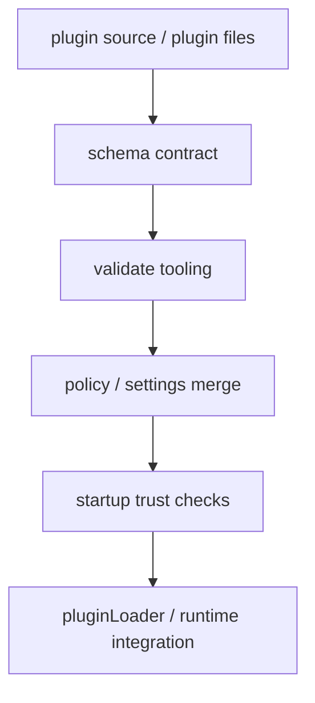

# Claude Code 源码共读笔记 76：validate / schema / policy 为什么说明 plugin 不是随便加载的目录，而是正式能力包

## 这篇看什么

前面 73-75 已经把 plugin 线的三层主骨架立起来了：

- 73：plugin 是统一能力包 / 治理包
- 74：pluginLoader 是装配线
- 75：plugin 里的不同能力面是分流接入的

如果到这里停住，其实还差最后一个很关键的判断：

> Claude Code 为什么敢把 plugin 这套东西做得这么重？

或者换句话说：

> 它靠什么保证 plugin 不会退化成“随便放几个文件就自动进 runtime”的松散目录机制？

答案就在这几层：

- schema
- validate
- policy
- startup checks / trust checks

这几层加在一起，才真正把 plugin 从“扩展目录”抬成“正式能力包”。

所以这篇的重点不是再讲一次 plugin 能干什么，而是讲：

> **Claude Code 用什么边界、规则和检查，来约束 plugin 这套能力系统。**

如果说 74 和 75 更偏“怎么接进去”，那 76 更偏：

> **为什么它能被放心地接进去。**

## 先给主结论

如果只先记一句话，我会留这个版本：

> Claude Code 并不是“发现一个插件目录就直接加载”，而是用 `schemas.ts` 定义正式 contract，用 `validatePlugin.ts` 给作者和开发流程提供严格校验，用 `pluginPolicy.ts` 和 `pluginStartupCheck.ts` 约束启用与安装边界，再用 startup trust 机制阻止不可信目录在未确认前触发插件链路；正因为有这一整套治理层，plugin 才成立为正式能力包，而不是松散目录约定。

再压缩一点，就是：

- **schema 定接口**
- **validate 做作者侧质检**
- **policy 定组织/用户边界**
- **startup check 定运行前闸门**

这四层叠在一起，就是 plugin 的治理底盘。

## 先把总图立住：plugin 的治理不是一个点，而是一串闸门

如果把这层画出来，我觉得更像下面这样：

这张图想说明的就一句话：

> plugin 不是“先 load，出了问题再说”，而是一路带着规则和闸门往前走。

这里每一层的角色都不一样：

### schema
负责回答“什么样的数据结构才算合法 plugin 世界的一部分”。

### validate
负责回答“插件作者在提交/安装前，哪里写错了、哪里有风险、哪里只是警告”。

### policy
负责回答“即使这个插件结构上合法，它是否允许被启用/安装”。

### startup trust
负责回答“即使配置上看起来能装，它是不是发生在一个用户已明确 trust 的工作目录里”。

也就是说，Claude Code 对 plugin 的判断从来不只是“这个 JSON 能 parse 吗”，而是一路在问：

- 结构对不对
- 风险大不大
- 来源和策略允不允许
- 当前目录和启动时机是不是可信

这套链路合起来，才像正式能力系统。

## 第一部分：`schemas.ts` 不是辅助类型文件，而是 plugin 世界的 contract 层

很多时候看到 `schemas.ts`，容易把它当“给 validate 用的辅助文件”。

但在 Claude Code 这里，这个文件的位置明显更重。

因为它做的不只是一些随手的字段约束，而是在定义：

> **plugin 世界里哪些对象是正式对象，它们长什么样，它们的边界在哪。**

这里最关键的几个 schema 大概包括：

- `PluginManifestSchema`
- `PluginHooksSchema`
- `PluginMarketplaceEntrySchema`
- 以及围绕 plugin name、marketplace source、官方名称保留规则的一整套约束

### 这说明什么？

说明 Claude Code 没把 plugin 设计成：

- “反正大家都写点 JSON”
- “loader 里 if 一下就行”
- “格式差不多就放过去”

它要的是：

> **plugin 从一开始就有正式 contract。**

这点很重要。

因为一旦 contract 写进 schema，后面很多层才能稳：

- validate 才有依据
- loader 才能做标准化
- CLI 才能做一致提示
- marketplace 才能防止奇怪输入
- policy 才能知道自己在管什么对象

### schema 里有个很值得注意的判断：官方命名与冒名约束
`scehmas.ts` 里不是只做字段类型校验，还在管 plugin name / official source 的边界，例如：

- 某些官方风格名字是保留的
- 第三方来源不能伪装成官方命名

这就很能说明问题。

如果 schema 只是“结构检查”，它没必要管这些。

一旦它开始管命名冒名边界，说明 schema 在这里已经不仅仅是类型层，而是：

> **生态身份边界的一部分。**

这也是 plugin 走向平台化的一个信号。

### 另一个很关键的点：runtime schema 和 authoring strictness 是分层的
从后面的 validate 逻辑看得很清楚：基础 schema 往往是偏 runtime-resilient 的，也就是：

- 能 strip unknown keys
- 更重视把 runtime 真正要消费的东西标准化出来

而严格校验则在 validate 阶段通过 `.strict()` 再补上。

这个分层我觉得很成熟。

因为它说明 Claude Code 不想把两个目标揉混：

- 运行时稳健
- 作者侧严格提示

它把这两层拆开了。

## 第二部分：`validatePlugin.ts` 不是 runtime 自检，而是作者侧/开发流程的“显式质检器”

`validatePlugin.ts` 这个文件很值得单独看，因为它的气质跟 loader 明显不一样。

如果说 loader 是“尽量装出来，但显式记录错误”，那 validate 更像：

> **在进入生态或进入安装流程前，给插件作者一套更严格、更可读、更开发者友好的质检工具。**

这点从很多细节里都能看出来。

### 1. 它会区分 error 和 warning
这很关键。

Claude Code 没有把 validate 做成“对/错”二值化，而是明确区分：

- 什么是必须修的错误
- 什么是建议修的警告

比如：

- JSON 语法坏了、schema 不过、路径遍历风险，这些是错误
- 插件名不是 kebab-case、缺 version / description / author，这些更偏 warning

这说明 validate 的目标不是“把作者训一顿”，而是：

> **帮助作者把 plugin 做成一个更标准、更稳定、更像正式能力包的产物。**

### 2. 它会在 schema 之前先做安全检查
比如 path traversal 检查就很说明问题。

而且源码注释写得很明白：

- 先检查路径遍历
- 哪怕 schema 后面也会报别的错，安全问题也要先被单独抓出来

这体现出很清楚的优先级：

> **安全问题不是 schema 失败里的一个普通子项，而是单独值得提到的风险类型。**

这也是 plugin 不是“普通目录”的证据之一。

### 3. 它会把 runtime 允许但作者不该写的内容单独提示出来
一个典型例子就是 marketplace-only 字段。

源码里专门说明：

- runtime 的 base schema 为了稳健，会 strip unknown keys
- 但作者跑 `claude plugin validate` 时，希望知道“这些字段其实不该写在 plugin.json 里”
- 所以 validate 会在 `.strict()` 之前先把这些字段单独提成 warning，再 strip 掉，避免双重报错

这段设计我觉得非常成熟。

它说明 validate 关心的不是“尽量不报错”，而是：

> **尽量给出作者真正需要的反馈。**

### 4. 它不只验证 manifest，还验证内容文件
这也是一个很重要的信号。

`validatePluginContents(...)` 会去扫：

- `skills/`
- `agents/`
- `commands/`
- `hooks/hooks.json`

然后分别给出对应的校验结果。

这说明 Claude Code 并不认为 plugin 只是一个 manifest 壳。

它很清楚：

> plugin 的“内容面”也是 contract 的一部分。

也就是说，真正被校验的不是“一个 JSON 文件”，而是：

- manifest
- 目录布局
- markdown frontmatter
- hooks JSON

这整套内容。

这才像正式能力包的质检。

## 第三部分：frontmatter 校验和 hooks 校验的不同严厉程度，暴露了 Claude Code 对不同组件的风险判断

这块我觉得特别有意思。

在 `validatePlugin.ts` 里，你会看到不同组件的校验力度不是完全一样的。

### frontmatter：更像开发者提醒 + 结构约束
对于 skill / command / agent 这类 markdown 文件：

- 没 frontmatter 会给 warning
- frontmatter 解析失败会报错
- 某些关键字段类型不对会报错
- 还有一些是可读性和规范性的提醒

这说明 Claude Code 对这类组件的态度是：

> **它们重要，但更偏“作者内容定义”层，所以容错和提示性会更多一些。**

### hooks.json：更偏硬失败
而对 `hooks.json`，源码注释说得非常直：

- runtime 里 pluginLoader 用的是 `.parse()` 而不是 `.safeParse()`
- 所以一个坏的 hooks.json 会直接让那部分加载失败

这背后的判断非常清楚：

> hooks 比普通 frontmatter 更像运行时控制面，所以它的结构错误不能被轻轻放过。

这个差异很好地说明了 Claude Code 的风险排序：

- 不是所有 plugin 组件都同样危险
- 越靠近 runtime 编排核心，校验越硬

这和前面 75 里说的 hooks 是正式 runtime 注册面，是一致的。

## 第四部分：`pluginPolicy.ts` 说明“结构合法”不等于“允许启用”

如果只看 schema 和 validate，你可能会觉得：

- 只要结构合法、内容规范，plugin 就该能用

但 `pluginPolicy.ts` 明确在说：不是这样。

它很短，但地位很重。因为它回答的是：

> **就算一个插件从结构上完全没问题，策略上也可能被硬禁用。**

源码里非常明确：

- policy-blocked plugin 不能被安装
- 也不能被启用
- 这是跨作用域的最高优先级约束

这说明 Claude Code 对 plugin 的治理不是单层的。

至少有两层完全不同的问题：

### 结构层问题
这个 plugin 合不合法，格式对不对，内容有没有错。

### 策略层问题
这个 plugin 就算合法，现在允不允许在这个环境里被用。

这两层分开非常重要。

因为真正的平台化系统，都不能把“合法性”和“许可性”混成一件事。

一个插件可以：

- 完全合法
- 完全能跑
- 但被组织策略锁死

而 `pluginPolicy.ts` 就是在把这个现实明确做进系统里。

## 第五部分：`pluginStartupCheck.ts` 说明插件启用不是“读设置 = 生效”，而是带优先级和迁移逻辑的

这一层我觉得也很关键。

如果系统很草率，插件启用状态可能就是：

- 读一个 settings 字段
- true 就开，false 就关

但 `pluginStartupCheck.ts` 明显不是这个档次。

它处理的是：

- 不同设置源的优先级
- 哪些 scope 是可编辑的
- managed / policy / local / project / user 的合并关系
- 启用状态从旧格式到新格式的迁移
- 插件是否存在于 marketplace 中的检查
- 失败项的分类记录

也就是说，它在解决的不是“布尔值读取”，而是：

> **在多来源设置和多作用域环境里，哪个 plugin 现在算真正启用，谁有权改它。**

这就是平台系统该做的事情。

### 一个很重要的点：policy 优先级最高
源码注释里把顺序写得很清楚：

- managed / policySettings
- localSettings
- projectSettings
- userSettings

这再次说明：

> 用户开关插件，并不是绝对权力；组织策略可以压住它。

这对企业/团队环境尤其重要。

也因为这一层存在，plugin 才不是一个“只跟当前用户聊天”的私有扩展机制，而是能进入更正式治理场景的系统。

## 第六部分：`performStartupChecks.tsx` 和 trust gate 把最后一道口子堵上了

如果前面都是结构、策略、设置层的闸门，那 `performStartupChecks.tsx` 处理的就是运行前最后一道很现实的问题：

> **当前工作目录用户到底信不信？**

源码里直接写了：

- 这段逻辑只会在 REPL trust dialog 确认之后跑
- trust dialog 没过，不应该触发插件安装链路

这个点特别重要。

因为 plugin 系统一旦接到 project / local source，就天然会跟当前目录发生关系。

如果没有 trust gate，风险会很难收住：

- 你一进一个陌生目录
- 目录里带了一堆配置或 plugin 线索
- 系统就自动开始安装 / 同步 / 激活某些东西

这显然不对。

所以 Claude Code 在这里明确做了一个现实而必要的安全判断：

> **用户没有先信任这个目录，插件相关的后台安装和启动检查就不该自动发生。**

这一步让整个 plugin 系统从“结构安全”走到了“交互安全”。

也就是说，plugin 的闸门不只是在文件格式里，也在用户确认流程里。

## 第七部分：把这几层合在一起看，plugin 才真正像“正式能力包”

如果把 schema、validate、policy、startup trust 这几层一起看，Claude Code 的意图就很清楚了。

它不是在说：

- 这里有个插件机制，大家随便扩展吧

它真正做的是：

### 用 schema 定义正式接口
告诉你 plugin 世界里，哪些对象长什么样。

### 用 validate 给作者一套显式质检
告诉你哪里错了、哪里有风险、哪里只是建议修。

### 用 policy 把“允许使用”从“结构合法”里拆出来
告诉你即使合法，也不代表在当前组织/环境中就能启用。

### 用 startup trust 把工作目录信任补上
告诉你即使配置和策略都没问题，用户没先点头，自动链路也不该乱跑。

这四层一叠，plugin 的气质就完全变了。

它不再像：

- 目录约定
- 脚本集合
- 非正式扩展点

而更像：

> **一个带 contract、质检、策略、信任门槛的正式能力系统。**

这也是为什么前面 73 说 plugin 更像生态单元，到 76 会显得更落地。

因为平台化不只在于“能装很多东西”，还在于：

> **你有没有清楚地决定什么能进、什么不能进、什么要用户点头、什么能被组织锁死。**

Claude Code 在这点上做得是成体系的。

## 一句话定义

如果让我给这篇留一个最短定义，我会写：

> Claude Code 不是靠“发现插件目录”来建立插件系统，而是靠 schema 定 contract、validate 做作者质检、policy 定启用边界、startup trust 定运行前闸门；正因为有这四层治理，plugin 才是正式能力包，而不是松散目录机制。

## 术语补充 / 名词解释

### `PluginManifestSchema`

plugin manifest 的正式结构 contract。定义了 runtime 和工具链如何理解一个 plugin。

### `.strict()`

validate 阶段常用的更严格 schema 检查方式。runtime base schema 可以偏宽松，但作者侧校验会更严格。

### path traversal check

对 `../` 一类越界路径的显式安全检查。它在 schema 之前先做，说明这是优先级更高的风险类型。

### policy block

由 managed settings / `policySettings` 施加的强制禁用规则。插件即使合法，也可能被策略硬拦。

### trust gate

启动前的工作目录信任闸门。用户未明确 trust 当前目录前，不应触发相关 plugin 启动/安装链路。

## 有意思的设计点

### 1. 运行时宽松与作者侧严格被明确拆开了

这点非常成熟。

Claude Code 没把“runtime 尽量稳健”和“作者侧尽量严格”混成一个目标，而是分别在 loader/schema 和 validate 里处理。

### 2. hooks 的校验硬度明显高于一般 frontmatter

这很符合前面的架构判断：hooks 更靠近 runtime 编排核心，所以结构错误不能轻轻放过。

### 3. policy 和 trust gate 让 plugin 真正进入了“产品安全边界”

没有这两层，plugin 还只是工程扩展机制；有了这两层，它才真正像一个能落到真实用户和团队环境里的系统。

## 和前面已读模块的关系

76 接在 75 后面，基本就把 plugin 线的第一阶段补齐了：

- 73：plugin 是什么
- 74：pluginLoader 怎么装
- 75：能力面怎么接
- 76：为什么这套东西不会退化成散装目录机制

到这里，plugin 线已经不只是“怎么实现”，而是把：

- 架构定位
- 装配主线
- 接入方式
- 治理边界

四层都串起来了。

## 下一步最顺怎么接

我觉得 76 写完之后，接下来最顺的方向已经开始从 runtime / 治理层，往产品生态层切了。

所以我会建议下一篇写：

### 77：plugin CLI / install / marketplace 是怎么把 plugin 变成产品级生态对象的

重点去看：

- `src/cli/handlers/plugins.ts`
- `src/services/plugins/pluginCliCommands.ts`
- `PluginInstallationManager.ts`
- marketplace 相关工具

核心问题会是：

- plugin 为什么不只是 runtime 抽象，而是完整产品对象
- install / uninstall / update / list / marketplace 这些动作是怎么落地的
- Claude Code 的 plugin 为什么已经开始像一个小生态，而不只是本地扩展体系

如果继续顺着这条线写，这会是非常自然的一步。