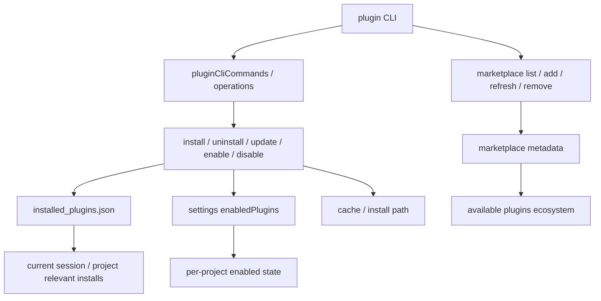

# Claude Code 源码共读笔记 77：plugin CLI / install / marketplace 是怎么把 plugin 变成产品级生态对象的

## 这篇看什么

前面 73-76 把 plugin 的 runtime 侧和治理侧基本已经串起来了：

- 它是什么
- 它怎么装
- 它的能力面怎么接
- 它为什么不是散装目录机制

那接下来最自然的问题其实已经不是 runtime 了，而是产品层：

> Claude Code 是怎么把 plugin 从“代码里的扩展对象”，做成一个用户真的能安装、启用、禁用、更新、列出、浏览市场的产品级对象？

答案就在这组文件里：

- `src/cli/handlers/plugins.ts`
- `src/services/plugins/pluginCliCommands.ts`
- `PluginInstallationManager.ts`
- `pluginOperations.ts`
- marketplace 管理相关
- `installedPluginsManager.ts`

这一层看完，你会很明显地感觉到：

> plugin 在 Claude Code 里已经不只是 runtime 抽象，而是一个完整的产品对象。

所以这篇重点不是“插件能接什么能力”，而是：

> **插件是怎么被做成一个有生命周期、有市场、有安装状态、有作用域、有更新语义的生态单元。**

## 先给主结论

如果只先记一句话，我会留这个版本：

> Claude Code 通过 plugin CLI 门面、安装/卸载/更新服务、marketplace 管理、installed_plugins.json 安装账本以及多 scope 状态模型，把 plugin 从运行时里的 `LoadedPlugin` 扩展成了一个完整产品对象：它不只会被 load，还可以被发现、安装、列举、启停、升级、跨项目区分作用域、进入市场分发与版本演进。

再压缩一点，就是：

- **runtime 里它是能力包**
- **产品层它是生命周期对象**
- **生态层它是市场分发单元**

这三层叠起来，plugin 才真正像一个小生态，而不是本地扩展集合。

## 先把总图立住：这层在做的不是加载，而是在做“插件产品化”

如果把 77 这一层画出来，我觉得更接近下面这张图：

这张图里最重要的一点是：

> 这层已经不再是“怎么把插件读进 runtime”，而是“怎么管理插件的整个产品生命周期”。

也就是说，Claude Code 在这里处理的已经是：

- 用户怎么发现插件
- 用户怎么安装插件
- 安装到哪里
- 属于哪个 scope
- 版本怎么记
- 更新怎么落盘
- 当前项目里算不算已安装、已启用
- 市场源怎么管理

这就是产品对象的语言，不再只是 runtime 语言了。

## 第一部分：`plugins.ts` 是 plugin 世界的 CLI 门面，不是单纯命令集合

先看 `src/cli/handlers/plugins.ts`。

这文件表面上像“CLI handler 集合”，但实际上它承担的是 plugin 产品层的门面职责。

为什么这么说？因为它提供的不是几个零碎命令，而是一整组围绕 plugin 生命周期的用户动作：

- validate
- list
- install
- uninstall
- enable
- disable
- update
- marketplace add/remove/refresh/list

这说明 Claude Code 从用户接口层已经把 plugin 当成正式对象在对待。

### 这类门面的意义是什么

它不是 runtime 的一部分，但它决定了用户和插件生态的交互方式。

一个东西值不值得被单独做 CLI 门面，往往说明它在产品里已经有了自己的稳定语义。

plugin 在这里显然已经具备：

- 可操作性
- 可枚举性
- 可安装性
- 可更新性
- 可治理性

所以 `plugins.ts` 不是“暴露底层函数”，而是在把底层 plugin 能力包装成用户可理解的产品动作。

### `list` 很值得注意
`plugin list` 并不是简单把磁盘文件列一下。

它会关心：

- 哪些是 installed plugins
- 哪些是 inline plugins
- 哪些加载失败
- 哪些已启用
- 哪些带 mcpServers
- 可选时还能列 available marketplace plugins

这说明 `list` 本身就已经在汇总多个层：

- 安装账本层
- runtime 加载层
- marketplace 可用项层
- 错误层

这和传统“ls 一下插件目录”完全不是一回事。

它更像一个插件世界的控制台视图。

## 第二部分：`pluginCliCommands.ts` 把用户动作翻译成生命周期动作

如果说 `plugins.ts` 是门面，那 `pluginCliCommands.ts` 更像业务层。

它的作用不是自己实现所有安装细节，而是把用户输入的动作：

- install
- uninstall
- enable
- disable
- update

翻译成真正的插件生命周期操作。

这一步很重要，因为它意味着 Claude Code 没有把插件 CLI 做成“命令直捣底层文件系统”的风格，而是有一层明确的 service boundary。

这会带来几个好处：

### 1. 用户意图和底层实现分离
“我要安装一个插件”和“该往哪个路径写、该更新哪个 registry、该怎么刷新 cache”不是一回事。

把这两层拆开后，产品动作才更稳定。

### 2. scope、settings、registry、cache 可以统一协调
一旦 install/uninstall/update 都走 service 层，它就更容易同时处理：

- 设置状态
- installed_plugins 账本
- cache 路径
- marketplace 来源信息
- project/local/user scope 差异

### 3. 后续 UI / CLI / 其他调用方可以复用同一套语义
也就是说，这一层是在把 plugin lifecycle 从“命令脚本”抬成“服务语义”。

这恰恰是产品化的重要信号。

## 第三部分：`PluginInstallationManager` 说明安装不是一个动作，而是一套状态机

这个类我觉得特别像 plugin 产品化的核心证据。

因为一旦系统里出现了专门的 `InstallationManager`，你就知道作者不再把安装理解成：

- git clone 一下
- 复制目录
- 写个记录
- 完事

真正的含义变成了：

> **安装是一个有状态、有元数据、有版本、有路径管理、有后续更新关系的正式过程。**

这跟前面 runtime 线是完全不同的思维方式。

runtime 线关心的是：

- 插件怎么进入系统
- 能力怎么接进去

安装管理线关心的是：

- 这个插件现在是否已安装
- 安装到哪
- 属于哪个 scope
- 当前版本是什么
- 是否有 pending update
- 磁盘状态与内存会话状态是否一致

这明显更像一个 package lifecycle manager，而不是简单 loader 附件。

### 这层最有意思的点：内存视图和磁盘视图被区分开了
`installedPluginsManager.ts` 里写得非常清楚：

- 当前 session 会用一份 in-memory snapshot
- 后台更新可以只改磁盘文件
- 当前运行 session 不一定立即切过去

这说明 Claude Code 对插件更新的理解已经很成熟：

> 更新不是“文件替换一下就好了”，还要考虑当前 session 正在跑什么版本。

这就很像包管理器/插件平台的思路了。

也正因为这样，才会有：

- pending updates
- disk differs from memory
- updateInstallationPathOnDisk

这些概念。

这不是本地小玩具系统会有的东西。

## 第四部分：`installed_plugins.json` 是安装账本，不等于 enabled state

我觉得这一点非常值得单独讲。

在 `installedPluginsManager.ts` 里，注释写得很清楚：

- `installed_plugins.json` 管的是 **安装状态与元数据**
- enabled/disabled state 则留在 `.claude/settings.json`
- enabled state 是 **per-repository** 的

这是一条非常关键的架构分层。

### 为什么重要？

因为很多系统会偷懒，把这两件事混在一起：

- “装了 = 开了”
- “关了 = 卸了”

但 Claude Code 没这么做。

它区分了两个完全不同的问题：

### 1. installation state
这个插件有没有被装到本机、装在哪、版本是什么、何时装的。

### 2. enabled state
在当前项目/当前设置作用域里，它是不是被启用。

这种分层会带来非常多现实好处：

- 同一个插件可以装了，但在某个项目里不开
- 不同项目可以对同一插件有不同启用状态
- 更新时能保留安装元数据，不必碰启用状态逻辑
- UI/CLI 可以分别回答“有没有装”和“当前这里算不算启用”

也就是说：

> **Claude Code 不是把 plugin 当成一个布尔开关，而是当成一个有安装账本和启用状态两层语义的产品对象。**

这点太关键了。

## 第五部分：scope 模型说明插件已经进入“跨项目/跨场景”的真实使用语境

继续看 `installedPluginsManager.ts`，会发现 scope 模型很完整。

至少涉及：

- user
- managed
- project
- local
- 以及某些 session / flag 相关场景

这说明 Claude Code 从一开始就知道，插件不是只在“一个用户、一个项目、一个目录”里存在的。

它要面对的是更真实的使用环境：

- 有些插件全局都想装
- 有些插件只想给某个项目装
- 有些插件是本地目录临时接入
- 有些插件是组织策略下发的 managed 安装

一旦 scope 模型建立起来，plugin 就真的不再像“本地一个目录约定”。

它更像：

> **带作用域的能力资产。**

### 这里还有个很现实的判断：relevant to current project
源码里专门处理了：

- 某插件虽然装在别的 project scope
- 但对当前项目并不 relevant
- UI 不能简单把它当“已经装了所以不用再装”

这类细节非常产品化。

因为真实用户不会关心“这机器上别的项目装过没有”，用户关心的是：

> **我现在这个项目里，它算不算已经装好、能不能用。**

Claude Code 把这个语义单独做出来，说明它已经在按真实使用情境打磨插件系统了。

## 第六部分：marketplace 管理说明 plugin 已经是分发生态对象，而不只是本地扩展对象

再看 `marketplaceManager.ts` 和 `marketplaceHelpers.ts`，生态味道就更浓了。

因为到这里，plugin 已经不仅仅是：

- 本地能 load 的东西

而是：

- 有 marketplace source
- 有 available plugin 列表
- 有 refresh 语义
- 有 known marketplaces
- 有 add/remove marketplace source
- 有 official/builtin 市场与第三方市场区分

这说明插件系统已经从“安装器”走向“生态入口”。

### marketplace 的意义不是多一个下载地址
而是把 plugin 带进了一种新的产品关系：

- 用户可以浏览“可用插件”
- 插件有来源身份
- 市场可以 refresh
- 不同市场可以共存
- 某些市场还能被 block 或被 policy 约束

这意味着 plugin 的分发不再是“给我一个 git repo 地址”，而是逐渐变成：

> **进入一个可发现、可管理、可统计、可治理的分发网络。**

这就是生态对象的特征。

### `plugin list --available` 很能说明这个转变
一旦 CLI 能同时列：

- 已安装的
- 当前 session inline 的
- 加载失败的
- marketplace 里可安装的

你就会发现用户面对的已经不是“插件文件”，而是：

> **一个有本地态、有会话态、有市场态的插件世界。**

这已经是产品视角，不是工程实现细节视角了。

## 第七部分：更新机制暴露了一个很成熟的产品判断——“会话中的版本”和“磁盘上的新版本”可以暂时不一致

这部分我觉得特别像成熟产品才会认真处理的东西。

`installedPluginsManager.ts` 明确区分：

- in-memory installed plugins（当前 session 视图）
- disk installed plugins（磁盘更新后的视图）

然后允许后台更新只先改磁盘，不强制打断当前会话。

这背后的产品判断很值得记住：

> **插件更新不是越快切换越好，而是要尊重当前运行会话的稳定性。**

这会直接带来这些概念：

- pending updates
- disk differs from memory
- getPendingUpdateCount / Details

也就是说，Claude Code 并不是把 update 看成“覆盖旧文件”这么简单，而是：

> **一次更新可以先完成分发层落盘，再等合适时机切换运行态。**

这非常像成熟 IDE / agent 平台 / package 管理系统，而不像一个简单扩展脚本机制。

## 第八部分：把这一层看完，plugin 在 Claude Code 里已经像一个“小型包管理+市场系统”了

如果把前面几篇加上这篇一起看，我觉得已经可以下一个更大的判断：

Claude Code 的 plugin，不只是：

- 可装的扩展
- 可 load 的能力包
- 可接入 runtime 的组件集合

它已经逐步长成一个更完整的体系：

### 有能力层
能承载 commands / agents / skills / hooks / MCP / LSP / styles。

### 有装配层
能被 pluginLoader 统一装成 `LoadedPlugin`。

### 有治理层
有 schema / validate / policy / trust gate。

### 有生命周期层
能 install / uninstall / update / enable / disable / list。

### 有账本层
有 `installed_plugins.json` 和 settings 分层。

### 有生态层
有 marketplace、available plugins、source 管理、版本演进。

这已经非常接近一个“小型包管理 + 市场系统”了。

当然，它还不是 npm 那种通用包管理器，也不是 VS Code Marketplace 那种完全平台化生态。但就 Claude Code 自己的产品边界来说，plugin 已经明显超出“本地扩展目录机制”很多了。

## 一句话定义

如果让我给这篇留一个最短定义，我会写：

> Claude Code 通过 CLI 门面、安装服务、作用域模型、installed_plugins 账本和 marketplace 管理，把 plugin 从 runtime 能力包进一步做成了一个可安装、可启停、可更新、可跨项目分作用域、可进入市场分发的产品级生态对象。

## 术语补充 / 名词解释

### `installed_plugins.json`

插件安装账本。记录插件是否安装、安装路径、版本、时间戳、scope 等元数据；不负责当前项目里是否启用。

### enabled state

插件启用状态，主要存放在 settings 中。它和安装状态分层，允许“已安装但当前项目未启用”。

### scope

插件安装/启用的作用域，例如 user、managed、project、local。决定插件在哪些环境里算 relevant。

### pending update

磁盘上的插件版本已更新，但当前运行 session 仍在使用旧版本时的中间状态。

### marketplace source

插件的市场来源。让插件具备可发现、可刷新、可管理的分发身份，而不只是“某个目录/某个仓库”。

## 有意思的设计点

### 1. 安装账本和启用状态被彻底拆开了

这让 plugin 的产品语义清晰了很多。

### 2. current project relevance 被单独建模了

这很贴近真实用户问题，而不是后台实现视角。

### 3. 更新时尊重当前会话稳定性

允许 disk 和 memory 暂时不一致，是个很成熟的判断。

### 4. marketplace 让 plugin 从扩展机制变成生态对象

一旦有 available、refresh、source 管理，插件就不再只是工程内部结构，而是用户可感知的生态系统。

## 和前面已读模块的关系

77 接在 76 后面，刚好把 plugin 线第一阶段收得更完整：

- 73：plugin 是什么
- 74：pluginLoader 怎么装
- 75：能力面怎么接
- 76：治理边界怎么立
- 77：产品生命周期和生态分发怎么做

到这里，plugin 线已经基本把：

- runtime
- 接入
- 治理
- 生命周期
- 生态

五层都串起来了。

也就是说，读到这里再回头看 Claude Code 的 plugin，你已经不太会把它误解成“几个 hooks + 几个 markdown 文件”了。

## 下一步最顺怎么接

我觉得 77 之后，plugin 线已经完成了第一轮主干阅读。

下一步可以有两个方向：

### 方向 A：做一篇 plugin 总结收口

比如：

**78：为什么说 Claude Code 的 plugin 本质上是统一扩展平台，而不是几个零散扩展点**

把 73-77 压成一篇总收口，会很适合回顾。

### 方向 B：切回更大的外围系统

比如接着看：

- plugin 和 builtin plugin 的关系
- plugin 与 cowork / add-dir / session-only 的边界
- 或者切回 agentteam / 远程 session / REPL 启动链

如果只选一个，我现在更倾向 **方向 A**。

因为 plugin 这条线连着写了 5 篇，到这里做一个总收口，会特别顺。