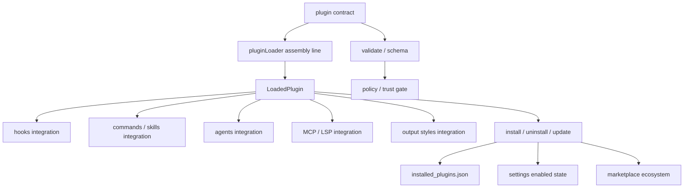

# Claude Code 源码共读笔记 78：为什么说 Claude Code 的 plugin 本质上是统一扩展平台，而不是几个零散扩展点

## 这篇看什么

前面从 73 一直写到 77，其实已经把 Claude Code plugin 这条线拆得很细了：

- 73：plugin 到底在提供什么能力面
- 74：pluginLoader 怎么把插件装成运行时能力包
- 75：plugin 的各能力接入面怎么挂进 runtime
- 76：validate / schema / policy 为什么说明它不是散装目录机制
- 77：CLI / install / marketplace 怎么把 plugin 变成产品级生态对象

写到这里，其实已经不太缺局部细节了。

真正缺的是一个更大的判断：

> **为什么说 Claude Code 的 plugin，本质上已经不是“几个扩展点拼在一起”，而是一套统一扩展平台？**

这篇就是专门做这个收口。

也就是说，它不是再补某个函数，而是把前面 5 篇的结论压成一个更大的架构判断。

目标很明确：

- 把 plugin 在 Claude Code 里的位置彻底立住
- 说明它为什么不是 hooks / commands / MCP 的简单合集
- 说明它为什么已经更接近一个统一扩展平台
- 顺手把这条线的阅读结论收成一张总图

## 先给主结论

如果这篇只先记一句话，我会留这个版本：

> Claude Code 的 plugin，本质上不是把 hooks、commands、agents、skills、MCP、LSP 和 output styles 几个零散扩展点绑在一起的“打包壳”，而是在同一套 contract、装配线、接入链、治理边界、生命周期和分发生态之上，把这些能力统一成一个可装载、可管理、可分发、可策略控制的扩展平台。

再压缩一点，就是：

- **扩展点是局部能力**
- **plugin 是统一平台边界**

或者说得再直一点：

> **Claude Code 不是“支持很多扩展点”，而是在用 plugin 把这些扩展点组织成一套统一扩展系统。**

这是这篇最该记住的骨架。

## 先把总图立住：plugin 把原本会散掉的几条线压成了一套统一系统

如果把前面几篇合起来，我觉得 Claude Code 的 plugin 总图更像下面这个结构：

这张图真正想说的其实只有一句话：

> **plugin 不是单一扩展点，而是把“定义、装配、接入、治理、生命周期、生态”全串起来的总边界。**

一旦你这样看，前面很多零散现象就会突然变得很顺：

- 为什么它需要自己的类型系统
- 为什么它需要自己的 loader
- 为什么不同能力面要分流接入
- 为什么它要有 schema / validate / policy
- 为什么它要有 install / update / marketplace

因为这些都不是“给某个小功能补配套”，而是在给一套扩展平台补全结构。

## 第一部分：如果它只是几个扩展点，就不需要 `LoadedPlugin` 这种统一运行时对象

这是我觉得最直接的一条证据。

看 `types/plugin.ts`，Claude Code 明明可以把系统做成这样：

- hooks 有 hooks 自己的定义
- commands 有 commands 自己的目录
- agents 有 agents 自己的 loader
- MCP 有 MCP 自己的配置
- 各玩各的

如果这么做，也不是完全不行。

但 Claude Code 没选这条路。

它选的是：

- 先定义一个 `LoadedPlugin`
- 再把 commands / agents / skills / hooks / output styles / mcpServers / lspServers / settings 全挂到这个统一对象上

这件事本身就已经说明：

> 它真正想要的不是“若干扩展点并存”，而是“若干扩展点共享一个统一宿主和统一边界”。

因为只要系统里出现了统一运行时对象，很多事情就自然发生了：

- 来源可追踪
- 启停可统一
- 错误可归因
- 策略可统一施加
- CLI 可统一管理
- marketplace 可统一分发

也就是说，`LoadedPlugin` 不是个小技术细节，它其实是在宣告：

> **Claude Code 的扩展世界，不是分散对象集合，而是统一插件对象集合。**

这就是平台化的第一步。

## 第二部分：如果它只是打包壳，就不需要 `pluginLoader` 这条重装配线

74 那篇最重要的结论其实就是：

> `pluginLoader.ts` 做的不是读目录，而是装配。

这个结论放到收口篇里特别重要。

因为如果 plugin 只是个薄壳，它不需要做这么多事：

- 处理 builtin / marketplace / inline / session-only 多来源
- 兼容 cache / versioned cache / seed cache
- load 或补默认 manifest
- 收集组件路径
- 合并 hooks
- 记录 errors
- 输出 enabled / disabled / errors 快照

这些动作放在一起，已经远远超出“插件目录扫描器”的范畴了。

它更像什么？

> **像一个扩展平台的统一装配总线。**

为什么这点关键？

因为一旦一个系统里存在统一装配总线，说明它在回答的问题已经不是：

- “这个目录里有没有插件文件”

而是：

- “这个扩展对象如何被规范地转换成系统内部可治理对象”

这和本地目录机制完全不是一回事。

所以 pluginLoader 的存在，本身就是平台化的第二个证据。

## 第三部分：如果它只是同一包里的不同文件，就不需要“分面接入、统一边界”这套设计

75 那篇最重要的判断，我觉得在收口时也必须留下：

> plugin 统一的是边界，不统一的是接入方式。

这一句其实非常能说明 Claude Code 的成熟度。

因为一个不成熟的系统，通常会走两种极端：

### 极端 1：完全散的
- hooks 自己一套
- commands 自己一套
- agents 自己一套
- MCP 自己一套
- 没有统一边界

### 极端 2：强行统一成一种注册协议
- 所有东西都走一个 `registerX()`
- 语义差异被抹平
- 系统看起来整齐，但实际上不好用

Claude Code 走的是中间这条：

- 用 plugin 把它们统一在一个封装边界里
- 但运行时接入仍然尊重各自语义

所以你会看到：

- hooks 走 runtime 注册表
- commands / skills 走入口枚举链
- agents 走角色定义装配链
- MCP / LSP 走连接器链
- output styles 走样式收集链

这说明它不是“把功能堆一包”，而是：

> **在一个统一平台边界里，容纳多种本质不同的扩展接入模式。**

这是平台化很典型的特征。

## 第四部分：如果它只是工程扩展机制，就不需要 schema / validate / policy / trust gate 这一整套治理层

76 那篇其实把平台化的另一半讲出来了。

因为真正把一个系统从“扩展机制”变成“扩展平台”的，不只是它能装多少东西，而是它有没有治理层。

Claude Code 在 plugin 这里，治理层已经很完整：

- `schemas.ts` 定 contract
- `validatePlugin.ts` 定作者侧质检
- `pluginPolicy.ts` 定策略边界
- `pluginStartupCheck.ts` / `performStartupChecks.tsx` 定 startup / trust 闸门

这组东西放在一起，说明它不是在说：

- “这里有个可扩展目录，祝你好运”

它是在说：

> **这是一套正式扩展系统，哪些东西算合法、哪些只该 warning、哪些会被策略硬拦、哪些在用户未 trust 目录前不该启动，都得说清楚。**

这就是平台和机制的差别。

### 机制思维
能用就行。

### 平台思维
要同时回答：

- 什么能进
- 什么不能进
- 什么需要作者修
- 什么需要用户点头
- 什么可以被组织锁死

Claude Code 在 plugin 上明显已经是后者了。

所以治理层的存在，是平台化的第三个强证据。

## 第五部分：如果它只是 runtime 能力包，就不需要 install / uninstall / update / marketplace 这一整套产品生命周期

77 那篇其实把最后一块拼图补上了。

因为一个系统就算：

- 有统一对象
- 有统一 loader
- 有治理层

它也还不一定是“平台”。

它可能仍然只是工程内部扩展框架。

真正把它往平台再推一步的，是产品生命周期和分发生态：

- install
- uninstall
- update
- enable / disable
- installed_plugins.json
- settings 中的 enabled state
- scope 模型
- marketplace source 管理
- available plugin 列表

这些东西加起来，说明 Claude Code 在 plugin 上已经不只是“内部工程结构”，而是：

> **面向用户、面向项目、面向市场分发的产品系统。**

而且这里还有几个很像成熟平台的判断：

### 安装账本和启用状态分离
说明“装了”和“当前项目里启没启”是两回事。

### scope 模型存在
说明插件不是只服务于单一项目，而是进入了跨项目 / 全局 / managed 环境。

### disk state 和 memory state 可以暂时不一致
说明更新机制已经在考虑会话稳定性，而不是只想着覆盖文件。

### marketplace source 被正式建模
说明 plugin 已经进入可发现、可刷新、可来源管理的生态网络。

这一层一出来，plugin 就真的已经很像“小型包管理 + 市场系统”了。

这就是平台化的第四个证据。

## 第六部分：把前面几篇压缩一下，plugin 在 Claude Code 里其实统一了六件事

如果要把 73-77 压成一张最简心智图，我觉得可以直接压成六层：

### 1. 统一能力边界
把 hooks、commands、agents、skills、MCP/LSP、styles 放到同一个 plugin 边界里。

### 2. 统一运行时对象
用 `LoadedPlugin` 让这些能力共享同一宿主、来源身份和治理元数据。

### 3. 统一装配主线
用 `pluginLoader` 把多来源输入装成统一运行时对象。

### 4. 统一治理边界
用 schema / validate / policy / trust gate 保证扩展系统不会散。

### 5. 统一生命周期
用 install / uninstall / update / enable / disable / scopes 管插件的产品动作。

### 6. 统一分发生态
用 marketplace、available、source 管理把插件带进生态层。

这六层叠起来以后，你再回头看 Claude Code plugin，就很难再把它理解成“几个零散扩展点”了。

因为零散扩展点通常只拥有其中 1-2 层。

Claude Code 的 plugin 已经拥有 6 层。

这就是为什么我更愿意把它定义成：

> **统一扩展平台，而不是扩展点合集。**

## 第七部分：那它和“几个扩展点”的本质区别到底在哪

这一点如果要讲得最透，我觉得可以直接对比。

### “几个扩展点”的世界
它通常长这样：

- 这里能挂个 hook
- 那里能加个 command
- 另一个地方能配个 MCP
- 每个点各自为政
- 没统一身份
- 没统一装配
- 没统一治理
- 没统一产品生命周期

这种系统也能扩展，但它更像是：

> 一组能力插槽。

### “统一扩展平台”的世界
它则更像这样：

- 各扩展点共用 plugin 作为统一边界
- 共用 runtime 对象与来源身份
- 共用 loader / contract / policy / lifecycle / marketplace 体系
- 各自保留不同接入语义，但共享平台级治理与分发

这种系统不只是“能扩展”，而是：

> **扩展已经成为系统本身的一等结构。**

Claude Code 的 plugin，明显更接近后者。

也就是说，plugin 的价值不在于“又多了一个扩展点”，而在于：

> **它把本来可能散成碎片的扩展能力，组织成了一套能长期演进的统一结构。**

这才是这条线真正值得记的地方。

## 一句话定义

如果让我给整个 plugin 系列留一个最短定义，我会写：

> Claude Code 的 plugin，本质上是统一扩展平台：它把多种扩展能力放进同一封装边界，用统一运行时对象、统一装配线、统一治理层、统一生命周期和统一分发生态把它们组织起来，因此它不只是若干扩展点的集合，而是一套正式的扩展系统。

## 术语补充 / 名词解释

### 统一扩展平台
不是指“所有扩展都长得一样”，而是指它们共享：

- 同一封装边界
- 同一装配体系
- 同一治理底盘
- 同一生命周期与生态系统

### `LoadedPlugin`
平台内部的统一插件运行时对象。它让多种扩展能力拥有同一宿主和来源身份。

### platform boundary
这里说的平台边界，指的就是 plugin 本身。它不是单个能力点，而是扩展系统的统一组织单元。

### lifecycle layer
插件的安装、启停、更新、作用域和账本层。没有这一层，扩展更像工程机制；有了这一层，才更像产品平台。

## 有意思的设计点

### 1. Claude Code 没有追求“形式统一”，而是追求“平台统一”

这点很关键。

它没有强行让 hooks、commands、agents、MCP 都走同一条接入协议，而是允许它们保留不同语义；统一的是平台边界和治理体系。

### 2. 它把“失败、策略、来源、版本、作用域”都当成平台的一部分

这说明它不是只关心“成功加载时看起来多漂亮”，而是真的把现实世界里的复杂性都纳进来了。

### 3. 它已经有了明显的平台演进空间

既然 contract、loader、policy、lifecycle、marketplace 都已经立起来了，后面再扩新的能力面，成本会比“散点扩展”低很多。

这也是平台的价值所在。

## 和前面已读模块的关系

这篇就是对 73-77 的总收口。

它不再追单个函数，而是把前面 5 篇压成一个更大的判断：

- 73 立边界
- 74 立装配
- 75 立接入
- 76 立治理
- 77 立生态
- 78 立总判断

所以如果你后面再回看 plugin 线，这篇应该就是最适合放在最前面的“总索引 / 总结论”之一。

## 下一步最顺怎么接

plugin 线到这里，我觉得已经可以正式收一轮了。

如果后面继续，我觉得有两个方向最顺。

### 方向 A：切回更大的 Claude Code 总架构

因为 plugin 这条线现在已经完整了，下一步很适合回到更大的问题：

- plugin 在整个 Claude Code runtime 总图里到底占什么位置
- 它和 agent / hooks / MCP / session / query engine 怎么拼成一张更完整的大图

### 方向 B：切 builtin / cowork / add-dir / session-only 这些边缘形态

因为 plugin 主线已经读透了，接下来再去读这些特殊边界，会更容易看懂：

- 哪些算正式 install
- 哪些只是 session 注入
- 哪些是 builtin plugin
- 哪些是 cowork 模式扩展

如果只选一个，我现在更倾向 **方向 A**。

因为 plugin 线已经收口了，下一步最有价值的是把它放回 Claude Code 整体架构里，而不是继续在 plugin 子枝杈上深挖。