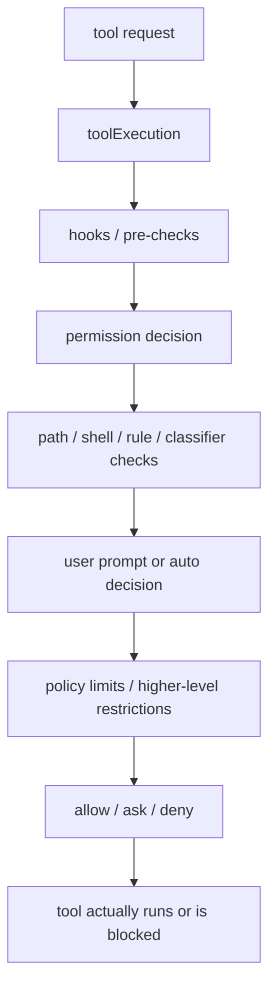

# Claude Code 源码共读笔记 79：Claude Code 的权限系统到底在管什么

## 这篇看什么

plugin 这条线先收住之后，下一块最适合接的就是权限系统。

因为前面其实已经读过很多“会动的部分”：

- tool
- agent / subagent
- hooks
- MCP
- plugin

但 Claude Code 不是一个“有能力就直接跑”的系统。

它的真正底层约束其实一直在另一层：

> **哪些动作可以做，哪些动作要问，哪些动作要拦，哪些动作即使用户想开也会被更高层策略限制。**

这就是权限系统。

所以这篇不急着先钻某个函数细节，而是先回答一个更大的问题：

> Claude Code 的权限系统，到底在管什么？

这个问题如果先看清，后面再读 tool execution、bash、shell、policy limits，就不容易散。

## 先给主结论

如果这篇只先记一句话，我会留这个版本：

> Claude Code 的权限系统，并不只是“执行危险命令前弹个确认框”。它真正管理的是：工具调用是否可执行、文件路径是否在允许边界内、shell/bash 命令是否符合自动放行规则、用户临时或持久授权如何落到 settings、以及组织级 policy limits 是否在更高层直接禁止某类能力。换句话说，它管的是 agent runtime 的行动边界，而不只是一个 UI 确认动作。

再压缩一点，就是：

- **tool execution 是动作入口**
- **permissions 是运行时边界判断层**
- **shell/bash 是高风险判定子系统**
- **policy limits 是更高层约束**

所以如果只记一句最短版：

> **权限系统管的是 Claude Code“能不能做这件事”，不是“怎么把这件事做完”。**

## 先把总图立住：Claude Code 的权限不是单点检查，而是一串边界判断

如果把这一层画出来，我觉得更接近下面这张图：

这张图最重要的点有两个。

### 第一，权限系统不在工具之外
它不是工具跑完了再补一个确认，而是直接插在 tool execution 主链里。

### 第二，它不是只靠用户点一下
它同时还会看：

- 路径规则
- shell 前缀和命令分类
- session / 持久授权规则
- settings 里的 allow / deny
- 更高层的 policy limits

所以 Claude Code 的权限系统，更像一串逐层收紧的边界判断，而不是一个单独弹窗组件。

## 第一部分：`toolExecution.ts` 说明权限系统本质上是“工具执行前的决策层”

要理解 Claude Code 的权限系统，最应该先看的不是某个 permissions helper，而是 `src/services/tools/toolExecution.ts`。

因为这里能看得最清楚：

> 权限系统并不是外挂，而是 tool runtime 的主链组成部分。

从这个文件里的结构看，工具执行时会发生几件关键事情：

- 先处理 hooks / 输入变形 / 预处理
- 再进入 permission decision
- 决定结果可能是 `allow` / `ask` / `deny`
- 如果不是 allow，就不会继续走到真正执行
- 如果 permission layer 改写了输入，后续还会用更新后的输入继续

这说明 Claude Code 的权限系统不是“最后补一句确定吗”，而是：

> **真正决定工具调用能否进入执行态的门。**

这点非常关键。

因为它意味着权限系统和 tool execution 是同一层级的 runtime 组成部分，而不是旁路逻辑。

### 一个很重要的细节：permission decision 还可能带回结构化结果
从 `toolExecution.ts` 里能看出来，permission decision 不只是一个布尔值。

它至少可能带：

- `behavior`（allow / ask / deny）
- `decisionReason`
- `message`
- `updatedInput`
- `contentBlocks`
- 某些情况下的用户修改信息

这说明 Claude Code 对权限的理解不是：

- “只是判一下能不能跑”

而是：

> **权限层本身也可能参与工具输入的重写、结果归因和用户反馈内容拼装。**

这一点会让你对后面 hooks / shell / prompt 授权机制的关系看得更清楚。

## 第二部分：权限系统管的第一个核心对象，其实是“路径边界”

很多人一说权限系统，第一反应都是 shell 命令。

但从 `src/utils/permissions/pathValidation.ts` 看，Claude Code 管得非常重的一层其实是：

> **文件路径能不能被读、能不能被改、能不能被创建。**

这非常合理。

因为对 coding agent 来说，真正最常发生的高风险动作之一，不是“跑个命令”，而是：

- 改哪个文件
- 往哪写
- 是不是越出工作区
- 是不是借助 shell expansion / glob / symlink / UNC path 做路径绕过

### 这层里最值得记的几个点

#### 1. deny 先于 allow
这是典型安全系统的写法。

#### 2. 读和写不是同一种判断
代码里会按 operation type 区分 `read` 和 `edit`，这说明 Claude Code 没把文件操作粗暴看成一个权限桶。

#### 3. sandbox write allowlist 会参与判断
这说明 Claude Code 的权限边界不是只看用户规则，还会看 sandbox 本身的可写边界。

#### 4. 对 shell expansion / glob / `~root` / `$VAR` 这种会产生 TOCTOU 风险的写路径非常敏感
这很说明问题：

> Claude Code 在文件权限上防的，不只是“明显越界”，而是“先验证一个路径、执行时 shell 展开成另一个路径”的这种时间差漏洞。

所以我会把 path validation 这一层定义成：

> **Claude Code 权限系统里的空间边界层。**

它回答的是：这个动作会落到文件系统的哪里，那里是不是允许触达。

## 第三部分：shell / bash 这条线不是“能不能执行命令”那么简单，而是命令语义风险分类系统

再看 `src/utils/shell/` 和 `src/utils/bash/`，会发现 Claude Code 在 shell 这块做得非常重。

如果只是一个简单系统，它大可以这样做：

- bash 一律 ask
- 或者 bash 一律 deny / allow

但 Claude Code 没这么粗糙。

它明显在做一件更复杂的事：

> **尝试理解命令长什么样、前缀是什么、哪些可以自动放行、哪些必须提权、哪些根本不该被某种前缀规则放过。**

### 这里最有代表性的线索是 prefix / parser / quoting / validation 这些模块并存
你会看到：

- `src/utils/shell/prefix.ts`
- `src/utils/bash/parser.ts`
- `src/utils/bash/bashPipeCommand.ts`
- `src/utils/bash/shellQuote.ts`

这说明 Claude Code 对 shell 并不是“当字符串看一眼”。

它在努力解决一个非常现实的问题：

> **对 bash/powershell 命令，系统要不要在真正执行前先做足够靠谱的风险判断？**

### 一个关键判断：prefix auto-allow 不是随便做的
从 `prefix.ts` 的注释就能看出来，系统非常警惕这种事：

- 不能允许过宽的 shell executable prefix
- 否则等于把整个权限系统打穿

这背后的逻辑很直白：

- 如果你允许 `bash:*`
- 基本等于任何东西都能通过

所以 Claude Code 这里不是在做“便利性优化”，而是在做：

> **自动放行规则的安全约束。**

### bash parser/quote 那些细节说明它在防“解析器和真实 shell 语义不一致”
像 `bashPipeCommand.ts` 里的很多注释，明显就在防：

- shell-quote 和真正 bash 语义不一致
- 某些 quoting / substitution / control structure 会导致解析错判
- 原本应该被拒绝或至少谨慎对待的命令，被错误归类

这个层次已经不是普通应用权限系统会做到的程度了。

它说明 Claude Code 对 shell 权限的理解是：

> **不是“命令执行”本身危险，而是“命令字符串的真实语义”危险。**

所以 shell / bash 这条线，本质上是权限系统里的**语义风险分类层**。

## 第四部分：权限规则不是只存在内存里，它还会被更新、持久化、分作用域管理

再看 `src/utils/permissions/PermissionUpdate.ts`，就会发现 Claude Code 不是每次都重新 ask 一遍那么简单。

它的权限系统里显然存在：

- session 级规则
- user / project / local 等 destination
- allow / deny 规则的增删改
- 持久化到 settings 的能力

这说明 Claude Code 的权限系统不是“弹窗系统”，而是：

> **一个可演化的规则系统。**

### 为什么这个点很重要

因为一旦权限规则可更新、可持久化，它就不再只是运行时瞬时判断，而变成：

- 用户的长期偏好
- 当前项目的局部边界
- 会话期间的临时放权
- 明确拒绝过的行为记忆

这会直接影响 agent 长期使用体验。

也就是说，Claude Code 在权限上不是只想做到“安全”，还想做到：

> **安全边界可持续、可复用、可解释。**

这也是为什么权限系统会和 settings、scope、rule parser 这些东西粘得很深。

## 第五部分：policy limits 说明权限系统上面还有一层“更高权限的权限系统”

如果前面几层都是本地 runtime 的权限边界，那 `src/services/policyLimits/` 就是在告诉你：

> **Claude Code 的权限系统上面，还有一层组织/服务端策略约束。**

这一层很关键。

因为它说明 Claude Code 并不认为“本地设置 + 用户点击”就是最终权威。

从 `policyLimits/index.ts` 看得很清楚：

- 会去拉取 organization-level policy restrictions
- 有缓存
- 有轮询刷新
- 某些 policy unknown 时 fail-open
- 某些关键 traffic on miss 时 fail-closed

这说明什么？

说明 Claude Code 的权限模型至少分成两层：

### 本地运行时边界
例如：
- tool permission
- path validation
- shell/bash auto-allow or ask
- session/user/project/local rules

### 更高层组织策略边界
例如：
- 某类能力是否被 org policy 直接禁掉
- 某些 product 行为是否允许
- 远程 session / feedback 等是否可用

这会让 Claude Code 的权限系统更接近企业产品，而不是个人工具。

### 一个很有意思的点：不是所有未知 policy 都 fail-closed
从代码看，很多 policy 在 unknown / unavailable 时会 fail-open，只对极少数 essential traffic 做 deny-on-miss。

这说明作者在平衡：

- 安全
- 可用性
- 网络/cache 失败时的退化行为

这类权衡很成熟，也说明 policy limits 不是“再套一层死规则”，而是产品级控制系统。

## 第六部分：把这些层合在一起看，Claude Code 的权限系统其实在管三种边界

如果把前面的层压一下，我觉得 Claude Code 权限系统真正管理的是三种边界。

### 1. 行为空间边界
也就是：这个动作会碰到哪里。

典型就是 path validation：
- 读哪里
- 写哪里
- 是否越出允许空间

### 2. 行为语义边界
也就是：这个动作本身是不是危险语义。

典型就是 shell / bash：
- 命令前缀是什么
- 是否包含高风险控制结构
- 自动放行规则是不是过宽

### 3. 行为权力边界
也就是：谁说了算、谁能开、谁能拦。

典型就是：
- session / user / project / local permission rules
- policy limits
- 用户确认 vs 组织限制

这三层加在一起，你才会明白：

> Claude Code 的权限系统不是“一个 permission modal”，而是 agent 行动边界的总调度层。**

这也是为什么它会散落在 toolExecution、permissions、shell、bash、policyLimits 这么多地方。

不是因为结构乱，而是因为它本来就在覆盖不同维度的边界。

## 第七部分：为什么权限系统必须先立“总图”，不能一上来就只读 bash 或 rules

这其实也是我为什么建议先写 79 总图的原因。

因为如果你一上来就只看：

- bash parser
- allow / deny rules
- policy limits

很容易误读成：

- 这里只是在做命令审计
- 那里只是设置文件
- 另一处只是企业开关

但一旦把总图立起来，你会发现它们是在共同回答一件事：

> **Claude Code 这个 agent runtime，此刻到底有没有权力做这个动作。**

这里真正的主角不是 bash，也不是 path rule，而是：

> **runtime 行为决策。**

所以后面不管往哪条子线继续拆，都应该记住：

- bash 是权限系统的一个高风险子系统
- path validation 是权限系统的空间边界层
- policy limits 是权限系统的上层策略闸门
- toolExecution 才是这几层真正汇合并给出 allow/ask/deny 的主链位置

有了这个总图，后面就不容易散。

## 一句话定义

如果让我给这篇留一个最短定义，我会写：

> Claude Code 的权限系统，本质上是在 tool execution 主链上，对 agent 的行动边界做统一决策：它同时检查路径空间边界、shell 命令语义风险、本地 allow/deny 规则、会话与持久授权以及更高层 policy limits，因此它管的是“agent 是否有权做这件事”，而不只是“执行前要不要弹确认框”。

## 术语补充 / 名词解释

### `toolExecution`

工具执行主链。权限系统并不是外挂，而是直接插在这里做 allow / ask / deny 决策。

### path validation

文件系统空间边界判断层。主要负责决定某个读/写/创建动作落点是否允许。

### shell / bash permission layer

命令语义风险判断层。不是简单看字符串，而是尽量判断命令前缀、结构和潜在危险语义。

### permission update

权限规则更新层。负责把 allow / deny / directory 等变更作用到 session 或持久 settings。

### policy limits

更高层组织/服务端策略限制。即使本地运行时看起来能做，policy 也可能在更高层直接禁止。

## 有意思的设计点

### 1. 权限层不是只返回布尔值

它还能返回 updatedInput、message、contentBlocks、decisionReason，这说明它也是 runtime 决策的一部分，而不只是闸门。

### 2. Claude Code 很重视 shell 解析与真实 shell 语义不一致的风险

这说明它不是“做个大概判断”，而是在认真防误判带来的权限穿透。

### 3. policy limits 让权限系统具备了企业产品气质

没有这一层，它更像本地工具；有了这一层，它才更像真正可管控的 agent 平台。

## 和前面已读模块的关系

79 很适合接在前面这些线之后：

- tool
- hooks
- MCP
- plugin

因为你前面其实一直在看“Claude Code 能干什么、怎么接进来”。

而 79 开始回答的是另一半：

> **Claude Code 凭什么能做、又为什么有些事不能直接做。**

这会把前面的“能力图”补成“能力 + 边界图”。

## 下一步最顺怎么接

这篇把总图立住之后，我觉得下一步最顺的不是直接去 policy limits，而是先切：

### 80：tool execution 和 permission decision 是怎么接上的

重点会回答：

- allow / ask / deny 到底在哪个主链位置决定
- hooks 和 permission decision 谁先谁后
- permissionDecision 的结构化结果怎么回流到后续执行
- 为什么权限层能改写 input，而不只是点头/摇头

也就是说，80 最适合先把“主链上的权限决策”讲透。