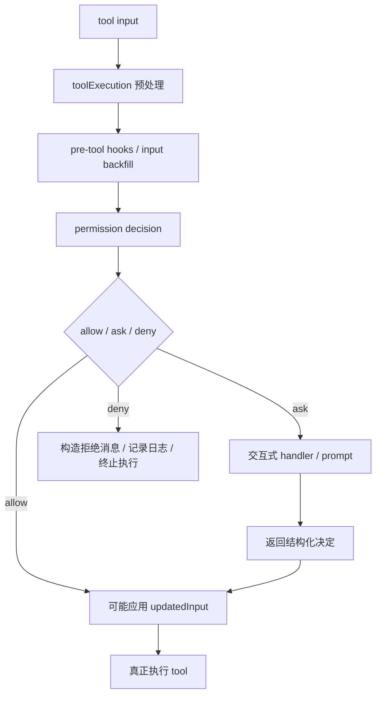

# Claude Code 源码共读笔记 80：tool execution 和 permission decision 是怎么接上的

## 这篇看什么

79 已经先把权限系统总图立起来了。

那下一步最自然的问题就是：

> 在真正一次工具调用里，权限判断到底是怎么插进主链的？

也就是：

- tool execution 先做什么
- hooks 和 permission check 谁先谁后
- allow / ask / deny 是在哪个节点真正定下来的
- permission decision 为什么不只是一个布尔值
- 为什么它还能改写输入、回传内容块、写入日志分类

这篇就专门回答这些问题。

如果说 79 讲的是“权限系统在 Claude Code 里管什么”，那 80 讲的就是：

> **权限系统在一次真实 tool 调用里，是怎么被接进 runtime 主链的。**

## 先给主结论

如果只先记一句话，我会留这个版本：

> 在 Claude Code 里，permission decision 不是工具执行之外的附加确认步骤，而是 `toolExecution.ts` 主链中的正式决策节点：工具输入先经过预处理与 hooks，再进入统一的 permission 判断；这个判断返回的不是简单 yes/no，而是结构化的 `allow / ask / deny` 决策对象，里面还可以携带 `updatedInput`、`decisionReason`、提示消息和内容块，随后直接改写后续执行路径。

再压缩一点，就是：

- **tool execution 负责组织回合**
- **permission decision 负责决定动作命运**
- **decision 结果会回流并改写后续执行**

所以一句最短版：

> **权限判断是 tool runtime 的正式分叉点，不是外围确认框。**

## 先把总图立住：一次工具调用里，权限判断插在“准备执行”和“真正执行”之间

如果只看主链，我觉得结构大概是这样：

这张图最关键的地方是：

### 第一，permission decision 在执行前，但在很多“准备工作”之后
它不是一进来第一步就问，也不是执行完才补。

### 第二，它会真正改写控制流
它不是只给个标记，而是直接把主链分成：

- allow → 继续执行
- ask → 进入交互式授权
- deny → 构造拒绝结果并停止

也就是说，permission decision 在这里更像一个 runtime switch，而不是附加 UI。

## 第一部分：`toolExecution.ts` 里，hooks 和 permission 不是互不相干的两块，而是串联的

这个点很重要。

如果粗看，很容易把 `toolExecution.ts` 想成：

- 前面一些 hook
- 后面一些 permission
- 再后面执行 tool

但真正值得注意的是，它们不是简单并排，而是有顺序关系的。

从代码结构看，大致是：

1. 先准备 / backfill 输入
2. 运行 pre-tool hooks
3. hook 有机会返回 `updatedInput` 或 permission 相关决策
4. 再进入正常 permission flow
5. 最后依据 permission decision 决定是否执行

这说明 Claude Code 并不是把 hooks 和 permissions 做成两条完全独立的边。

而是：

> **hooks 可以在 permission decision 前先参与这一轮工具调用的改写。**

这件事的含义很大。

因为它说明 tool execution 主链不是：

- 先把一个固定输入送给权限系统

而是：

- 先让 runtime 上游控制层有机会改写这次调用
- 再让权限系统对“当前有效输入”做判断

这会让 hooks 真正进入 runtime 主链，而不是只做外围通知。

## 第二部分：permission decision 返回的是结构化结果，不是布尔值

这个点是理解 Claude Code 权限系统成熟度的关键。

如果系统简单，它完全可以返回：

- true
- false

最多再加个“要不要弹窗”。

但 Claude Code 不是这么做的。

从 `toolExecution.ts` 和 `PermissionResult.ts` 相关结构能看出来，permission decision 至少会包含：

- `behavior`：`allow` / `ask` / `deny`
- `decisionReason`
- `message`
- `updatedInput`
- `contentBlocks`
- 某些场景下的 `userModified` / `acceptFeedback`

这说明什么？

说明 Claude Code 的权限系统不是单纯判断器，而是：

> **既判断，又解释，又可能改写输入，还能把额外内容回流给后续消息层。**

### 为什么 `updatedInput` 很关键
这说明 permission 层不是被动裁判，而有可能成为“输入修正层”。

也就是说，权限结果不只是：

- 你能不能做这个动作

还可能是：

- 你只能在改成这个版本之后做这个动作

这一下就把 permission 层的角色从守门员抬成了：

> **runtime 中有修改权的决策层。**

### 为什么 `decisionReason` 很关键
Claude Code 明显不满足于“allow/deny 了就完事”。

它还想知道：

- 这个决定是规则命中的
- 是 hook 给出的
- 是 classifier 决定的
- 是用户临时允许的
- 还是持久授权命中的

这意味着 permission decision 还承担归因职责。

这对日志、解释、UI、后续分析都很关键。

## 第三部分：真正的分叉点是 `allow / ask / deny`，而 ask 不是 deny 的弱版本

这一点很值得单独说。

在 Claude Code 里，`ask` 不是“暂时没 allow”；它是一个正式状态。

这说明权限系统的心智模型不是二元：

- 能
- 不能

而是三元：

- 可以直接执行
- 需要用户参与决策
- 明确不能执行

这个设计很成熟。

因为 agent runtime 里的很多高风险动作，本来就不该只被粗暴归成 allow 或 deny。

### `ask` 的角色是什么
`ask` 实际上是：

> **把 runtime 主链临时切到“交互式授权子流程”里。**

也就是说，权限系统不是只在本地做静态判定，而是把“用户补充决策”本身也纳入主链的一部分。

这一点和很多普通应用的弹窗不同。

普通应用常常是：

- 主流程停住
- UI 弹个确认框
- 回来继续

Claude Code 则更像：

- 主链进入一个正式 permission handler
- handler 产出结构化结果
- 再回到主链

这让 ask 变成正式 runtime 状态，而不是 UI 特例。

## 第四部分：`PermissionContext` 和 interactive handler 说明用户授权不是 UI 事件，而是上下文状态更新

这一块在 `src/hooks/toolPermission/PermissionContext.ts` 和 `handlers/interactiveHandler.ts` 里能看得更清楚。

Claude Code 不是把用户授权只看成“点一次按钮”。

它在更系统地处理：

- 当前 permission mode 是什么
- 这轮决定属于临时还是持久
- decision 的分类是什么
- 要不要把结果写回规则 / settings
- 交互结果是否改写输入

这说明 interactive permission handler 的作用不是：

- 单纯把 UI 结果抛回来

而是：

> **把用户决策翻译成 runtime 能用、而且后续可持续生效的权限状态。**

也就是说，UI 只是输入端，真正重要的是：

- 如何映射到 permission rule
- 如何分类成 temporary / permanent / reject
- 如何回到主链

这就是为什么 permission system 不只是 confirm dialog。

## 第五部分：BashTool 的权限预判说明“命令执行权限”被特殊认真对待

`src/tools/BashTool/bashPermissions.ts` 在这条线上特别值得注意。

因为它说明 shell/batch 命令的权限判断，并不是等到最后统一粗判，而是有专门的高风险预判子系统。

从 `toolExecution.ts` 里的调用也能看出来：

- bash allow classifier 会被 speculative 地提前启动
- 它和 pre-tool hooks、permission dialog 等可以并行

这背后的判断很值得记住：

> **BashTool 太重要、太高风险，所以 Claude Code 在主链上专门给它做了更精细、更早启动的权限分类。**

这说明 permission decision 不是完全 tool-agnostic 的。

虽然总框架统一，但对于 BashTool 这种高风险工具，它会额外挂更重的分析链。

所以如果要更准确地说：

- 权限系统有统一主链
- 但在高风险工具上会接特殊子系统

这非常符合 Claude Code 的工程气质。

## 第六部分：deny 也不是“返回 false”就完了，而是会构造完整拒绝路径

这一点也很容易被低估。

从 `toolExecution.ts` 看，deny 之后不是简单 `return false`。

系统还会：

- 记录日志
- 构造拒绝消息
- 带上 permission decision 的 message/contentBlocks
- 某些场景下识别是否来自 `PermissionRequest` hook
- 记录 classifier / rule / hook 等 decision reason

这说明 Claude Code 对 deny 的理解不是：

- 执行失败

而是：

> **这也是一次正式 runtime 结果，只不过结果是“拒绝执行”。**

这点很重要，因为它让拒绝本身也变成了系统可解释、可追踪、可展示的一部分。

也就是说，权限系统不只是保护运行时，还在维护交互质量。

## 第七部分：为什么说 permission decision 是“主链分叉点”，不是“主链附属件”

把前面几节压一下，我觉得最该留下来的判断就是这个。

Claude Code 的 tool execution 主链里，permission decision 的地位其实很高。

它不是：

- 一个后置通知
- 一个 UI 弹窗
- 一个布尔守卫条件

它真正做的是：

### 1. 承接上游改写后的输入
hooks 或 backfill 先改了输入，再交给它。

### 2. 决定主链往哪个方向走
allow / ask / deny 直接决定是否执行、是否进交互、是否终止。

### 3. 可能改写后续执行的输入
`updatedInput` 不是装饰字段，而是直接影响后续实际执行内容。

### 4. 给整次决策附带解释和归因
`decisionReason`、message、contentBlocks 等让这个决定能被系统理解和展示。

所以从 runtime 位置上看，permission decision 更像：

> **一次工具调用从“准备阶段”进入“可执行阶段”的正式分叉点。**

这个理解一旦立住，后面再去看 path validation、shell classifier、permission rules，就会很顺。

因为它们都不是散的，而是在给这个分叉点提供输入。

## 一句话定义

如果让我给这篇留一个最短定义，我会写：

> 在 Claude Code 的 `toolExecution.ts` 主链里，permission decision 是工具调用进入真正执行前的正式分叉点：它承接 hooks 和预处理后的输入，返回结构化的 `allow / ask / deny` 决策，并可附带 `updatedInput`、归因和反馈内容，从而直接改写后续执行路径，而不是只充当一个布尔确认步骤。

## 术语补充 / 名词解释

### `permissionDecision`

权限决策结果对象。不是布尔值，而是包含行为、原因、消息、输入改写和内容块等信息的结构化结果。

### `behavior`

权限决策的主行为字段：
- `allow`
- `ask`
- `deny`

它直接决定 tool execution 主链分叉。

### `updatedInput`

权限层或 hook 层返回的新输入。若存在，会被后续真正执行阶段使用。

### `decisionReason`

权限结果的归因信息，用来说明这次 allow/ask/deny 来自规则、用户、hook、classifier 还是其他来源。

### interactive permission handler

当 decision 是 `ask` 时进入的交互授权处理层。它把用户选择转成 runtime 可继续消费的结构化结果。

## 有意思的设计点

### 1. permission 层能改输入，不只是拦截

这说明它是 runtime 决策层，而不是纯守门层。

### 2. `ask` 是正式状态，不是“还没决定”

这让用户交互被纳入主链，而不是 UI 特判。

### 3. BashTool 有特殊预判链

这说明统一权限主链之上，还会给高风险工具接专用子系统。

## 和前面已读模块的关系

80 是 79 的自然下一篇。

- 79：权限系统总图
- 80：权限决策怎么接进 tool execution 主链

它们合起来，权限系统的主骨架就立住了：

- 79 解释权限系统在管什么
- 80 解释它在真实工具调用里怎么起作用

## 下一步最顺怎么接

80 之后，我觉得最顺的不是立刻切 policy limits，而是继续把高风险动作最核心的一条线讲透：

### 81：BashTool 的权限判断为什么不是“跑命令前问一下”这么简单

重点可以看：

- `src/tools/BashTool/bashPermissions.ts`
- `src/utils/bash/`
- `src/utils/shell/`

核心问题会是：

- BashTool 为什么有自己一套更重的权限分析链
- prefix / parser / classifier 分别在防什么
- 为什么 shell 语义判断会比普通工具难这么多

这会比现在直接切 policy 更顺，因为你刚刚已经把主链上的 permission decision 接点看清了。