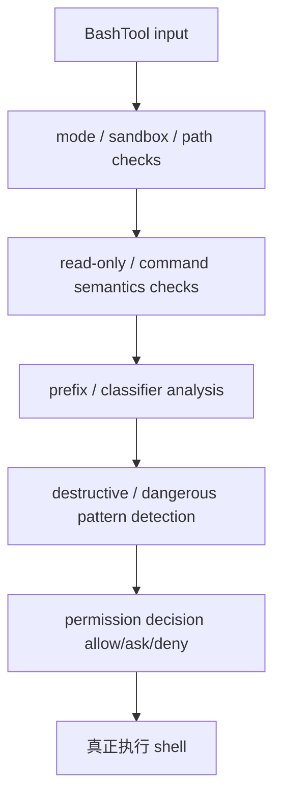

# Claude Code 源码共读笔记 81：BashTool 的权限判断为什么不是“跑命令前问一下”这么简单

## 这篇看什么

80 已经把一个关键位置讲清楚了：

> permission decision 是怎么接进 `toolExecution.ts` 主链的。

那下一步最自然的问题就是：

> 为什么 BashTool 在这套权限系统里会显得特别重？

也就是说，Claude Code 为什么没有把 BashTool 简化成：

- 跑命令前问一下用户
- 用户点允许
- 然后直接执行

如果只是这样，它其实不需要这么多模块：

- `bashPermissions.ts`
- `bashSecurity.ts`
- `readOnlyValidation.ts`
- `modeValidation.ts`
- `pathValidation.ts`
- `commandSemantics.ts`
- `destructiveCommandWarning.ts`
- `src/utils/shell/prefix.ts`
- `src/utils/bash/parser.ts`
- `src/utils/bash/bashPipeCommand.ts`

这些文件一起出现，已经说明 BashTool 的权限判断不是一个 UI 问题，而是一套专门的安全分析链。

这篇就专门回答：

> **Claude Code 为什么要把 BashTool 的权限系统做成“命令语义分析 + 风险分类 + 执行边界判断”的组合，而不是简单确认框。**

## 先给主结论

如果只先记一句话，我会留这个版本：

> Claude Code 对 BashTool 的权限判断，核心不是“用户愿不愿意点允许”，而是“系统能不能在真正执行前大致判断这条命令会做什么、风险在哪、能否自动放行、是否只读、是否越界、是否具有破坏性，以及 shell 解析和真实语义之间有没有误判风险”。正因为 shell 命令是一种高压缩、高歧义、可组合的动作表达，所以 BashTool 需要专门的权限分析链，而不是简单弹窗。

再压缩一点，就是：

- **Bash 命令不是普通输入字符串**
- **它是一种高度可组合的行动脚本**
- **所以权限系统必须先做语义近似判断，再决定 allow / ask / deny**

一句最短版：

> **Claude Code 不是在“给命令加确认框”，而是在“给 shell 语义加决策层”。**

## 先把总图立住：BashTool 权限判断是一条多段分析链，不是一个单点 if

如果把这一层画出来，我觉得更像下面这样：

这张图最重要的是：

> BashTool 权限判断不是一个“最后统一问一下”的节点，而是一整条分析链。

这条链里每一步都在回答不同问题：

- 当前 mode 允许不允许
- sandbox 应不应该开
- 路径会不会越界
- 这条命令是不是只读
- 命令前缀是不是可自动放行
- 它有没有明显破坏性模式
- shell parser 会不会误判语义

这些问题合起来，才构成最终的 permission decision。

## 第一部分：BashTool 的难点，不是“执行命令”，而是“命令字符串和真实行为之间隔着一层语义鸿沟”

这是整条线最根上的一句话。

如果工具是 `FileReadTool`，输入通常很直接：

- 一个路径
- 一个操作

如果工具是 `FileEditTool`，你也还能比较清楚地知道：

- 改哪个文件
- 旧文本是什么
- 新文本是什么

但 BashTool 不是这样。

一条 shell 命令往往会同时包含：

- 可执行程序
- 参数
- 管道
- 重定向
- 子命令
- 变量展开
- glob
- command substitution
- control structures
- 引号与转义语义

也就是说，BashTool 输入看起来是一行字符串，实际上却是：

> **一门微型脚本语言。**

这就是为什么 Claude Code 不可能只做“跑前问一下”。

因为在系统真正尝试判断风险前，连“这条命令到底想干什么”都还没完全清楚。

所以 BashTool 权限系统首先面对的，不是用户授权，而是：

> **命令语义恢复问题。**

## 第二部分：`bashPermissions.ts` 说明 BashTool 在统一权限主链上挂了专用高风险子系统

80 已经讲过，权限系统有统一主链。

但 BashTool 明显不是“统一主链里的一般成员”。

从 `src/tools/BashTool/bashPermissions.ts` 和 `toolExecution.ts` 的调用关系能看出来，Claude Code 会对 bash 命令做更早、更细的权限预判。

这说明一个很重要的架构事实：

> **Claude Code 的权限系统是统一的，但对 BashTool 有专门增强。**

为什么必须增强？

因为 BashTool 一旦误判，后果会远大于普通工具：

- 能删文件
- 能改权限
- 能联网
- 能执行任意可执行程序
- 能用 shell 语法把很多动作压到一行里

所以系统不能只在最后说：

- 这是个 BashTool，问一下用户就好

它更合理的做法是：

- 尽可能先做结构化风险判断
- 再决定哪些可以自动放、哪些必须 ask、哪些该强烈提示

这就是 `bashPermissions.ts` 的存在意义。

## 第三部分：read-only validation 说明 Claude Code 并不把 bash 当成天然“危险工具”，而是在努力识别“只读命令”

这一点我觉得很值得记住。

一个粗糙的系统很可能会说：

- 反正 bash 太危险了
- 一律 ask

这样最省事，也最安全。

但 Claude Code 没这么做。

`readOnlyValidation.ts` 的存在说明它在努力回答一个更细的问题：

> **这条命令虽然是 shell，但它是不是其实只在读，不在写。**

这个设计背后很重要的判断是：

- BashTool 不是全都一样危险
- “读”和“改”在 shell 世界里仍然有实质差别
- 如果系统能识别出只读命令，就没必要把所有 bash 都打成同一风险等级

这会直接改善 agent 的可用性。

因为 coding agent 的很多 bash 调用，本来就是：

- `ls`
- `cat`
- `rg`
- `git status`
- `find`

这些动作如果每次都靠人工确认，系统会非常难用。

所以 read-only validation 的意义不只是“优化体验”，而是：

> **把 BashTool 从“统一高危”拆成“按语义分级”的工具。**

这就是成熟权限系统该做的事。

## 第四部分：prefix / classifier 说明 Claude Code 在做“自动放行的约束化设计”

`shell/prefix.ts` 是这一层里很关键的文件。

它最重要的思想不是“识别前缀”，而是：

> **哪些命令模式可以被自动放行，而且这种自动放行不能把整个权限系统打穿。**

源码注释已经写得很直：

- 不能允许过宽的 shell executable prefix
- 例如 `bash:*` 这种会让任意命令钻过去

这说明 Claude Code 对自动放行非常谨慎。

### 这里真正的难点是什么
不是“怎么多放几个常见命令”，而是：

> **怎么让 auto-allow 只覆盖低风险、可解释、边界清楚的命令形态。**

这件事一旦做不好，整个权限系统就会被 prefix policy 绕过。

所以 prefix/classifier 这套东西，本质上不是方便功能，而是：

> **自动放行的安全约束层。**

这也解释了为什么 BashTool 权限判断会有 classifier、prefix spec、pre-check 这些东西并存。

Claude Code 在这里不是“猜命令”，而是在尽量构建一个：

- 可自动化
- 但不会过宽
- 出错成本可控

的放行子系统。

## 第五部分：parser / bashPipeCommand / shellQuote 这些模块说明 Claude Code 在防“解析器看错，shell 真跑偏”

这一层是 BashTool 权限链里最工程、也最容易被忽略的部分。

如果只是做表面判断，系统完全可以：

- split 一下字符串
- 看看第一个单词
- 粗略判一下

但 Claude Code 明显知道这样不够。

`src/utils/bash/parser.ts`、`bashPipeCommand.ts`、`shellQuote.ts` 这些模块，以及里面大量关于 quoting、substitution、control structure 的注释，都说明它在重点防一类问题：

> **权限系统对命令的理解，和真正 shell 执行时的理解不一致。**

这类问题一旦发生，就非常危险。

因为系统可能以为：

- 这是个 harmless token

而实际 shell 运行时却把它解释成：

- 管道
- 重定向
- 命令替换
- 额外执行片段

### 这其实是在防“语义穿透”
不是普通的注入漏洞那种经典说法，而是：

- 权限层理解的一套语义
- 真实执行层理解的是另一套语义
- 两者一偏差，整个 permission model 就会失真

所以这些 parser/quote 辅助模块的真正作用，不是“把命令解析得漂亮一点”，而是：

> **尽量缩小权限判断语义和真实 shell 语义之间的差距。**

这也是为什么 BashTool 权限系统会显得比别的工具复杂很多。

因为别的工具输入通常是结构化的；bash 输入天生不是。

## 第六部分：destructive / dangerous pattern 检查说明 Claude Code 还在做“显式高危模式识别”

再看 `destructiveCommandWarning.ts`、`dangerousPatterns.ts` 这些文件，会发现 Claude Code 并不满足于：

- prefix 判断
- 只读判断
- parser 解析

它还单独做了一层更直白的事情：

> **识别显式高危/破坏性模式。**

这个层次很好理解。

因为有些命令就算解析结构很清楚，也依然很危险，比如：

- 大范围删除
- 强制覆盖
- 递归危险操作
- 对系统关键位置的写入

这种风险并不需要多复杂的语义恢复，只要识别出模式本身就该提高警惕。

所以 destructive / dangerous pattern 这一层，可以理解成：

> **Bash 权限系统里的“显式红旗层”。**

它和 parser 那层不是重复关系。

- parser 层防的是“你看错我实际会干什么”
- dangerous pattern 层防的是“你就算看对了，这个东西也本来就很危险”

这两层叠在一起，才比较完整。

## 第七部分：mode / sandbox / path validation 说明 BashTool 的权限判断不只是命令内容，还包括执行环境边界

如果只盯着命令字符串，很容易遗漏另一半问题：

> 这条命令在哪个 mode、哪个 sandbox、哪个路径边界里跑？

`modeValidation.ts`、`pathValidation.ts`、`bashSecurity.ts` 这些模块说明 Claude Code 对 BashTool 的判断不是“只看命令文本”。

它还会同时考虑：

- 当前 permission mode 是什么
- 这条命令应不应该跑在 sandbox 里
- 它涉及的路径是否越界
- 当前环境允许的执行边界是什么

也就是说，BashTool 的权限系统至少同时在看三样东西：

### 1. 命令内容
它看起来想干什么。

### 2. 命令语义
它真正会干什么。

### 3. 命令环境
它会在哪个边界里干这件事。

这三个层次一旦合起来，你就很难再把 BashTool 的权限判断理解成“问一下用户”。

因为真正决定风险的，根本不是单一按钮，而是：

> **命令 × 语义 × 环境**

的组合。

## 第八部分：为什么说 BashTool 是 Claude Code 权限系统里最能体现“agent 安全工程味”的部分

如果把前面几层压一下，我觉得 BashTool 权限系统最值得记住的，不是某个具体函数，而是它体现出的一种工程立场：

> **面对 shell 这种高表达力工具，不能把权限问题外包给用户最后一次点击。系统必须先尽量理解、尽量分级、尽量约束、尽量解释。**

这就是 Claude Code 在 BashTool 上做这么重设计的原因。

因为对 agent runtime 来说，bash 是一个特别典型的能力：

- 极强大
- 极灵活
- 极模糊
- 极容易压缩复杂动作

这类能力最怕两种极端：

### 极端 1：全靠用户点确认
那系统会很吵，也很不稳定，用户长期会麻木。

### 极端 2：过度自动化
那一旦判断失误，破坏性也最大。

Claude Code 试图走中间这条路：

- 尽量识别低风险只读命令并自动化
- 对高危模式明确加重判断
- 对 shell 解析歧义做额外防御
- 对执行环境边界做独立检查

这就是为什么我会说：

> **BashTool 权限链不是“跑命令前问一下”，而是 Claude Code 最典型的一段 agent 安全工程。**

## 一句话定义

如果让我给这篇留一个最短定义，我会写：

> Claude Code 对 BashTool 的权限判断，本质上是在做 shell 行为的多层近似建模：它同时分析命令是否只读、前缀是否可自动放行、parser 与真实 shell 语义是否可能偏差、是否命中高危模式，以及当前 mode / sandbox / path 边界是否允许执行；因此它不是给 bash 加确认框，而是在给 shell 行为加安全决策层。

## 术语补充 / 名词解释

### read-only validation

判断一条 shell 命令是否本质上只读、不产生写入副作用的验证层。它决定了 BashTool 不必一律高危处理。

### prefix / classifier

对命令前缀和模式做风险归类的自动放行分析层。核心目标不是“多放”，而是“有边界地放”。

### parser / shellQuote gap

权限层对命令语义的理解，和真实 shell 执行语义之间的潜在差距。Claude Code 明显在主动防这种错位。

### destructive / dangerous patterns

显式高危模式识别层。即使命令结构清楚，只要模式本身危险，也需要额外加权处理。

### execution environment boundary

命令执行时所在的 mode、sandbox、路径边界。Bash 权限判断不仅看“干什么”，还看“在哪干”。

## 有意思的设计点

### 1. Claude Code 没有把 BashTool 直接等同于“高危且统一 ask”

它在努力区分只读、低风险和高风险命令，这说明它追求的是可用性和安全性的平衡，而不是纯粹保守。

### 2. 系统非常在意“权限层理解”和“真实 shell 理解”之间的偏差

这是一种很工程化、也很 agent-native 的安全意识。

### 3. BashTool 权限判断是内容、语义、环境三层一起看

这比普通“命令白名单/黑名单”思路要成熟很多。

## 和前面已读模块的关系

81 接在 80 后面很顺：

- 79：权限系统在管什么
- 80：permission decision 怎么接进 tool execution
- 81：为什么 BashTool 要有一套更重的权限分析链

这三篇合起来，Claude Code 权限系统的主骨架就基本立住了。

尤其 81 补上后，一个很重要的误区会被拆掉：

> Claude Code 的 shell 权限判断不是交互式确认 UI，而是 runtime 里的语义风险分析子系统。

## 下一步最顺怎么接

我觉得 81 之后，下一步可以顺着把权限系统另一条偏“规则与策略”的线补出来。

最自然的是：

### 82：路径权限、allow/deny 规则和 settings 持久化是怎么组成长期授权体系的

重点可以看：

- `src/utils/permissions/pathValidation.ts`
- `src/utils/permissions/PermissionUpdate.ts`
- `src/utils/permissions/permissionsLoader.ts`
- `src/utils/permissions/permissionRuleParser.ts`

核心问题会是：

- Claude Code 的长期授权不是怎么“记住一次点击”，而是怎么把规则落成可解释的权限系统
- session / local / project / user 这些层次是怎么在权限体系里工作的

这会比现在直接切 `policyLimits` 更顺，因为你已经先把本地 runtime 权限主链和 Bash 高风险子系统看清了。