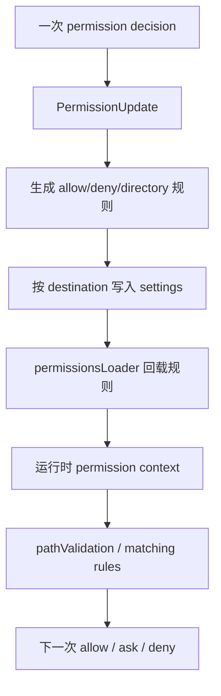

# Claude Code 源码共读笔记 82：路径权限、allow/deny 规则和 settings 持久化是怎么组成长期授权体系的

## 这篇看什么

79 到 81 已经把权限系统的两条主干立起来了：

- 79：权限系统总图
- 80：permission decision 怎么接进 tool execution 主链
- 81：为什么 BashTool 的权限判断会这么重

接下来最自然该补的，其实不是更高层的 policy limits，而是先把本地长期授权体系讲清楚。

因为 Claude Code 的权限系统并不是：

- 每次都重新问
- 问完只在当前 UI 上留个瞬时结果

它真正很重要的一层是：

> **用户的允许/拒绝，怎么沉淀成规则；规则怎么落到 settings；路径边界怎么和 allow/deny 一起组成长期授权体系。**

这篇就专门讲这件事。

也就是说，它关注的不是“某一次权限判断”，而是：

> **Claude Code 怎么把一次次 permission decision 累积成一套可持续生效、可解释、可持久化的本地权限系统。**

## 先给主结论

如果这篇只先记一句话，我会留这个版本：

> Claude Code 的长期授权体系，不是简单“记住上次你点了允许”，而是把权限抽象成规则系统：路径操作会先过 path validation，allow/deny 规则会按 destination（session / local / project / user）分层管理，`PermissionUpdate.ts` 负责把交互式决策转成规则更新，`permissionsLoader.ts` 再把 settings 里的规则装回运行时上下文。也就是说，Claude Code 持久化的不是一次点击，而是一套可解释的权限规则。**

再压缩一点，就是：

- **路径边界是权限空间基础**
- **allow/deny 规则是长期授权表达形式**
- **settings 是持久化载体**
- **loader / updater 把“运行时决策”和“长期规则”接起来**

一句最短版：

> **Claude Code 记住的不是“你同意过”，而是“以后什么样的动作在什么范围内可以被同意”。**

## 先把总图立住：长期授权体系是“路径边界 + 规则 + 持久化 + 回载”四层组合

如果把这一层画出来，我觉得更像下面这样：

这张图最关键的点是：

> Claude Code 的长期授权不是一个旁路记忆机制，而是会重新回流到下一次运行时判断里的。**

也就是说，今天你在交互里做的授权动作，会变成：

- 一条规则
- 存进某个 scope 的 settings
- 下次加载时再进运行时 context
- 最后直接影响下一次 permission decision

这说明 Claude Code 做的是完整闭环，而不是一次性缓存。

## 第一部分：路径权限是这套长期授权体系的“空间骨架”

先看 `pathValidation.ts`。

这文件在整个权限系统里特别重要，因为它回答的是：

> **一个文件相关动作，会落到文件系统的哪里，而那个位置是否允许触达。**

长期授权如果没有空间边界，几乎一定会失控。

因为用户说“允许你改这个文件”，和说“允许你改所有文件”完全不是一回事。

Claude Code 很清楚这一点，所以 path validation 的逻辑做得很细：

- 区分 read / edit
- deny 先于 allow
- 工作目录内的默认边界
- sandbox allowlist 的参与
- deny-within-allow 这种更细的反向约束
- 对 glob / shell expansion / `~root` / `$VAR` 这类 TOCTOU 风险的主动防守

### 这说明什么
说明 Claude Code 的长期授权从一开始就不是“抽象允许某类动作”，而是：

> **允许某类动作在某个空间边界内发生。**

换句话说，路径是长期授权体系的几何边界。

如果没有它，allow/deny 规则就会太粗。

## 第二部分：`PermissionUpdate.ts` 说明长期授权的核心不是记忆，而是“规则变更”

这个文件是这条线的核心之一。

因为它把一个非常关键的产品判断写死了：

> **用户在交互里做出的权限决策，系统不会只当成一次点击，而会尝试把它转换成规则更新。**

从这个文件看，Claude Code 会处理多种 update：

- 设置 mode
- 添加 allow / deny 规则
- 替换某类规则
- 删除规则
- 添加目录
- 删除目录

这意味着什么？

意味着在 Claude Code 的设计里，“权限变化”本身就是一种结构化状态变更。

不是：

- 某个 modal 返回 yes/no

而是：

- 运行时权限上下文被更新
- 可选时再持久化到某个 settings source

这个差别特别大。

### 为什么重要
因为一旦你把用户授权翻译成规则变更，就会天然获得这些能力：

- 后续可解释
- 后续可撤销
- 后续可迁移
- 后续可作用于一类相似动作，而不只是单点复现

这就是为什么我会说 Claude Code 记住的不是“你点过允许”，而是：

> **“什么规则被你明确加入了系统”。**

### 另一个关键点：destination 明确存在
这些更新不是无处安放的。

它会明确落到不同 destination：

- session
- local
- project
- user

这说明长期授权从一开始就是分层的，不存在一个“大而化之的总权限池”。

## 第三部分：`permissionsLoader.ts` 说明 settings 不是存档柜，而是运行时权限上下文的来源之一

如果只有 `PermissionUpdate.ts`，这套体系还不完整。

因为规则写进去之后，还得在下一次启动或下一轮运行时被装回来。

这就是 `permissionsLoader.ts` 的作用。

它说明 Claude Code 对 settings 的理解不是：

- 把配置写盘，方便以后看看

而是：

> **把 settings 当成权限上下文的持久化来源。**

这点非常关键。

因为它意味着 settings 里的 allow / deny / additionalDirectories 等信息，不是文档，而是运行时输入。

也就是说：

- `PermissionUpdate` 负责把决策落成规则
- `permissionsLoader` 负责把规则重新装成上下文

两者加起来，长期授权体系才闭环。

### 这也解释了为什么 Claude Code 要有 session / local / project / user 层次
因为 loader 最终要面对的问题是：

> 这一轮运行时到底该继承哪些规则？

不同 scope 的存在，就是为了让这个问题有层次化答案。

## 第四部分：`permissionRuleParser.ts` 说明规则不是内部怪结构，而是要有“可写、可读、可归一化”的表示

长期授权系统如果真的想可维护，规则本身必须能被稳定表示。

这就是 `permissionRuleParser.ts` 很重要的原因。

它在做的不是花哨工作，而是很基础但很关键的一件事：

> **把权限规则在“字符串表示”和“运行时结构表示”之间来回转换，并保持归一化。**

为什么这一步重要？

因为长期授权如果没有稳定表示，会立刻出现这些问题：

- 同一条规则写法不同但语义相同
- 删除规则时匹配不上
- 去重困难
- 持久化和回载不一致
- UI/CLI 展示难以解释

Claude Code 显然不想要这种混乱。

所以 permission rule parser 的本质作用不是 parser，而是：

> **让权限规则真正成为一种稳定的数据语言。**

这对于“长期授权体系”非常关键。

因为长期体系最怕的不是一次决策错，而是规则本身越来越脏、越来越不可维护。

## 第五部分：`PermissionRule.ts` 和 shadowed rule detection 说明 Claude Code 不是只想“能用规则”，而是想“让规则长期不烂”

这块特别能体现系统成熟度。

一个简单系统有了 allow/deny 规则之后，通常就停了。

但 Claude Code 还继续往前做了一步：

- 规则对象本身有结构定义
- 还会检查 shadowed rule / 冲突 / 被覆盖关系

这说明作者已经在面对一个真实问题：

> **一旦权限规则开始长期积累，系统怎么防止它们自己变成一团糟。**

这其实是长期授权系统必然会遇到的问题。

因为随着用户不断：

- 允许一次
- 拒绝一次
- 加一个目录
- 改一个 project 规则
- 再加一个 user 级规则

规则很容易出现：

- 重复
- 阴影覆盖
- 宽规则把窄规则吞掉
- deny / allow 之间的理解混乱

shadowed rule detection 的存在说明 Claude Code 已经开始对这个问题有自觉。

这点很重要。

因为它意味着这套系统不仅关心：

- 规则能不能跑

还关心：

- 规则长期积累后还能不能读、能不能解释、会不会相互踩踏

这是“长期授权体系”比“临时确认系统”成熟得多的地方。

## 第六部分：长期授权体系最核心的产品判断，是“权限要表达成规则，而不是记忆成例外”

如果把前面几层压一下，我觉得这篇最该留下来的产品判断就是这句：

> **Claude Code 没有选择把权限长期化做成“记住这次例外”，而是做成“把这次例外提升成规则”。**

这是非常关键的分叉。

### 如果记忆的是例外
系统会变成：

- 我以前点过一次允许
- 但为什么这次又不一样
- 我也不知道哪些东西已经被放宽了
- 规则越来越不可解释

### 如果记忆的是规则
系统就变成：

- 我允许的是哪类操作
- 落在哪个 scope
- 针对哪些路径
- 是 allow 还是 deny
- 能不能持久化、撤销、替换

Claude Code 显然选择了后者。

这就让长期授权不再像黑盒记忆，而更像：

> **一个小型本地权限管理系统。**

也正因此，它会自然需要：

- parser
- loader
- update system
- shadow detection
- settings destinations

这些结构。

## 第七部分：把这几层合在一起看，Claude Code 的本地长期授权体系其实已经很像“规则引擎雏形”了

当然，它还不是一个特别庞大的 policy engine。

但如果你把路径边界、规则表示、规则更新、settings 落盘、规则回载、shadow detection 这些东西放一起看，会发现它已经具备很多“规则引擎雏形”的特征：

- 有规则对象
- 有规则表示语言
- 有规则优先级（deny / allow 等）
- 有作用域
- 有持久化层
- 有运行时回载层
- 有冲突/阴影检测意识

这意味着 Claude Code 的权限系统，至少在本地长期授权这一块，已经不是临时拼起来的功能了。

它是有明显体系感的。

这也解释了为什么前面读 tool execution 和 BashTool 时，会发现权限系统那么重。

因为在它下面，确实已经有一套长期授权底盘在支撑。

## 一句话定义

如果让我给这篇留一个最短定义，我会写：

> Claude Code 的长期授权体系，本质上是把一次次 permission decision 转换成可解释的规则：路径边界负责定义空间范围，allow/deny 规则负责表达授权内容，`PermissionUpdate.ts` 负责把交互决策变成规则变更，`permissionsLoader.ts` 再把 settings 中的规则装回运行时上下文，因此系统持久化的不是一次点击，而是一套可长期生效的本地权限规则。**

## 术语补充 / 名词解释

### destination

权限规则落盘或生效的目标层级，例如：
- session
- local
- project
- user

它决定规则的作用范围和生命周期。

### `PermissionUpdate`

权限状态变更对象。描述的是“增加/删除/替换什么规则或目录”，而不是单次 yes/no 结果。

### `permissionsLoader`

把 settings 里的权限规则重新装成运行时 permission context 的加载层。

### permission rule parser

权限规则的表示转换层。负责在字符串形式和运行时结构之间做归一化转换。

### shadowed rule

被更宽或更高优先级规则遮蔽的规则。它的存在说明长期积累的规则可能会变脏，需要检测与整理。

## 有意思的设计点

### 1. Claude Code 记住的不是“你点过允许”，而是“你新增了一条规则”

这让权限系统变得更可解释，也更可维护。

### 2. 路径边界不是附属检查，而是长期授权的空间骨架

没有路径边界，长期授权就只能变成过粗的全局开关。

### 3. shadow detection 表明作者已经在为“长期积累后的规则可维护性”做准备

这是一种很成熟的系统意识。

## 和前面已读模块的关系

82 接在 79-81 后面刚好：

- 79：权限系统总体在管什么
- 80：permission decision 怎么接入 tool execution
- 81：为什么 BashTool 权限链这么重
- 82：本地长期授权体系怎么成立

到这里，本地权限系统的三层骨架基本齐了：

- 主链决策
- 高风险 shell 子系统
- 长期授权规则体系

## 下一步最顺怎么接

我觉得 82 之后，下一步就可以自然切到更高层了：

### 83：policy limits 是怎么把本地权限系统再往上套一层组织策略闸门的

重点可以看：

- `src/services/policyLimits/`

核心问题会是：

- 本地 permission system 和 organization-level policy 的边界是什么
- 哪些能力是本地能决定的，哪些能力会被更高层直接锁死
- Claude Code 为什么要做 fail-open / fail-closed 的区分

这会刚好把权限系统这一轮从“本地 runtime”推到“产品/组织治理层”。