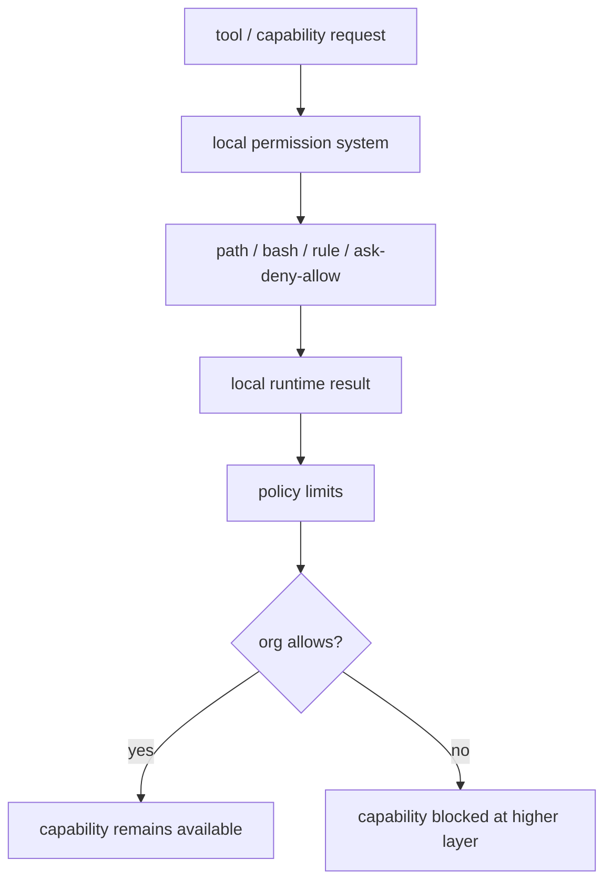

# Claude Code 源码共读笔记 83：policy limits 是怎么把本地权限系统再往上套一层组织策略闸门的

## 这篇看什么

79 到 82 这几篇，基本把 Claude Code 的**本地权限系统**讲清楚了：

- 79：权限系统总图
- 80：permission decision 怎么接进 tool execution
- 81：BashTool 为什么要有一条重权限分析链
- 82：路径权限、allow/deny 规则和 settings 持久化怎么组成长期授权体系

如果到这里停住，会很容易形成一个错觉：

> Claude Code 的权限边界，最终就是本地 runtime + 本地 settings 说了算。

但源码不是这样。

在这套本地权限系统之上，Claude Code 还专门做了一层：

> **policy limits**

这层东西非常关键，因为它说明：

- 本地能不能做，不一定是最终答案
- 用户点不点允许，也不一定是最终权威
- 某些能力会被更高层组织策略直接限制

所以这篇要回答的就是：

> **Claude Code 是怎么把本地权限系统，再往上套一层组织级策略闸门的。**

如果说前面几篇主要在讲 agent 本地 runtime 的行动边界，那 83 讲的就是：

> **更高层产品/组织治理，怎么覆盖到这个行动边界之上。**

## 先给主结论

如果这篇只先记一句话，我会留这个版本：

> Claude Code 的 `policyLimits` 并不是本地 permission system 的重复版本，而是一层更高优先级的组织策略闸门：它会从服务端拉取 organization-level restrictions，带本地缓存、重试、轮询与退化策略，并通过 `isPolicyAllowed(...)` 之类的接口让运行时能力在“本地允许”之外，再额外回答一次“组织是否允许”。也就是说，policy limits 不是再做一遍 permission check，而是在本地权限系统之上叠加一层产品级治理边界。**

再压缩一点，就是：

- **本地 permission system 管运行时边界**
- **policy limits 管组织级能力边界**

一句最短版：

> **policy limits 决定的不是“你想不想做”，而是“你所在环境被不被允许做”。**

## 先把总图立住：权限系统到这里已经变成“两层闸门”

如果把 79-83 这几篇压一下，我觉得总图更接近下面这样：

这张图里最关键的一点是：

> Claude Code 的最终能力边界，不是单层 permission system，而是本地运行时边界 + 更高层组织策略边界。**

也就是说，某个动作要真正成立，至少要同时满足：

1. 本地权限系统允许
2. 上层 policy limits 没有把这类能力锁死

这就是 policy limits 的位置。

它不是本地 permission flow 的一部分，但它在更高层决定：

- 某类能力到底是不是在产品上就可用
- 某个功能入口是不是应该直接被限制

## 第一部分：`policyLimits` 的目标不是“细粒度工具授权”，而是“组织级功能限制”

看 `src/services/policyLimits/index.ts`，第一眼就会感觉它和 `pathValidation.ts`、`PermissionUpdate.ts` 那类文件气质完全不一样。

为什么？

因为它不在处理：

- 某个具体文件能不能写
- 某条 bash 命令要不要 ask
- 某个工具调用 updatedInput 是什么

它在处理的是更上面的事情：

> **某类产品能力，在当前账号/组织环境里是否被允许。**

源码里明确举到的例子就包括：

- `allow_remote_sessions`
- `allow_product_feedback`

这说明 policy limits 的粒度不是单个 tool invocation，而更像：

- 产品功能位
- 能力开关位
- 组织治理位

所以这层的本质不是“再做一遍 permission check”，而是：

> **定义这个环境里，哪些能力从产品层面就应该被关掉。**

这也是为什么我会把它叫“组织策略闸门”，而不是“权限规则扩展包”。

## 第二部分：它是服务端下发的组织限制，不是本地硬编码规则

这点很关键。

`policyLimits/index.ts` 一上来就说明，这套东西是：

- 从 API 拉取的
- 带缓存的
- 跟 auth / account 状态相关的

这意味着 policy limits 和本地 permission rules 的最大区别之一是：

### 本地 permission rules
来源于：
- session
- local/project/user settings
- 用户或本地交互行为

### policy limits
来源于：
- 组织/服务端
- 远端策略接口
- 当前账号是否 eligible / authorized

所以 policy limits 不是让用户自己配的另一套本地限制，而是：

> **来自产品/组织管理面的外部治理输入。**

这会直接改变 Claude Code 的系统性质。

因为一旦存在这层，就说明 Claude Code 的能力边界不再只是本机 agent 的私人选择，而是已经进入：

- 团队环境
- 企业环境
- 管理员策略环境

这也是为什么前面说它更像“产品级治理层”，而不只是本地工具安全策略。

## 第三部分：`isEligibleForPolicyLimits()` 很说明问题——不是所有环境都要打这层策略链

源码里有个很重要的判断：

> 不是所有用户/环境都要去命中 policy limits endpoint。

比如：

- 3p provider users 不应该去打这个 endpoint
- custom base URL users 不应该去打

这说明 Claude Code 很清楚 policy limits 是一个**有适用范围的治理层**，而不是所有运行环境都通吃的逻辑。

这个设计很合理。

因为它承认了一个现实：

- Claude Code 可能运行在官方 SaaS / 官方账号体系里
- 也可能运行在第三方 provider / 自定义环境里

前者可能存在组织策略后端；后者未必。

所以 `policyLimits` 不是“只要有 Claude Code 就有”的本地恒定模块，而是：

> **仅在某类产品/账号上下文中才成立的组织治理能力。**

这点很重要。

它说明作者并没有把 policy limits 写成“神一样的最终规则”，而是尊重不同部署形态的边界。

## 第四部分：这套系统很重视缓存、轮询和退化策略，说明它不是一次性查询，而是持续治理输入

`policyLimits/index.ts` 很大一部分代码其实都在处理：

- 缓存文件
- 初始加载 promise
- retry / exponential backoff
- background polling
- refresh / clear / stop polling

这说明什么？

说明 policy limits 在 Claude Code 里不是“临时查一下”的小功能，而是：

> **一个会持续影响当前 session 的动态治理输入。**

### 为什么必须这样做

因为组织策略不是纯本地常量。

它可能会发生变化：

- 账号状态变化
- 组织管理员改策略
- 用户重新认证
- 缓存失效

如果系统只在启动时读一次，很快就会和真实策略状态脱节。

所以作者给它补了：

- cache
- polling
- refresh
- clear
- wait-for-initial-load

这一整套机制。

这说明 policy limits 的地位已经不是一个工具函数，而更像：

> **持续同步的策略状态源。**

这非常像企业产品里的 feature/policy control plane。

## 第五部分：`isPolicyAllowed(...)` 这个接口很简单，但它背后是“更高层允许性”的统一出口

我觉得这个函数特别值得记。

因为它把很多复杂实现压成了一个很清晰的运行时问题：

> **这个 policy key，在当前环境里允许吗？**

这个接口的价值不在于逻辑复杂，而在于它把组织策略层的复杂性都藏在后面了。

调用方不用知道：

- 缓存是不是命中了
- 网络是不是失败了
- 当前 restriction 是不是存在
- polling 有没有更新

调用方只需要问：

- `isPolicyAllowed('allow_remote_sessions')`
- `isPolicyAllowed('allow_product_feedback')`

这种 API 形态很说明问题。

它表示 policy limits 想成为的是：

> **产品能力开关的统一高层判断口。**

也就是说，本地系统其他部分只要想知道某类能力在组织层面是否可用，不必直接碰后端细节，只要走这一层就够了。

这就是控制平面接口的典型风格。

## 第六部分：fail-open / fail-closed 的区分，暴露了 Claude Code 在“安全”和“可用性”之间的明确权衡

这部分我觉得很有意思，也最能体现产品成熟度。

源码里并不是简单地说：

- 没拿到 policy，就一律拒绝

也不是：

- 没拿到 policy，就一律放过

它做得更细：

- 大部分 unknown / unavailable policy 采用 fail-open
- 但某些关键项会 fail-closed

而且源码里专门列了 `ESSENTIAL_TRAFFIC_DENY_ON_MISS` 这样的集合。

### 这说明什么

说明作者很清楚这里不是纯安全问题，而是：

> **安全、产品可用性、网络可靠性、用户体验之间的平衡问题。**

如果一律 fail-closed：
- 安全更保守
- 但一旦缓存或网络出问题，很多功能会莫名挂掉

如果一律 fail-open：
- 可用性更稳
- 但某些关键限制会在策略缺失时失效

Claude Code 选的是中间路线。

这很成熟，因为真实产品里这类系统不可能只讲原则，不讲退化行为。

所以我会把这一点总结成：

> **policy limits 不只是策略接口，还是策略故障时的退化策略系统。**

## 第七部分：从整个权限专题回看，policy limits 说明 Claude Code 的权限边界已经分成“本地 runtime 层”和“组织治理层”

如果把 79 到 83 压一下，我觉得这一轮权限线最重要的提升就在这里。

前面 79-82 主要都还是在讲：

- 本地工具调用怎么被约束
- 命令语义怎么被分析
- 规则怎么被持久化
- 路径和 allow/deny 怎么组成长期授权

而 83 补上后，一个更大的事实就完整了：

> **Claude Code 的最终权限边界，并不止于本地 runtime。**

它至少分成两层：

### 第一层：本地运行时权限系统
它管：
- 具体 tool invocation
- path / bash / ask / deny / rules
- 本地 settings 和交互授权

### 第二层：组织策略系统（policy limits）
它管：
- 某类能力是否在当前环境中根本可用
- 产品级能力位是否被更高层关闭
- 某些功能入口是否应被统一锁死

这两层一叠，就意味着 Claude Code 的权限系统已经不是单机 agent 小工具了，而是：

> **既有本地 runtime 安全边界，也有组织治理边界的产品系统。**

这点非常重要。

因为这也是为什么前面那套 permission system 会显得那么正式：

- 它不是只为单机脚本服务
- 它是在一个更大产品治理框架里工作

## 一句话定义

如果让我给这篇留一个最短定义，我会写：

> `policyLimits` 是 Claude Code 权限体系上的组织策略层：它从服务端拉取带缓存和轮询的 organization-level restrictions，并通过统一的 `isPolicyAllowed(...)` 判断口，把“本地 runtime 允许”再提升为“组织环境也允许”的双层边界；因此它不是重复本地 permission system，而是在其之上再套一层产品级治理闸门。**

## 术语补充 / 名词解释

### policy limits

组织级策略限制集合。由服务端返回，用于限制某些产品能力在当前环境中是否可用。

### eligibility

当前运行环境是否适用 policy limits 机制。并不是所有 provider / base URL / 账号环境都需要打这条策略链。

### `isPolicyAllowed(...)`

运行时统一的组织策略判断接口。调用方通过 policy key 获取“当前环境是否允许”的答案，而不直接接触缓存、轮询和网络细节。

### fail-open / fail-closed

当 policy 信息缺失、不可达或未知时，系统如何退化：
- fail-open：默认允许
- fail-closed：默认拒绝

Claude Code 对不同 policy 采用了区分处理。

## 有意思的设计点

### 1. policy limits 不是本地 permission rules 的加强版，而是另一层治理来源

一个来自用户/本地设置，一个来自组织/服务端。两者语义不同。

### 2. 它把“策略获取失败时怎么办”也当成正式系统设计的一部分

这说明作者考虑的是产品实际运行，而不是理想网络环境。

### 3. 它的适用范围是有边界的

并不是任何 Claude Code 运行环境都要走这条组织策略链，这一点处理得很克制。

## 和前面已读模块的关系

83 接在 82 后面，刚好把权限系统这一轮的主干补齐：

- 79：权限系统总图
- 80：tool execution 里的 permission decision
- 81：BashTool 高风险分析链
- 82：长期授权规则体系
- 83：组织策略闸门

到这里，Claude Code 权限系统已经基本从：

- 本地运行时
- 工具主链
- shell 高风险动作
- 长期规则体系
- 组织策略层

五层都串起来了。

## 下一步最顺怎么接

我觉得 83 写完之后，权限这条线其实已经可以正式收一轮了。

如果还继续，我更倾向只剩两个方向：

### 方向 A：做一篇权限系统总收口

也就是：

**84：为什么说 Claude Code 的权限系统本质上是在给 agent runtime 做分层行动边界**

把 79-83 压成一张总图和一个总判断。

### 方向 B：补 PermissionRequest hook 的特殊位置

也就是：

**84：PermissionRequest hook 在权限系统里到底处在什么位置**

这个更偏细节，也有价值，但我觉得优先级低于总收口。

如果只选一个，我现在更倾向 **方向 A**。