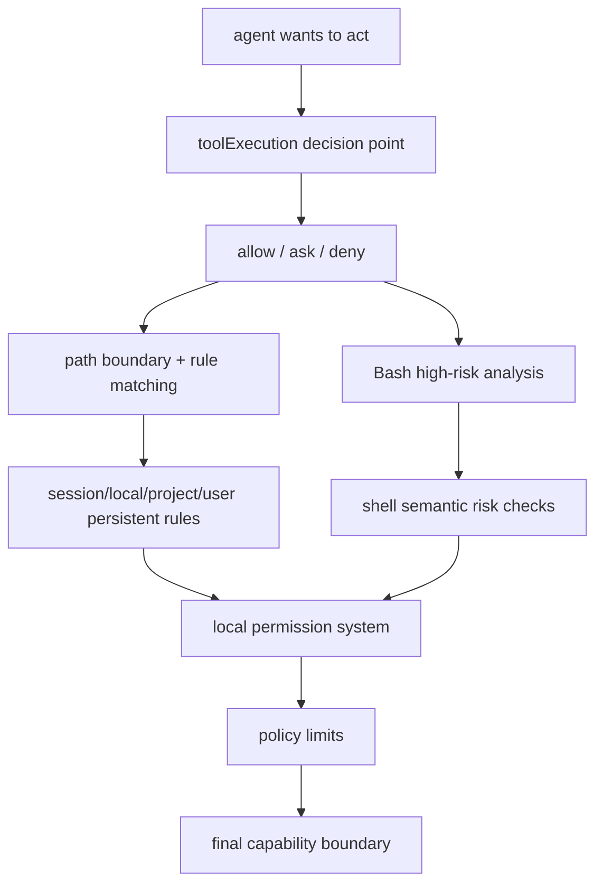

# Claude Code 源码共读笔记 84：为什么说 Claude Code 的权限系统本质上是在给 agent runtime 做分层行动边界

## 这篇看什么

这一轮权限专题，从 79 一直写到 83，其实已经把很多局部件都拆开了：

- 79：权限系统总图
- 80：tool execution 和 permission decision 的接点
- 81：BashTool 的高风险权限分析链
- 82：路径权限、allow/deny 规则和长期授权体系
- 83：policy limits 这层组织策略闸门

如果继续往下拆，当然还能写：

- PermissionRequest hook 的特殊位置
- 某些 classifier 的实现细节
- 某类 path rule 的边角行为

但到这一步，主干其实已经够完整了。

所以这篇不再追某个细节文件，而是专门做一轮收口，回答一个更大的问题：

> **为什么说 Claude Code 的权限系统，本质上不是“几个确认框 + 一些 allow/deny 规则”，而是在给整个 agent runtime 做分层行动边界。**

也就是说，这篇的目标不是补实现，而是把前面五篇压成一个更大的架构判断。

## 先给主结论

如果这篇只先记一句话，我会留这个版本：

> Claude Code 的权限系统，本质上不是一个附着在工具执行外面的 UI 审批层，而是一套围绕 agent runtime 行动边界展开的分层控制系统：它在工具主链上决定一次动作能否进入执行态，用 BashTool 的专用分析链处理高风险 shell 语义，用路径与规则系统沉淀长期授权，再在这些本地边界之上叠加组织级的 policy limits。因此它真正管理的不是“用户愿不愿意点允许”，而是“这个 agent 在当前上下文中到底拥有多大行动权力”。**

再压缩一点，就是：

- **工具执行前有决策边界**
- **高风险 shell 有专门语义边界**
- **长期规则有本地持久边界**
- **组织策略有更高层治理边界**

所以一句最短版：

> **Claude Code 的权限系统是在给 agent runtime 画一层层行动边界。**

## 先把总图立住：权限系统不是一个点，而是从 runtime 到组织治理的分层边界

如果把前面 79-83 压成一张图，我觉得更接近下面这样：

这张图想表达的其实就一句话：

> **Claude Code 的权限系统不是单层 guard，而是一套从局部工具动作一直延伸到组织策略层的分层控制结构。**

也就是说，它至少同时在回答四种问题：

1. 这次动作现在能不能执行？
2. 这条 shell 命令真实语义上是不是太危险？
3. 这次授权要不要沉淀成长期规则？
4. 就算本地愿意，组织层面是不是还允许？

把这四层放在一起，权限系统的真实位置就清楚了。

## 第一部分：第一层边界，是 tool execution 主链里的“即时行动边界”

79 和 80 里其实已经把第一层讲出来了。

Claude Code 的权限系统首先不是一个 settings 文件，也不是一个 modal，而是直接插在 `toolExecution.ts` 主链里的决策层。

这一层回答的是：

> **这次工具调用，此刻能不能进入真正执行。**

它的核心特征有几个：

- 不在执行之后，而在执行之前
- 不是布尔值，而是结构化的 `allow / ask / deny`
- 会承接 hooks / 预处理后的输入
- 还可能返回 `updatedInput`、`decisionReason`、内容块等回流信息

这说明什么？

说明 Claude Code 对权限的第一层理解就是：

> **agent 每次想做动作时，runtime 都必须先决定“你这步能不能落地”。**

所以第一层边界，其实就是**即时行动边界**。

这不是长期规则，也不是组织策略，而是每次动作要过的主链闸门。

## 第二部分：第二层边界，是 BashTool 这种高表达力工具的“语义风险边界”

如果只有第一层，其实还不够。

因为不是所有工具的风险形态都一样。

前面 81 已经讲过，BashTool 最特殊的地方在于：

- 输入看起来像一行字符串
- 实际上却是一门可组合的微型脚本语言

所以 Claude Code 对 BashTool 额外挂了一套更重的权限分析链：

- read-only validation
- prefix / classifier
- parser / shell-quote 语义对齐
- dangerous / destructive pattern detection
- sandbox / mode / path 边界补充判断

这说明权限系统第二层管的，不再只是：

- 这次动作要不要 ask

而是：

> **这类工具的语义复杂度，是不是高到必须单独建一层风险判断。**

所以我会把这层叫做：

> **语义风险边界。**

它特别适合 shell 这种高表达力能力。

也正因为有这层，你才不会把 Claude Code 的权限系统误解成“就是交互框 + 白名单”。

它其实在努力理解：

- 命令看起来在做什么
- 真实 shell 执行时可能会变成什么
- 哪些命令虽然是 bash，但本质上只读
- 哪些模式天生就该被提高风险等级

这已经是很典型的 agent 安全工程了。

## 第三部分：第三层边界，是路径与规则体系组成的“长期本地边界”

如果系统只会每次 ask，那它其实还称不上成熟。

真正成熟的一步，是 82 讲的那层：

> **把瞬时 permission decision 提升成长期规则系统。**

这里 Claude Code 做了几件很关键的事：

- 用 path validation 给权限提供空间骨架
- 用 allow/deny 规则表达长期授权内容
- 用 `PermissionUpdate.ts` 把交互决策变成规则变更
- 用 `permissionsLoader.ts` 把 settings 中的规则再装回运行时上下文
- 用 destination 把规则分到 session / local / project / user 等层次
- 还开始处理 shadowed rule 这种长期积累后的可维护性问题

这意味着 Claude Code 的权限系统不是只会说：

- 这次允许
- 下次再说

而是在说：

> **你这次的授权，要不要变成以后也能沿用的本地边界。**

所以第三层边界可以叫：

> **长期本地边界。**

它的本质是把 agent runtime 的行动约束，从单次决策扩展成可持续、可解释、可持久化的规则系统。

这也是为什么前面说 Claude Code 记住的不是“你点过允许”，而是“你新增了一条规则”。

## 第四部分：第四层边界，是 policy limits 带来的“组织治理边界”

如果权限系统只有前三层，它已经很强了，但仍然更像一套本地 runtime 安全系统。

83 补上的最后一层，才真正把它抬成产品级治理结构：

> **policy limits**

这层不是在判断：

- 某条 bash 命令危险不危险
- 某个文件能不能写
- 你之前是不是已经允许过

它判断的是更上面的问题：

- 当前组织环境允许不允许某类能力
- 这个账号上下文里某些 product capability 是否被关闭
- 某些功能位在更高层是不是就已经被锁死

它的特征也明显和前面不同：

- 来源于服务端组织策略
- 有 eligibility 边界
- 有本地缓存 / 重试 / 轮询
- 有 fail-open / fail-closed 的退化策略
- 通过 `isPolicyAllowed(...)` 这类统一接口暴露给运行时其他部分

所以第四层边界我会叫：

> **组织治理边界。**

这一层一旦存在，Claude Code 的权限系统就不再只是“我的 agent 在我电脑上能干什么”，而是：

> **这个 agent 在当前产品与组织环境里，到底被允许拥有多大能力。**

这就是产品系统和本地工具系统的本质差别之一。

## 第五部分：把这四层合在一起，Claude Code 的权限系统真正管理的是“agent 的行动权”

如果把前面四层压一下，我觉得最值得留下来的判断就是这句：

> **Claude Code 的权限系统，真正管理的不是单个工具调用，而是 agent 在不同层级上的行动权。**

为什么这么说？

因为四层边界分别回答的是：

### 即时行动边界
这次动作此刻能不能落地。

### 语义风险边界
这类高表达力命令真实上会不会太危险。

### 长期本地边界
这次允许/拒绝要不要沉淀成后续稳定规则。

### 组织治理边界
就算本地允许，当前环境是否从更高层就不让做。

这些层不是重复，而是在共同限定同一件事：

> **agent 的行动权到底被放到哪里。**

这也是为什么我会说它本质上是在给 agent runtime 做分层行动边界。

因为主角不是“某个弹窗”，也不是“某个 path rule”，而是：

> **agent 能动到什么程度。**

## 第六部分：它为什么不是“几个确认框 + 几个规则文件”

这一点如果要讲透，最简单的方法其实就是反过来比。

### 如果它只是几个确认框
那它不会需要：

- `updatedInput`
- `decisionReason`
- BashTool 专用语义分析链
- rules parser / loader / updater
- shadowed rule detection
- policy limits 缓存 / 轮询 / eligibility

### 如果它只是几个规则文件
那它也不会需要：

- 在 `toolExecution.ts` 主链中做结构化分叉
- 把 ask 做成正式 runtime 状态
- 给 shell 命令做这么重的语义近似建模
- 把组织策略单独拆成更高层控制平面

这些东西同时存在，说明 Claude Code 面对的根本不是“权限 UI 怎么做”，而是：

> **agent runtime 在真实世界里如何被约束。**

这是一个系统设计问题，不是一个交互小功能问题。

所以说到底，Claude Code 权限系统的复杂度不是“写多了”，而是它在认真解决一个复杂问题：

- 既要给 agent 足够行动力
- 又不能让它没有边界
- 还得让边界长期可持续、可治理、可被组织接管

这当然不可能只靠几个确认框解决。

## 一句话定义

如果让我给整个权限专题留一个最短定义，我会写：

> Claude Code 的权限系统，本质上是在给 agent runtime 做分层行动边界：它先在工具主链上控制一次动作是否进入执行，再对高风险 shell 语义做专项分析，把本地授权沉淀成长期规则系统，最后再叠加组织级 policy limits，因此它管理的不是表面上的“确认动作”，而是 agent 在当前上下文中实际拥有的行动权。**

## 术语补充 / 名词解释

### 行动边界

这里说的不是单一权限点，而是 agent 在不同层级上被允许行动到什么程度的整体范围。

### 即时行动边界

`toolExecution.ts` 主链里的 allow / ask / deny 分叉，决定一次工具调用此刻能否执行。

### 语义风险边界

像 BashTool 这种高表达力工具，需要额外分析其真实命令语义风险，而不只是看字符串表面。

### 长期本地边界

用户的授权/拒绝被沉淀为路径和规则系统，并持久化到 settings，影响后续会话。

### 组织治理边界

通过 `policyLimits` 从服务端引入的更高层产品/组织策略限制。即使本地愿意，也可能被更高层锁死。

## 有意思的设计点

### 1. Claude Code 没有把所有权限问题揉成“一次确认”

它允许不同风险层级有不同处理方式，这正是系统成熟的表现。

### 2. 它既关心“这次能不能做”，也关心“以后该不该继续这样做”

这让权限系统从瞬时判断升级成了长期治理系统。

### 3. 它既有本地 runtime 边界，也有组织治理边界

这让 Claude Code 的权限体系明显更像产品平台，而不是单机脚本工具。

## 和前面已读模块的关系

这篇就是对 79-83 的总收口。

如果压成一句话，顺序大概是：

- 79 立总图
- 80 立主链分叉
- 81 立 shell 高风险子系统
- 82 立长期本地规则体系
- 83 立组织治理层
- 84 给出总判断

所以如果以后要回顾 Claude Code 权限专题，我觉得这篇会是最适合放在前面的总索引之一。

## 下一步最顺怎么接

权限这条线到这里，我觉得已经可以正式收一轮了。

如果后面还继续，我觉得最顺有两个方向：

### 方向 A：切回更大的 Claude Code 总架构

把：

- tool
- agent
- hooks
- plugin
- permissions

重新拼成一张更大的 runtime 总图。

### 方向 B：补一个 PermissionRequest hook 的专题细讲

如果你觉得权限线还想再补一个细节位，那这个是最值得单开的一篇。

如果只选一个，我现在更倾向 **方向 A**。