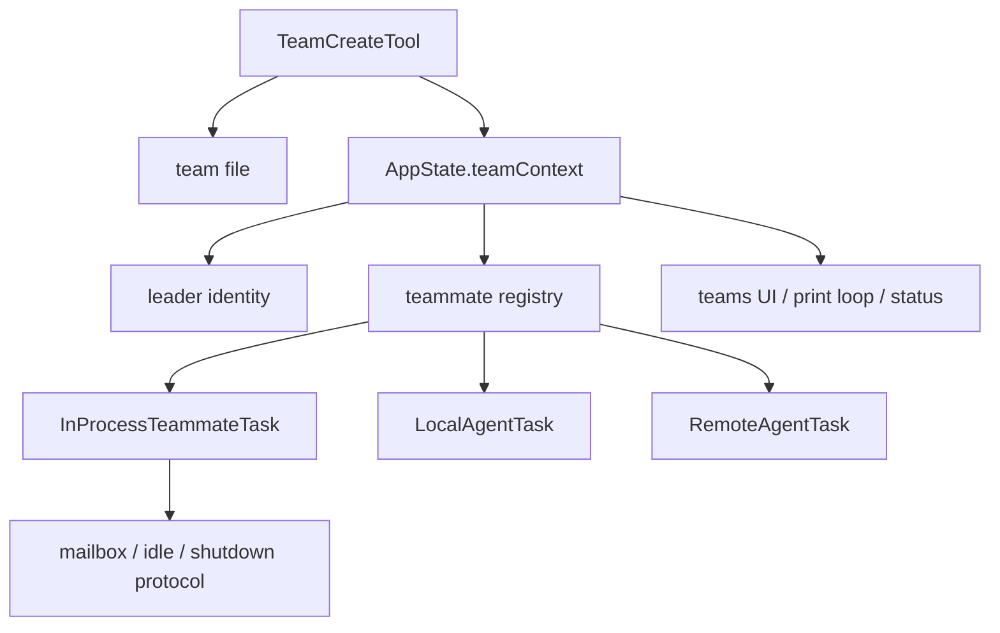

# Claude Code 源码共读笔记 85：Claude Code 的 team / teammate runtime 到底在系统里处在什么位置

## 这篇看什么

前面已经把 plugin 和 permissions 两大块都收了一轮。

接下来再往上看，一个很自然的新问题就是：

> Claude Code 里的 team / teammate，到底只是“多开几个 agent”吗？

如果只是字面理解，很容易把它想成：

- 一个 TeamCreateTool
- 多 spawn 几个 agent
- 并发干活
- 结束

但我看完这轮入口代码后的第一感觉是：完全不是这么简单。

Claude Code 这里做的，不是一个“并发 AgentTool 小功能”，而是更像：

> **一个带 leader、teammate 身份、team file、task runtime、mailbox 通信和 UI 状态的 swarm runtime。**

所以这篇先不急着钻 InProcessTeammateTask 或 mailbox 细节，而是先把总图立住：

- team / teammate 在系统里到底处于什么层
- 它和 agent / subagent / task / local agent / remote agent 的关系是什么
- 为什么这块值得被当成一个新专题，而不是 agent 线的边角料

## 先给主结论

如果这篇只先记一句话，我会留这个版本：

> Claude Code 的 team / teammate 机制，本质上不是“多开几个 agent”，而是一套独立的 swarm runtime：`TeamCreateTool` 负责把 team 作为持久对象注册进系统，`teamContext` 负责把它接入 AppState，`teammate.ts` 负责在 leader / teammate / standalone 之间建立身份语义，`teamHelpers.ts` 负责 team file 和成员元数据的落盘与维护，而真正干活的 teammate / local / remote agent task 则在这套 team runtime 上继续承载执行。也就是说，team 不是 agent 的附庸，而是 Claude Code 里一层专门的多 agent 协作运行时。**

再压缩一点，就是：

- **agent 是执行体**
- **task 是承载体**
- **team / teammate 是协作运行时层**

一句最短版：

> **Claude Code 的 team 不是几个 agent 的集合，而是一个 swarm runtime。**

## 先把总图立住：它不是单工具功能，而是跨 tool / state / task / mailbox 的一层 runtime

如果把我现在看到的结构压成一张图，大概更像下面这样：

这张图里最重要的点是：

> team 不是一个调用点，而是一层横跨创建、身份、任务承载、状态展示和收尾协议的 runtime 组织结构。**

这也是为什么我觉得这块该单独成专题。

因为它不是某个函数的“顺手扩展”，而是在 Claude Code 内部专门长出来的一套多 agent 协作框架。

## 第一部分：`TeamCreateTool` 说明 team 在 Claude Code 里是正式对象，不是临时数组

最值得先看的入口就是 `src/tools/TeamCreateTool/TeamCreateTool.ts`。

这个文件一眼就能看出很多信息。

如果 team 只是临时并发几个 agent，它根本不需要这么多结构。

但实际上一创建 team，就会发生这些事：

- 生成 `team_name`
- 生成 deterministic 的 `leadAgentId`
- 写 `teamFile`
- 记录 `leadSessionId`
- 初始化 task 目录
- 把 teamName 注册进 task list / leader context
- 更新 `AppState.teamContext`
- 注册 session cleanup

这说明什么？

说明 Claude Code 从一开始就没把 team 当成“几个子任务的临时分组”，而是：

> **一个有名字、有文件、有 leader、有状态、有后续清理责任的正式运行时对象。**

这一点特别重要。

因为它把 team 从“逻辑概念”抬成了“系统对象”。

也正因为它是正式对象，才需要：

- team file
- leader id
- task directory
- cleanup lifecycle
- UI teamContext

所以只看 TeamCreateTool，你就已经能知道：

> team 在 Claude Code 里不是一个 convenience wrapper，而是一层持久运行时容器。**

## 第二部分：`teammate.ts` 说明 Claude Code 专门为“team 中的 agent 身份”建了一层语义

这块是我觉得很有意思的地方。

在很多系统里，多 agent 只要有 task id 或 session id 就够了。

但 Claude Code 显然不满足于这个层级。

`src/utils/teammate.ts` 做的事情非常明确：

- 区分 standalone / teammate / team lead
- 提供 `getAgentId()` / `getAgentName()` / `getTeamName()`
- 处理 `dynamicTeamContext`
- 优先级上支持 AsyncLocalStorage 的 in-process teammate context
- 支持 plan mode required / parent session id / color 等 teammate 属性

这意味着什么？

意味着 Claude Code 不是把“team 里的 agent”当成普通 agent 加一个 tag，而是在系统语义上明确承认：

> **teammate 是一种特殊运行身份。**

这很关键。

因为只要“身份”被专门建模，后面很多东西才说得通：

- 谁是 leader
- 谁属于某个 team
- 哪些 stop hooks 只对 teammate 有意义
- 哪些消息应该走 mailbox
- 哪些 analytics 应该记为 teammate / standalone / subagent

所以 teammate.ts 的意义不是几个 getter，而是：

> **给 swarm runtime 里的 agent 提供专门身份语义。**

这层一旦存在，team runtime 就和普通 background agent runtime 分开了。

## 第三部分：`AppStateStore.teamContext` 说明 team 已经进入前台状态模型，而不只是后台实现细节

这点也很重要。

在 `src/state/AppStateStore.ts` 里，teamContext 不是一个不起眼的字段。

它里面有：

- `teamName`
- `teamFilePath`
- `leadAgentId`
- `selfAgentName`
- `isLeader`
- `teammates` 映射

每个 teammate 还会带：

- name
- agentType
- color
- tmux / pane / cwd / spawnedAt 等信息

这说明 Claude Code 对 team 的理解已经不是：

- 后台有人在跑

而是：

> **team 是一个前台可见、可操作、可浏览、可切换视图的状态域。**

这个判断很关键。

因为一旦某个能力进入 AppState 的正式结构，它就说明这不是实现细节，而是产品结构。

也就是说，team runtime 不是某个 tool call 的副产物，而是已经进入：

- UI
- 状态管理
- 交互导航
- teammates 视图

这些用户可感知层。

这就是“运行时层”而不是“工具小功能”的证据之一。

## 第四部分：`teamHelpers.ts` 说明 team 还有一层持久化协作基础设施

如果 TeamCreateTool 是入口，`teamHelpers.ts` 就是这套系统的基础设施层。

这个文件一眼就能看出，Claude Code 对 team 的处理很正式：

- 有 `TeamFile` 类型
- 有 `members` 列表
- 记录 lead、session、model、prompt、backendType、mode、worktreePath 等成员元数据
- 有 teamAllowedPaths
- 有 hiddenPaneIds
- 有同步/异步读写 team file
- 有 remove teammate / hidden pane 管理 / cleanup 辅助

这说明 team 在 Claude Code 里并不是“进程内临时数据结构”，而是：

> **有磁盘落地、有成员注册表、有后续协作辅助状态的持久对象。**

这很像什么？

其实很像一个轻量的 swarm control file。

它不是数据库，但已经承担了：

- team 元数据
- 成员关系
- 协作边界
- 清理责任
- 视图管理辅助状态

所以如果只从系统角色看，teamHelpers 更像：

> **team runtime 的本地控制面。**

这个判断我觉得很重要。

因为它说明 Claude Code 的 swarm 不是“多开几个子进程大家各干各的”，而是有一个共享控制对象在背后维系秩序。

## 第五部分：从任务类型分布看，team runtime 不是只管 teammate，而是在更大的 agent runtime 世界里占一层协调位

我这轮额外看了几个 task 入口，感觉更明确了。

目前至少能看到三类承载体：

- `InProcessTeammateTask`
- `LocalAgentTask`
- `RemoteAgentTask`

这说明 Claude Code 内部并不是只有一种“agent 在运行”。

而 team / teammate 这一层的价值，不只是开 teammates，而是：

> **在更大的 agent task 世界里，给 swarm 协作定义一层专门的组织结构。**

换句话说：

- `LocalAgentTask` 更像本地后台 agent 任务
- `RemoteAgentTask` 更像远程 session / remote review / ultraplan 那一支
- `InProcessTeammateTask` 才最像 swarm teammate 本体

而 team runtime 的位置，恰恰就是把其中“属于 swarm 协作”的那一部分抽出来，做成一个单独层。

所以它不是跟 Local/Remote/AgentTool 平级的一块工具，而更像：

> **在 agent task 生态之上，新增了一个 team-oriented orchestration layer。**

这也是为什么我觉得后面必须单独开几篇去讲任务承载和边界，不然很容易混。

## 第六部分：我现在对这块的核心判断是——它更像 swarm runtime，而不是 agent team feature

如果把前面这些观察压一下，我觉得最值得留下来的不是某个文件名，而是这个判断：

> **Claude Code 这里更像“swarm runtime”，而不是普通意义上的 agent team feature。**

为什么我这样说？

因为它已经同时具备：

### 1. 正式创建入口
TeamCreateTool / TeamDeleteTool 不是临时命令，而是 team 生命周期入口。

### 2. 专门身份语义
teammate、leader、standalone 都被区分出来了。

### 3. 正式状态模型
teamContext 进入 AppState。

### 4. 本地控制面
team file / members / allowed paths / hidden panes / cleanup 都有基础设施。

### 5. 多任务承载接口
真正执行层落在 InProcessTeammateTask / LocalAgentTask / RemoteAgentTask。

### 6. 后续显然还有通信协议
mailbox、idle、shutdown、leader polling 这些线索已经很明显了。

这些东西放一起，就很难再把它看成“多 agent 功能”了。

它更像是一套：

> **leader-led swarm coordination runtime.**

## 一句话定义

如果让我给这篇留一个最短定义，我会写：

> Claude Code 的 team / teammate 机制，本质上是一层 swarm runtime：它把 team 作为正式对象创建并落盘，用 teamContext 接入前台状态，用 teammate 身份语义区分 leader 与成员，再把具体执行委托给不同 agent task 承载体，因此它不是“多开几个 agent”，而是 Claude Code 内部一套独立的多 agent 协作运行时。**

## 术语补充 / 名词解释

### team

在这里不是一个抽象概念，而是会被 `TeamCreateTool` 创建、写入 team file、注册进 AppState 的正式运行时对象。

### teammate

不是普通 agent 的别名，而是 team runtime 里的专门身份。带 teamName、agentId、parentSessionId、planModeRequired 等上下文。

### teamContext

AppState 里的 team 状态域。用于把 team / teammates 暴露给 UI、状态管理和交互层。

### team file

磁盘上的本地控制文件。记录 team 元数据、成员、allowed paths、hidden pane 等协作状态。

### swarm runtime

这里指的是：leader、成员、状态、协作协议、任务承载和清理责任组成的一整套多 agent 运行时，而不只是并发调用能力。

## 有意思的设计点

### 1. team 从一开始就被做成正式对象，而不是临时并发分组

这让后续的 cleanup、成员管理、UI 展示、协作协议都有稳定挂点。

### 2. Claude Code 对“teammate 身份”非常认真

不是简单 agentId 打个标签，而是专门建了一层 teammate 语义。

### 3. 这块明显是横跨 tool / state / task / mailbox / UI 的系统层

所以它值得单开专题，而不是塞进 agent 线里顺手讲。

## 和前面已读模块的关系

这篇很适合接在前面的 agent / subagent、plugin、permissions 后面。

因为到这里，你已经有足够背景去理解：

- agent 是什么
- task 是什么
- hooks / permissions / plugin 这些能力层分别在哪

而 team / teammate 这一层，实际上是在这些之上再搭一个协作运行时。

所以它更像下一阶段，而不是前面任何一个专题的附属品。

## 下一步最顺怎么接

这篇把总图立住之后，下一步最顺我觉得就是：

### **86：TeamCreateTool / TeamDeleteTool——team 是怎么被创建、注册和清理的**

因为现在“team 是正式对象”这个判断已经立住了，最自然就是去看它的生命周期外壳怎么落地。

再往后，才适合继续拆：

- InProcessTeammateTask
- mailbox / idle / shutdown 协议
- LocalAgentTask / RemoteAgentTask 和 teammate 的边界