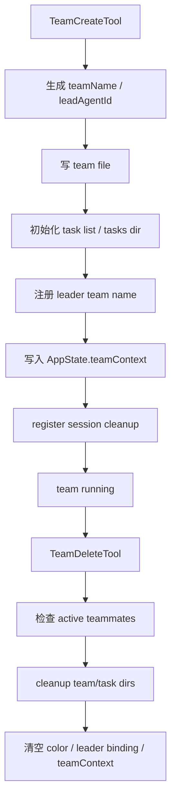

# Claude Code 源码共读笔记 86：TeamCreateTool / TeamDeleteTool：team 是怎么被创建、注册和清理的

## 这篇看什么

85 已经先把一个大判断立住了：

> Claude Code 的 team / teammate，不是“多开几个 agent”，而是一层独立的 swarm runtime。

那下一步最自然的问题就是：

> 这个 swarm runtime 作为正式对象，到底是怎么被创建、注册、接入系统，再在结束时被清理掉的？

这件事主要看三块：

- `TeamCreateTool.ts`
- `TeamDeleteTool.ts`
- `teamHelpers.ts`

再加一点 `tasks.ts`。

这一篇不谈 teammate 如何跑，也不谈 mailbox 协议，而是专门讲：

> **team 作为一个正式对象，它的生命周期外壳是怎么落地的。**

换句话说，这篇讲的是 team 的**对象生命周期层**。

## 先给主结论

如果这篇只先记一句话，我会留这个版本：

> Claude Code 并不是在需要多 agent 时临时组个数组，而是用 `TeamCreateTool` 把 team 正式创建成一个带 team file、leadAgentId、task list、AppState.teamContext 和 session cleanup 记录的运行时对象；再用 `TeamDeleteTool` 在成员安全退出后统一清理 team 目录、task 目录、颜色状态和 leader 绑定。也就是说，team 的生命周期不是“spawn 完就算有、停掉就算没”，而是明确被做成了创建 → 注册 → 运行 → 安全清理的完整对象流程。**

再压缩一点，就是：

- **TeamCreateTool 负责把 team 变成系统对象**
- **TeamDeleteTool 负责把它安全退场**

一句最短版：

> **Claude Code 把 team 当成有完整生命周期的正式运行时对象。**

## 先把总图立住：team 生命周期不是一个工具调用，而是一串系统注册动作

如果把 create / delete 这条线画出来，我觉得更接近下面这样：

这张图里最关键的点是：

> team 不是一个逻辑概念，而是会被写盘、注册状态、占用任务命名空间、绑定 leader，并最终被系统性清理掉的对象。**

所以它的 create/delete 不是普通工具调用，而是 lifecycle transition。

## 第一部分：`TeamCreateTool` 的第一件事不是 spawn teammate，而是“先确认 team 这个对象能成立”

我觉得这点很重要。

如果系统粗糙，它可能会直接：

- 来一个 team_name
- 然后开始 spawn 成员

但 `TeamCreateTool.ts` 一上来处理的不是“启动 worker”，而是 team 本身的合法性和唯一性。

### 这里有两个关键动作

#### 1. leader 只能同时带一个 team
它会先检查当前 `AppState.teamContext` 有没有 existing team。

这说明 Claude Code 不允许 leader session 同时管理多个 team。

这个限制其实非常合理。

因为一旦允许一个 leader 挂多个 team，很多东西都会立刻变复杂：

- task list 归属
- mailbox 路由
- teamContext UI
- cleanup responsibility
- shutdown 流程

所以 Claude Code 在入口就把这个复杂性砍掉了。

这表明作者对 team 的理解不是“可随便堆加的标签”，而是：

> **一次 session 里 leader 只管理一个 swarm 容器。**

#### 2. team name 冲突时不会硬失败，而是生成 unique name
这个细节也很有意思。

`generateUniqueTeamName(...)` 不是直接报错，而是会在 team 已存在时生成一个新的 slug。

这说明 Claude Code 更偏向：

- 创建操作尽量成功
- 但 team 作为正式对象必须保持唯一命名

这是一种比较“产品化”的选择。

## 第二部分：`leadAgentId` 很关键，它说明 team 从一开始就是有“中心身份”的

创建 team 时，Claude Code 会立刻生成：

- `leadAgentId`
- `leadAgentType`
- `leadModel`

并写进 team file。

这件事不是装饰。

它其实在说明：

> team 的结构从一开始就不是对称的，而是 leader-centered。**

也就是说，team 不是一组平等 agent 的集合，而是：

- 一个 leader
- 若干成员
- 由 leader session 驱动的 swarm

这点和前面 `teammate.ts` 的身份语义是完全对上的。

所以 `leadAgentId` 的意义不只是“记录一下谁创建的”，而是：

> **team 的组织中心从创建那一刻就被显式固定了。**

后面很多逻辑，包括：

- teamContext.leadAgentId
- isTeamLead
- leader 轮询消息
- team cleanup 责任

都会围着这个中心身份展开。

## 第三部分：team file 是这条生命周期最关键的落地点，它把 team 从内存概念变成持久对象

创建 team 时最关键的一步，其实不是 setAppState，而是：

> `writeTeamFileAsync(finalTeamName, teamFile)`

因为只要 team file 一落地，team 就已经不再只是当前函数里的几个变量了。

### team file 里装了什么
从 `TeamFile` 结构看，至少包括：

- name
- description
- createdAt
- leadAgentId
- leadSessionId
- members
- hiddenPaneIds
- teamAllowedPaths

而且初始 members 里会先写入 leader 自己。

这说明 team file 不是“以后可能用到的配置文件”，而是：

> **team runtime 的初始控制文件。**

有了它，系统后面才有稳定锚点去做：

- 成员加入/移除
- allowed path 共享
- pane 显隐
- leader 发现
- session cleanup

所以我会把 team file 看成 team 生命周期里的第一块硬地基。

没有它，team 只是瞬时状态；有了它，team 才成了正式对象。

## 第四部分：`resetTaskList` / `ensureTasksDir` / `setLeaderTeamName` 说明 team 创建不只是写一个 swarm config，而是顺手重建“任务命名空间”

这部分很容易被低估，但我觉得非常关键。

TeamCreateTool 里创建 team 之后，不只是写 team file，它还会：

- `resetTaskList(taskListId)`
- `ensureTasksDir(taskListId)`
- `setLeaderTeamName(sanitizeName(finalTeamName))`

这说明什么？

说明 Claude Code 里的 team 并不只是一个协作关系对象，它还会：

> **重设 leader 这边的任务空间。**

这点很重要。

因为 swarm 一旦形成，后面的 task 编号、task 输出、task list 归属，都不再只是 leader session 自己的默认 namespace，而要切到 team namespace。

源码里的注释已经写得很直：

- 如果不把 leader team name 注册进去，leader 会回退到 session ID
- 那它写出来的 tasks 目录就会和 tmux / iTerm2 teammates 预期的不一致

也就是说，team create 的一个关键动作其实是：

> **把 leader 从原来的单 session task 世界，切到 team task 世界。**

这个动作非常“运行时层”。

它说明 team 不是在已有 task 世界上额外挂一层说明，而是会真实改变任务命名空间。

## 第五部分：`AppState.teamContext` 的写入，说明创建成功不只是磁盘层完成，还要进入前台状态层

如果 team file 是持久控制面，那 `setAppState(... teamContext ...)` 就是把 team 接进前台 runtime 状态。

这里写进去的内容包括：

- teamName
- teamFilePath
- leadAgentId
- teammates（先放 leader 自己）

这一步的意义是：

> team 创建成功不是“后台有文件了”，而是“前台状态世界里也出现了一个 team 域”。**

这会直接影响：

- UI 里的 teams 视图
- status / spinner / teammate 视图
- print.ts 的 leader 行为
- 后续 teammate 加入时的状态更新

所以 create 并不是单一写盘动作，而是双注册：

- 写 team file
- 写 AppState.teamContext

少一边都不完整。

## 第六部分：`registerTeamForSessionCleanup(...)` 说明作者很清楚“team 是会泄漏的对象”，所以必须显式挂清理责任

这个细节我特别喜欢。

创建 team 之后，Claude Code 不会假装“以后肯定有人记得删”。

它会立刻：

- `registerTeamForSessionCleanup(finalTeamName)`

源码注释写得很明确：

- 否则 team 会一直留在磁盘上
- 除非显式 TeamDelete

这说明作者对 team 的理解非常现实：

> **team 不是只在内存里活的，它会留下真实文件和目录，所以如果不挂清理责任，就会变成垃圾对象。**

这也是为什么我说 team 是正式对象。

因为只有正式对象，才会有：

- 创建责任
- 使用责任
- 清理责任

而 `registerTeamForSessionCleanup` 就是在给 team lifecycle 补最后一块保险。

## 第七部分：`TeamDeleteTool` 说明 delete 不是直接 rm，而是“安全退场协议”的起点

再看 `TeamDeleteTool.ts`，会发现它的设计也很稳。

它不是：

- 看到 teamName
- 直接删目录

而是先检查：

- team file 里还有没有非 lead 成员
- 这些成员是不是 active
- 如果还有 active members，就拒绝 cleanup
- 提示先用 `requestShutdown` 让 teammates 优雅退出

这说明 TeamDelete 的本质不是“删配置”，而是：

> **team 生命周期的安全退场操作。**

这个点非常关键。

因为 team 一旦有活跃成员，强删的后果会很糟：

- task 所属关系失真
- mailbox / shutdown 协议断裂
- UI 状态和磁盘状态不同步
- 活跃 teammate 还在跑，但控制面没了

所以 Claude Code 在这里明确选择：

- 安全退场优先
- 即使这意味着 delete 不一定一次成功

这非常符合 swarm runtime 的设计逻辑。

## 第八部分：真正的 cleanup 不是删 team file 一步，而是一整组“解除绑定”动作

TeamDelete 真正完成 cleanup 时，也不是只有删目录。

它至少会做：

- `cleanupTeamDirectories(teamName)`
- `unregisterTeamForSessionCleanup(teamName)`
- `clearTeammateColors()`
- `clearLeaderTeamName()`
- 清掉 `AppState.teamContext`
- 清掉 inbox messages

这说明 cleanup 在 Claude Code 里真正清的是：

### 1. 磁盘对象
team dir / tasks dir / 相关落地状态。

### 2. 运行时注册
session cleanup registry 不该再追这个 team。

### 3. UI / 状态绑定
teamContext、颜色、inbox 都要退出当前状态世界。

### 4. 任务命名空间绑定
leader team name 清掉后，task 世界要回退到普通 session 模式。

也就是说，delete 不只是删除对象，而是在做：

> **把 leader 从 swarm runtime 重新解绑回普通 runtime。**

这点很有意思，也很值得记。

## 一句话定义

如果让我给这篇留一个最短定义，我会写：

> `TeamCreateTool` / `TeamDeleteTool` 负责的不是简单建删配置，而是 Claude Code 中 team 对象的完整生命周期：创建时把 team 写成带 leader、members、task namespace 和 AppState 注册的正式运行时对象；删除时又在确认成员安全退出后，统一清理磁盘对象、状态绑定和 leader 的 team 归属，因此 team 在系统里是有完整 create → register → run → cleanup 流程的。**

## 术语补充 / 名词解释

### team file

team 的本地控制文件。不是附属配置，而是 swarm runtime 的持久锚点。

### leadAgentId

team 的中心身份标识。说明 team 结构天然是 leader-centered，而不是对称 mesh。

### task namespace

team 创建后，leader 的任务空间会切到 team 维度，不再只是原来的 session 维度。

### session cleanup registry

会话结束时的清理登记表。防止 team 对象遗留在磁盘上变成垃圾状态。

## 有意思的设计点

### 1. team 创建时顺手重建了任务命名空间

这说明 team 不是“协作标签”，而是会真实改变 runtime 任务组织方式。

### 2. delete 被设计成安全退场，而不是强制删除

这很像真正的 swarm runtime，而不是普通配置项。

### 3. cleanup 清的不只是文件，还包括 leader 和 team runtime 的绑定关系

所以本质上是在“退出 swarm 模式”。

## 和前面已读模块的关系

86 接在 85 后面正好：

- 85：先回答 team / teammate runtime 在系统里是什么
- 86：再回答它作为正式对象怎么被创建、注册和清理

这样后面再去看：

- InProcessTeammateTask
- mailbox / idle / shutdown 协议
- Local / Remote / Teammate 边界

就会顺很多，因为 team 生命周期外壳已经先立住了。

## 下一步最顺怎么接

这篇写完之后，下一步最顺我觉得就是：

### **87：InProcessTeammateTask——真正的 teammate runtime 是怎么在同进程里跑起来的**

因为到这一步，team 外壳已经清楚了，最自然就是去看真正“队友本体”怎么运行。