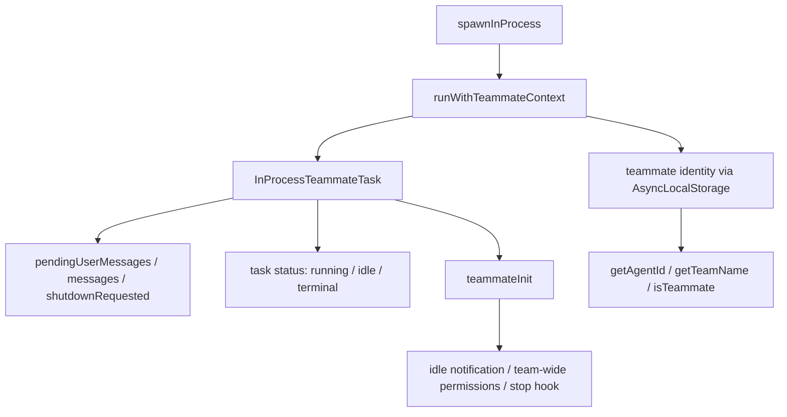

# Claude Code 源码共读笔记 87：InProcessTeammateTask：真正的 teammate runtime 是怎么在同进程里跑起来的

## 这篇看什么

85 先把总判断立住了：

> team / teammate 不是多开几个 agent，而是一层 swarm runtime。

86 又把 team 作为正式对象的生命周期外壳讲清楚了：

- 怎么创建
- 怎么注册
- 怎么清理

那接下来最自然的问题就是：

> team 建好了以后，真正干活的 teammate 本体到底怎么跑？

这一块里最关键的入口就是：

- `InProcessTeammateTask`
- `teammateContext.ts`
- `teammateInit.ts`
- `spawnInProcess.ts`

也是从这一层开始，你会真正感觉到：

> Claude Code 做的不是“几个后台 agent”，而是“在同一个 Node.js 进程里跑出多个有独立身份的 teammate 运行体”。

所以这篇重点不讲 TeamCreateTool，也不讲 mailbox 细节，而是专门回答：

> **真正的 teammate runtime，是怎么在同进程里跑起来的。**

## 先给主结论

如果这篇只先记一句话，我会留这个版本：

> `InProcessTeammateTask` 不是普通 background task 的一个变体，而是 Claude Code swarm runtime 的 teammate 承载体：它把 teammate 作为一种长期存在的任务类型放进 Task 框架中，用 `teammateContext` 的 AsyncLocalStorage 给同进程并发运行的队友提供身份隔离，用 `spawnInProcess.ts` 负责拉起实际执行，用 `teammateInit.ts` 在会话层补上 idle 通知和 team-wide permission 注入。也就是说，Claude Code 的 in-process teammate 不是“共享进程里的几段逻辑”，而是共享进程、隔离身份、共享 team 协议的一组正式运行体。**

再压缩一点，就是：

- **Task 框架给 teammate 提供承载壳**
- **AsyncLocalStorage 给 teammate 提供身份隔离**
- **swarm init 给 teammate 接上 team 协议**

一句最短版：

> **InProcessTeammateTask 是 Claude Code 在同进程里跑 swarm teammate 的正式 runtime 壳。**

## 先把总图立住：它不是简单 task，而是“task 壳 + 身份上下文 + team 协议”的组合

如果把这一层画出来，我觉得更像下面这样：

这张图里最重要的点是：

> 同进程 teammate runtime 不是一个东西，而是三层叠起来的：任务承载、身份隔离、team 协议接入。**

少一层都不完整：

- 没 task 壳，就没有状态、消息和 shutdown 管理
- 没身份隔离，就没法在同一进程里安全地区分多个 teammate
- 没 team 协议接入，就只是普通 agent，不是 swarm teammate

## 第一部分：`InProcessTeammateTask` 的核心意义，不是“能 kill”，而是“把 teammate 放进正式 Task 世界”

粗看 `InProcessTeammateTask.tsx`，代码量不算大，容易让人误判它只是个轻薄 wrapper。

但我觉得它最重要的价值不是函数多，而是位置对。

它把 teammate 定义成：

- `type: 'in_process_teammate'`
- 有自己专门的 task state
- 能被 kill
- 能被注入消息
- 能维护 message transcript
- 能标记 shutdownRequested
- 能区分 running / idle / terminal

这意味着什么？

意味着 Claude Code 没把 teammate 设计成：

- 普通函数调用
- 某个 agent 的内层协程
- 临时副线程

而是：

> **正式进入了 Task 抽象。**

这个选择非常关键。

因为一旦进入 Task 世界，后面很多东西就都有稳定挂点：

- UI 里怎么看 teammate
- transcript 怎么 zoom 进去看
- 输入怎么注入
- shutdown 怎么走
- spinner / 状态 / task 面板怎么展示

所以 `InProcessTeammateTask` 的真正意义不是“定义一个 task type”，而是：

> **把 teammate 变成 Claude Code 运行时里的一等任务对象。**

## 第二部分：它不是一次性任务，而更像“长生命周期、可 idle 的协作体”

`InProcessTeammateTask.tsx` 里有几个信号特别重要：

- `shutdownRequested`
- `pendingUserMessages`
- `messages`
- `isIdle`
- `findTeammateTaskByAgentId`
- `getRunningTeammatesSorted`

这些字段和 helper 放在一起，说明它不像一次性 background task。

### 为什么这么说

如果只是“一次干完就退出”的任务，通常不会这么强调：

- 可继续收消息
- transcript 持续追加
- 从 idle 再被叫醒
- 通过 agentId 找到当前还活着的同一个 teammate

这说明 Claude Code 对 teammate 的想象更像：

> **一个可以暂时空闲、但仍属于 team runtime 的长期协作体。**

这点跟前面 TeamDeleteTool 的“不能在 active teammate 还活着时直接 cleanup”是完全一致的。

也就是说，team 里的 teammate 不是短命 worker，而更像：

- 会话内长期存在
- 有持续身份
- 可多轮交互
- 能在 idle/running 之间切换

这就比普通 agent task 更接近“协作成员”。

## 第三部分：`pendingUserMessages` 这个设计很说明问题——teammate 不是纯自动 worker，而是可被重新对话的运行体

我觉得这个细节特别值得记。

`injectUserMessageToTeammate(...)` 会把消息塞进 `pendingUserMessages`，同时追加到 `messages` transcript 里。

这件事的含义很大。

因为它说明 teammate 不是：

- 启动之后封闭执行
- 外部只能等结果

而是：

> **运行过程中可以被继续对话、继续下发消息、继续协商。**

这点很关键。

它让 teammate 更像 team 里的一个活跃成员，而不是单向 worker。

所以 Claude Code 对 teammate 的抽象不是：

- 异步函数

而更像：

- 一个可持续收消息的 agent endpoint

这个判断一旦立住，后面你再看 mailbox、leader polling、transcript view，就会特别顺。

## 第四部分：真正让“同进程多 teammate”成立的关键，是 `teammateContext.ts` 里的 AsyncLocalStorage

如果只看 Task 层，你可能会问：

> 同一个 Node.js 进程里怎么跑多个 teammate，还不把身份搞串？

答案就在 `src/utils/teammateContext.ts`。

这层的意义非常明确：

> **用 AsyncLocalStorage 给每个 in-process teammate 提供隔离上下文。**

这就是整个 in-process teammate runtime 的核心技术支点。

### 它解决了什么问题

同一进程里多个 teammate 会共享很多全局代码路径。

如果没有上下文隔离，这些 getter 就会混掉：

- `getAgentId()`
- `getAgentName()`
- `getTeamName()`
- `getParentSessionId()`
- `isTeammate()`
- `isPlanModeRequired()`

而 `teammate.ts` 已经把优先级写得很清楚了：

- 优先 AsyncLocalStorage context
- 再 fallback 到 dynamicTeamContext

这说明作者对这层关系非常明确：

> **in-process teammate 是第一等身份来源，tmux / CLI 动态上下文只是后备。**

所以真正让“同进程 swarm”成立的，不是 spawn，而是：

> **身份隔离上下文。**

这点是整条线最值得记住的技术点之一。

## 第五部分：`spawnInProcess.ts` 说明 teammate 不是直接调用函数，而是有明确的拉起与终止控制

这层我现在只是初读，但信号已经很明显。

从 `spawnInProcess.ts` 和 `InProcessTeammateTask.kill(...)` 的关系看，Claude Code 对 in-process teammate 的处理不是：

- 某个函数自己跑完算了

而是：

- 有显式 spawn
- 有显式 kill
- 有 taskId 级别的生命周期控制

这说明 in-process teammate 虽然和 leader 在一个进程里，但它并不是 leader 代码路径中的“普通分支”。

它更像：

> **一个由 task framework 托管的、进程内独立运行单元。**

也就是说，“in-process”不代表“随便跑在一起”，而是：

- 共享进程
- 但有独立 task 控制
- 有独立身份上下文
- 有独立 team 协议接入

这是一个非常克制、也很工程的设计。

## 第六部分：`teammateInit.ts` 很关键，它说明 teammate runtime 不只要能跑，还得自动接上 team 规则和 idle 协议

如果到这里为止，teammate 还只是：

- 一个 task
- 一个上下文

那它仍然不算真正的 team 成员。

真正让它“像 teammate”的，是 `teammateInit.ts` 干的这些事：

### 1. 注入 team-wide allowed paths
如果 team file 里有 `teamAllowedPaths`，它会把这些规则通过 `applyPermissionUpdate(...)` 加到 session permission context 里。

这件事很重要。

因为它说明 team 协作不是只有“谁在一队里”，还会影响：

> **teammate 默认能动哪些共享路径。**

也就是说，team 不是纯组织关系，它还会回流到 permission system。

这个点非常漂亮，因为它把你前面读过的 swarm 和 permissions 线接起来了。

### 2. 注册 Stop hook，在 idle 时通知 leader
`teammateInit` 会给非 leader 成员注册 Stop hook，并在 stop 时：

- 标记自己 idle
- 给 leader 发 idle notification

这意味着 teammate runtime 不是“结束就消失”，而是：

> **结束/空闲这件事本身，也是 team 协议的一部分。**

这就和普通 LocalAgentTask 很不一样了。

普通 task 结束通常只意味着结束；
但 teammate 的 stop/idle 会被 leader 感知，并影响后续协作。

所以我会把 `teammateInit.ts` 理解成：

> **把普通运行体接入 team 行为协议的 adapter。**

## 第七部分：所以 InProcessTeammateTask 真正特别的地方，不是“同进程”，而是“同进程 + 隔离身份 + 可持续协作 + team协议”

如果把前面几层压一下，我觉得最值得留下来的不是“它是 in-process”这四个字，而是更完整的判断：

> **InProcessTeammateTask 不是简单把 agent 放到同进程里跑，而是把它做成同进程、隔离身份、长生命周期、可持续收消息、自动接 team 协议的正式 teammate runtime。**

这才是它和普通 background/local agent 最大的差别。

同进程只是承载形式，真正重要的是：

- 有独立 teammate identity
- 有 task 世界里的正式位置
- 能被 leader 找到、发消息、等 idle、请求 shutdown
- 会自动继承 team-wide 规则
- 会通过 hook 和 mailbox 回流团队状态

这已经不是“一个 agent call”能描述的东西了。

这是真正的 swarm 成员运行体。

## 一句话定义

如果让我给这篇留一个最短定义，我会写：

> `InProcessTeammateTask` 是 Claude Code swarm runtime 中真正的 teammate 承载壳：它把队友放进 Task 框架，用 AsyncLocalStorage 提供同进程身份隔离，再通过 `teammateInit.ts` 接上 team-wide permission 注入与 idle 通知协议，因此它不是普通 background task，而是一个可长期存在、可被继续对话、可参与团队协作协议的正式 teammate 运行体。**

## 术语补充 / 名词解释

### in-process teammate

运行在和 leader 相同 Node.js 进程里的 teammate，不等于“没有隔离”，而是靠 AsyncLocalStorage 做身份隔离。

### teammate identity

agentId / agentName / teamName / parentSessionId / planModeRequired 这一整组 teammate 特有上下文。

### AsyncLocalStorage context

同进程多 teammate 并发时的身份隔离机制。没有它，所有 teammate 身份都会串。

### idle notification

teammate 停止/空闲时，通过 Stop hook 回告 leader 的团队协作协议动作。

## 有意思的设计点

### 1. teammate 是“长期协作体”，不是“一次性 worker”

`pendingUserMessages`、`messages`、`shutdownRequested`、`isIdle` 这些设计都在说明这一点。

### 2. swarm 和 permissions 这两条线在 `teammateInit.ts` 里接上了

team-wide allowed paths 会直接注入到 session permission context，这个设计很漂亮。

### 3. 真正让同进程多 teammate 成立的，不是 spawn，而是 AsyncLocalStorage 身份隔离

这是这块最核心的技术支点。

## 和前面已读模块的关系

87 接在 85、86 后面很顺：

- 85：先看 team / teammate runtime 在系统里的位置
- 86：再看 team 对象本身怎么 create / register / cleanup
- 87： finally 看真正的 teammate 本体怎么跑起来

到这里，swarm 这条线就不再是抽象概念了，而是已经能看到：

- 外壳对象
- 生命周期
- 真正运行体

这三层怎么接上。

## 下一步最顺怎么接

这篇写完之后，下一步最顺我觉得就是：

### **88：mailbox + idle / shutdown 协议——teammate 之间是怎么通信和收尾的**

因为现在：

- team 已经建好了
- teammate 本体也已经跑起来了

最自然就是继续看：

- 它们怎么互相发消息
- leader 怎么感知 teammate idle
- shutdown 怎么完成闭环