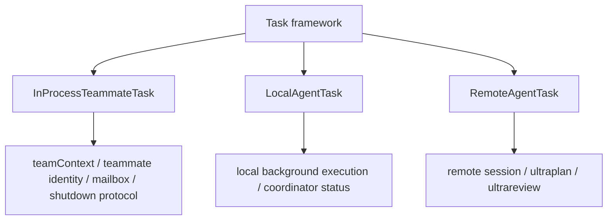

# Claude Code 源码共读笔记 89：LocalAgentTask / RemoteAgentTask 和 teammate runtime 的边界是什么

## 这篇看什么

85-88 已经把 swarm / team / teammate 这条主线拆开看了四层：

- 85：team / teammate runtime 在系统里的位置
- 86：team 对象怎么被创建、注册、清理
- 87：InProcessTeammateTask 这个 teammate 本体怎么跑起来
- 88：mailbox + idle / shutdown 协议怎么维持协作闭环

但看到这里，还有一个很容易混的点：

> Claude Code 里明明不只有 teammate task，为什么还同时有 `LocalAgentTask` 和 `RemoteAgentTask`？

如果不把这个边界拆开，后面很容易把所有“agent 在后台干活”的东西都混成一类。

而我这轮看下来，最重要的判断其实是：

> **Claude Code 不是只有一种 agent runtime，而是至少有三种承载体：in-process teammate、local agent、remote agent。它们都长得像任务，但语义、协作关系、状态管理和退出方式并不一样。**

所以这篇要回答的不是“谁更高级”，而是：

- 这三种 task 分别服务什么场景
- 哪些属于 swarm/team 世界
- 哪些只是更广义的 agent execution world
- 为什么 Claude Code 没把它们统一成一个万能 AgentTask

## 先给主结论

如果这篇只先记一句话，我会留这个版本：

> `InProcessTeammateTask`、`LocalAgentTask`、`RemoteAgentTask` 虽然都被挂在任务体系里，但它们在 Claude Code 里的系统角色完全不同：`InProcessTeammateTask` 属于 swarm runtime，是带 team 身份、mailbox、idle/shutdown 协议和 teammate 语义的协作成员；`LocalAgentTask` 属于本地后台 agent 执行壳，更像用户侧或 coordinator 侧拉起的独立本地 agent 工作单元；`RemoteAgentTask` 则服务远程 session / ultraplan / ultrareview 这类跨端或远程代理场景，重点不在 team 协作而在远端执行与结果回流。也就是说，三者共享 task 外形，但不共享运行语义：teammate 是协作成员，local agent 是本地后台执行体，remote agent 是远程执行体。**

再压缩一点，就是：

- **teammate = swarm 成员**
- **local agent = 本地后台执行体**
- **remote agent = 远程执行体**

一句最短版：

> **Claude Code 里不是一个 agent runtime，而是三个不同语义的 agent task family。**

## 先把总图立住：三者都像 task，但站在不同的系统层

如果把这三类东西压成一张图，我觉得更像下面这样：

这张图里最关键的点是：

> 它们共用的是 Task 外壳，不共用的是运行时语义。**

这一点非常重要。

因为如果只按代码目录名看，你会觉得它们只是三个任务类型；
但从架构角色看，它们其实分别挂在三个不同的系统层：

- teammate 挂在 swarm/team 协作层
- local agent 挂在本地后台 agent 执行层
- remote agent 挂在远程执行与代理层

## 第一部分：`InProcessTeammateTask` 的关键词不是“agent”，而是“team member”

这个判断是整篇的锚点。

在 87、88 已经能看得很清楚：`InProcessTeammateTask` 有一堆别的 task 没有的特征：

- teammate identity（`agentId` / `teamName` / `parentSessionId`）
- AsyncLocalStorage teammate context
- `pendingUserMessages`
- `shutdownRequested`
- `isIdle`
- mailbox 通信
- idle notification
- shutdown_approved

这些特征放在一起，说明它的设计目标不是“把一个 agent 放到后台”，而是：

> **把一个 agent 放进 team runtime，成为一个可持续协作、可被再次对话、可被 leader 管理的成员。**

所以 `InProcessTeammateTask` 最准确的理解不是 agent task，而是：

> **team member runtime**

也正因为如此，它才需要：

- 特殊身份系统
- mailbox 协议
- leader polling
- 安全退出机制

这些东西，Local/Remote 都没有同等强度地绑定。

## 第二部分：`LocalAgentTask` 更像“本地后台代理执行壳”，重点不是 team 协作，而是任务执行与状态展示

看 `LocalAgentTask.tsx`，我最直接的感觉是：

> 这条线的重点不是 teammate 语义，而是把一个本地 agent 工作单元纳入任务框架和前台展示。

它更像什么？

更像：

- 后台跑一个本地 agent
- 在 coordinator / task 视图里可见
- 有运行状态
- 有结果回流
- 可能和 review / plan / execute 这类 agent 模式相关

从组件层例如 `CoordinatorAgentStatus.tsx`、状态辅助层例如 `teammateViewHelpers.ts` 一起看，会感觉更明显：

`LocalAgentTask` 这条线更接近：

> **coordinator 管理下的本地 agent 执行任务**

而不是 team 里的一个长期成员。

### 这里最关键的区别是什么

`LocalAgentTask` 没有像 teammate 那样天然绑定：

- teamName
- mailbox inbox
- leader/shutdown_approved 协议
- idle 作为协作事件

这意味着 LocalAgentTask 虽然也在“后台跑 agent”，但它的系统语义更偏：

- **执行**
- **展示**
- **完成结果回流**

而不是：

- **长期协作成员关系**

这就是它和 teammate 最大的边界。

## 第三部分：`RemoteAgentTask` 的关键词也不是 teammate，而是“远程代理执行”

再看 `RemoteAgentTask.tsx`，会发现它更不是 swarm 成员。

它明显在处理另一类问题：

- 远程 session
- remote review / ultraplan / ultrareview
- 远端执行结果如何在本地任务体系中表现

也就是说，它要解决的核心不是：

- team 内成员怎么协作

而是：

> **一个不在本地同进程、甚至不一定在本机的 agent 执行体，怎么被当前 runtime 视作一个 task。**

这条线的重点天然会是：

- 远端连接/状态
- 结果同步
- UI 中如何表示远程 agent
- 如何接回 coordinator 的工作流

所以 `RemoteAgentTask` 的系统角色更像：

> **远程代理执行适配层。**

这和 teammate 的“组织成员语义”完全不是一回事。

## 第四部分：所以三者最大的区别，不是本地/远程，而是“有没有被 team runtime 吸进去”

很多人第一反应会把这三类 task 理解成：

- teammate = 本地
- local agent = 本地
- remote agent = 远程

但我觉得真正更有解释力的分法不是本地/远程，而是：

> **它有没有被 team runtime 吸进去。**

### 被吸进 team runtime 的
只有 `InProcessTeammateTask`。

因为它需要：

- team identity
- leader/member 关系
- mailbox
- idle/shutdown 协议
- team cleanup 约束

### 没被吸进 team runtime 的
`LocalAgentTask` 和 `RemoteAgentTask`。

它们虽然也可能被 coordinator 管理、也可能出现在统一状态面板里，但它们不天然承担：

- team membership
- teammate protocol
- swarm lifecycle responsibility

这就是最值得记的边界。

所以别把 teammate 简单看成 local agent 的一个子类。

从架构角色看，它更像另一个维度的东西：

- Local/Remote 是**执行承载差异**
- Teammate 是**协作关系差异**

## 第五部分：为什么 Claude Code 不把它们统一成一个万能 AgentTask

这件事我觉得特别能看出作者的系统判断。

表面上看，完全可以想象一种设计：

- 一个万能 `AgentTask`
- 加几个字段：`mode=local|remote|teammate`
- 大家都走同一个壳

但 Claude Code 没这么做。

我觉得原因很现实：

> **这三种东西表面相似，但真正复杂的差异不在“跑不跑 agent”，而在退出协议、状态模型、身份系统、通信链路和 UI 语义。**

如果硬揉成一个万能 AgentTask，后果很可能是：

- teammate 协议逻辑污染 local/remote
- remote 适配逻辑反过来污染 swarm 线
- UI 状态字段越来越难解释
- 任务生命周期分支越来越多

而现在拆开之后，代码虽然多几个 task type，但好处是每类任务的“系统角色”更清晰：

- teammate task：协作成员
- local agent task：本地后台执行
- remote agent task：远程执行适配

这其实是一种很健康的 runtime 分层。

## 第六部分：`AppStateStore` 和视图辅助层进一步证明——前台虽然会把这些 agent task 一起展示，但不会抹掉它们的语义差异

这也是很值得记的点。

从 `AppStateStore.ts`、`teammateViewHelpers.ts`、`CoordinatorAgentStatus.tsx` 这些地方一起看，会发现 Claude Code 在前台层确实努力做统一展示：

- 都是 task
- 都可能出现在可见 agent task 列表里
- 都可能出现在 coordinator 相关视图里

但它并没有因为“前台统一展示”就把底层语义抹平。

也就是说，Claude Code 做的是：

> **展示层尽量统一，运行时语义继续分层。**

这点非常成熟。

因为真实系统里，用户当然希望都能在一个地方看到“哪些 agent 在跑”；
但对实现者来说，仍然必须知道：

- 哪些是 team 成员
- 哪些只是本地后台执行
- 哪些是远程代理

这也说明前台统一视图不等于底层统一模型。

## 第七部分：所以 89 真正要留下来的判断是——Claude Code 有一个“更广义 agent task 世界”，而 swarm/team 只是其中一支

我觉得这是这篇最该留下来的结论。

前面 85-88 很容易让人产生一种错觉：

- teammate runtime 就是 Claude Code 的 agent runtime 主体

但 89 看完之后，更准确的说法应该是：

> **Claude Code 里存在一个更广义的 agent task 世界，而 swarm/team 只是其中最强调协作关系的一支。**

在这个更大的世界里：

- teammate 解决的是“多 agent 团队协作”
- local agent 解决的是“本地后台 agent 执行”
- remote agent 解决的是“远程代理执行”

这三条线都需要任务抽象，但抽象之上承载的是不同问题。

所以如果以后继续读 agent runtime，更稳的方式不是把所有 agent task 混起来看，而是先问：

> 这里要解决的是执行承载问题，还是协作关系问题，还是远程代理问题？

这个区分一旦立住，整个源码结构会清楚很多。

## 一句话定义

如果让我给这篇留一个最短定义，我会写：

> Claude Code 并没有把所有 agent 背景执行统一成一个万能 AgentTask，而是拆成三类有不同系统角色的任务：`InProcessTeammateTask` 负责 swarm/team 里的协作成员运行体，`LocalAgentTask` 负责本地后台 agent 执行，`RemoteAgentTask` 负责远程代理执行；三者共用任务框架，但不共用协作语义，因此真正的边界不在“是不是 agent”，而在“它是 team 成员、本地执行体，还是远程执行体”。**

## 术语补充 / 名词解释

### teammate runtime

带 team 身份、mailbox、idle/shutdown 协议、leader 协调关系的协作成员运行时，不等于普通后台 agent。

### local agent task

本地机器上运行的后台 agent 任务，更偏执行壳与状态展示，不天然承担 team 协作语义。

### remote agent task

远程 session / 远程代理执行的任务壳，核心是远端执行与结果回流，而不是 team membership。

### task family

这里指一组共享任务框架但系统语义不同的任务类型。Claude Code 的这三类 agent task 就构成了三个不同 family。

## 有意思的设计点

### 1. teammate 不是 local agent 的一个小变种，而是另一条独立语义线

这个边界一旦看清，swarm 线就不容易再被看扁。

### 2. Claude Code 选择“展示统一、语义分层”而不是“底层强行统一”

这是很稳的架构判断。

### 3. 真正的分类轴不只是 local/remote，而是 execution vs collaboration

这一点比表面目录结构更重要。

## 和前面已读模块的关系

89 接在 85-88 后面正好，因为它不是继续深挖 swarm 内部，而是把 swarm 和更大的 agent task 世界拉开边界。

这样后面做 90 收口时，就不容易把 team/runtime 说成“所有 agent 机制的总称”。

## 下一步最顺怎么接

这篇写完之后，下一步最顺我觉得就是：

### **90：为什么说 Claude Code 的 team 系统本质上是一个带 leader、mailbox 和 task runtime 的 swarm**

因为到 89 为止：

- team 的位置
- team 生命周期
- teammate 本体
- 协议层
- 和 local/remote 的边界

都已经齐了，正好可以做一篇系统收口。