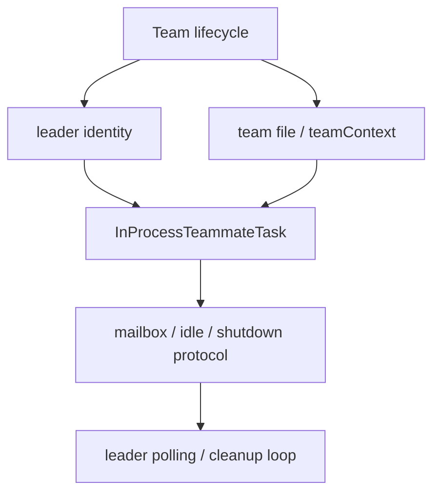

# Claude Code 源码共读笔记 90：为什么说 Claude Code 的 team 系统本质上是一个带 leader、mailbox 和 task runtime 的 swarm

## 这篇看什么

85-89 这一小段其实已经把 Claude Code 的 swarm / team 线拆得比较细了：

- 85：team / teammate runtime 在系统里的位置
- 86：team 作为正式对象怎么 create / register / cleanup
- 87：InProcessTeammateTask 这个 teammate 运行体怎么跑起来
- 88：mailbox + idle / shutdown 协议怎么维持协作闭环
- 89：teammate、local agent、remote agent 的边界是什么

到这里，其实可以开始收口了。

因为如果再继续按文件深挖，信息会越来越散；
但从架构判断上说，这一段已经足够支持一个更大的结论：

> Claude Code 的 team 系统，本质上不是一个“多 agent 功能”，而是一套带 leader、mailbox、task runtime、状态模型和优雅退场协议的 swarm runtime。

这篇就不再追某个具体实现细枝末节，而是做一次系统收束。

它要回答的是：

- 为什么这里应该叫 swarm，而不只是 team feature
- leader 在里面到底扮演什么角色
- mailbox 为什么是架构关键，而不是小工具
- task runtime 为什么让这套系统从“并发能力”升级成“协作运行时”

## 先给主结论

如果这篇只先记一句话，我会留这个版本：

> Claude Code 的 team 体系之所以值得被叫作 swarm，不是因为它能同时跑多个 agent，而是因为它已经具备了一套完整的多 agent 协作运行时：`TeamCreateTool` / `TeamDeleteTool` 把 team 建成正式对象并管理其生命周期，`teammate.ts` 和 `teamContext` 给 leader / teammate 建立专门身份与前台状态模型，`InProcessTeammateTask` 把成员放进正式任务世界，`teammateMailbox.ts` 提供显式消息总线，而 `cli/print.ts` + shutdown 流程又让 leader 真正承担了协调与收尾责任。也就是说，这套系统的本质不是“同时起多个 agent”，而是“让多个 agent 在一个有中心、有协议、有运行体和有退出闭环的协作系统里长期共存”。**

再压缩一点，就是：

- **leader 提供中心协调位**
- **mailbox 提供消息与状态协议**
- **task runtime 提供正式运行体**

一句最短版：

> **Claude Code 的 team 系统，本质上是一个带中心协调者的 swarm runtime。**

## 先把总图立住：这套系统不是三个点，而是五层拼起来的

如果把这条线压成一张总图，我觉得更像下面这样：

这张图里最关键的点是：

> swarm 不是“多 agent”这一件事，而是生命周期、身份、运行体、协议、收尾五层同时存在。**

少任何一层，它都更像功能；
五层都齐了，它才更像 runtime。

## 第一部分：为什么它不是“team feature”，而更像 swarm runtime

我觉得判断一个系统是不是 swarm，不要先看名字，要先看它有没有下面这些东西：

### 1. 有没有正式对象层
Claude Code 有。

`TeamCreateTool` 创建的不是临时组，而是：

- 有 team name
- 有 leadAgentId
- 有 team file
- 有 tasks dir
- 有 AppState.teamContext
- 有 session cleanup 责任

这说明 team 在系统里是正式对象，不是随手拼出来的上下文。

### 2. 有没有成员身份层
Claude Code 也有。

`teammate.ts` 明确区分：

- team lead
- teammate
- standalone

还有：

- `getAgentId()`
- `getAgentName()`
- `getTeamName()`
- `getParentSessionId()`

这说明 swarm 里的 agent 不是匿名 worker，而是有角色身份的成员。

### 3. 有没有正式运行体层
Claude Code 还是有。

`InProcessTeammateTask` 不是普通函数，而是：

- 正式 task type
- 有消息注入
- 有 transcript
- 有 idle 状态
- 有 shutdownRequested

所以 teammate 是正式运行体，不是“一次性调用”。

### 4. 有没有协议层
Claude Code 也有。

`teammateMailbox.ts` + `teammateInit.ts` + `stopHooks.ts` + `cli/print.ts` 组成了：

- mailbox
- idle notification
- shutdown_approved
- leader polling

这已经是显式协作协议了。

### 5. 有没有收尾闭环
Claude Code 仍然有。

- active teammate 不能直接 delete team
- 要 requestShutdown
- leader 消费 `shutdown_approved`
- 最后统一 cleanup

这说明 swarm 的退出也不是粗暴 kill，而是有状态一致性的闭环。

把这五点放一起，我觉得再叫它“team feature”就偏轻了。

它更像：

> **Claude Code 内部的一个小型 swarm runtime。**

## 第二部分：leader 是这套系统里最容易被低估的角色，它不是普通成员，而是编排中心

如果只从命名看，很多人会把 leader 理解成：

- 第一个被创建的 agent
- 或者权限更高一点的 teammate

但源码不是这个意思。

从 `leadAgentId`、`TEAM_LEAD_NAME`、`teamContext.isLeader`、`cli/print.ts` 那套逻辑一起看，leader 实际更像：

> **swarm 的中心协调者。**

为什么这么说？

### leader 负责建立 team
team 是 leader session 创建出来的。

### leader 负责持有 teamContext
前台 team 状态是围着 leader 视角展开的。

### leader 负责收消息
未读 teammate mailbox 的轮询是在 leader 侧完成的。

### leader 负责推动 shutdown 闭环
当输入关闭、teammate 还活着时，是 leader 主动发 shutdown 提示并等待回执。

### leader 负责最终清理
收到 `shutdown_approved` 后，也是 leader 侧把成员从 team file / teamContext 中移除，并完成退场。

这说明 leader 在这套系统里的角色，不是“其中一个 agent”，而是：

> **带有协调、观察、收尾职责的 orchestrator。**

这也是为什么我会把 Claude Code 的 team 系统归到“带中心的 swarm”，而不是纯分布式 mesh。

它不是人人对等的自组织群体，至少当前实现不是。

它更像：

- 一个中心 leader
- 若干被组织起来的 teammate
- 通过显式协议协同工作

## 第三部分：mailbox 的意义不只是消息传递，而是把协作关系从隐式调用变成显式协议

这一层是我觉得最能证明“这是 runtime 不是 feature”的地方。

如果没有 mailbox，这套系统也许还能勉强跑：

- leader 持有一堆对象引用
- teammate 状态变化时直接回调 leader
- 结束时再统一清理

但那样会很脆，也很难扩。

Claude Code 没这么做。

它专门做了：

- team + agentName 路由的 inbox
- JSON 文件式消息存储
- 读写锁
- unread message 消费
- sender / summary / color / timestamp

这说明 mailbox 不是“方便 UI 显示几条消息”，而是：

> **把团队协作显式化。**

这件事很重要。

因为一旦协作关系变成显式协议，整个系统就会有几个非常大的好处：

- 状态可追踪
- 行为可调试
- 前后台都能接入
- 退出逻辑能走统一路径

所以 mailbox 的价值不是“传话”，而是：

> **把 swarm 的协作机制从隐式耦合变成显式协议。**

这是成熟度很高的设计。

## 第四部分：task runtime 让 teammate 从“概念上的成员”变成“系统里的正式运行体”

这条线如果只看概念，容易说得很虚。

但 `InProcessTeammateTask` 这一层给了它一个非常硬的落点。

因为 teammate 一旦被放进 Task 框架，它就不再只是：

- “leader 下面的一个 agent”

而变成：

- 可追踪
- 可注入消息
- 可保持 transcript
- 可区分 idle/running/terminal
- 可请求 shutdown

的正式运行体。

这件事为什么重要？

因为 runtime 最本质的东西不是“能跑”，而是：

> **能被系统稳定地管理。**

Task 抽象给了 teammate 这种被管理能力。

所以 task runtime 的意义，不是实现细节，而是：

> **把 swarm member 从逻辑概念变成一等运行对象。**

如果没有这一层，team 只会像一种组织关系；
有了它，team 才真正落成一个运行时系统。

## 第五部分：优雅退场这件事，恰恰说明作者不是把它当并发工具，而是当协作系统

我觉得这也是特别值得强调的点。

如果只是并发工具，最简单的做法永远是：

- 结束时 kill 掉所有 agent
- 删掉目录
- 完事

但 Claude Code 没这么干。

它在 delete / print / mailbox 这几层都体现出同一个原则：

> **成员关系的退出要被认真对待。**

所以它才会：

- 不允许 active teammate 时直接删除 team
- 需要 requestShutdown
- 要等待 `shutdown_approved`
- leader 再统一移除成员
- 最后才 cleanup team

这说明作者在乎的不是“资源尽快收掉”，而是：

- 成员状态一致
- team file 一致
- AppState 一致
- mailbox / inbox 一致
- 最终 UI 和运行态都一致

这种对退出一致性的重视，本身就是 runtime 思维。

所以我会说，Claude Code 的 team 系统不是“能并发”这么简单，
而是：

> **它有完整协作生命周期意识。**

## 第六部分：89 的边界判断反过来进一步证明——swarm 只是更大 agent task 世界中的一支，但它是最强调协作协议的一支

89 已经把边界拉开了：

- `InProcessTeammateTask`
- `LocalAgentTask`
- `RemoteAgentTask`

都属于更广义的 agent task 世界。

但正因为看过 89，反而更容易确认 90 的结论。

因为你会发现：

- `LocalAgentTask` 重点是本地后台执行
- `RemoteAgentTask` 重点是远程执行适配
- 只有 `InProcessTeammateTask` 被深度吸进 team runtime

也就是说，真正让 team 系统成立的，不是“也有 task”，而是：

- 有 team object
- 有 leader/member identity
- 有 mailbox protocol
- 有 shutdown 闭环

这些东西 Local/Remote 都没有完整承担。

所以 swarm 的独特性，不在它也是 task，而在：

> **它是一组被组织关系、通信协议和生命周期约束起来的 task。**

这句话我觉得特别重要。

## 第七部分：所以 90 最后该留下来的，不是某个实现细节，而是这个系统判断

如果把 85-90 全部压成一个判断，我觉得最值得记住的是：

> Claude Code 在 team 这条线上做的，不是“开多个 agent 干活”这么简单，而是实现了一套有中心协调者、有正式对象层、有任务承载层、有消息协议层和有优雅退场机制的小型 swarm runtime。**

这个判断为什么重要？

因为它会直接影响后面怎么看更多代码：

- 你不会再把 TeamCreateTool 当成一个独立 feature
- 你不会再把 mailbox 当成 UI 附属工具
- 你不会再把 InProcessTeammateTask 看成普通后台任务
- 你也不会把 local / remote / teammate 混成一个“agent 都差不多”的世界

一旦这个判断立住，整个 team 线的源码结构就会顺很多。

## 一句话定义

如果让我给这篇留一个最短定义，我会写：

> Claude Code 的 team 系统，本质上是一个带中心 leader 的 swarm runtime：它用 team 对象管理生命周期，用 teammate 身份模型组织成员，用 `InProcessTeammateTask` 提供正式运行体，用 mailbox / idle / shutdown 协议维持协作，再由 leader 完成轮询、协调和收尾，因此真正的核心不是“多开几个 agent”，而是“让多个 agent 在一个有中心、有协议、有状态和有退出闭环的协作系统里长期共存”。**

## 术语补充 / 名词解释

### swarm

这里不是营销词，而是指一套真正包含成员、协调者、消息协议、任务承载和退出闭环的多 agent 协作运行时。

### leader

team 的中心协调者，不只是第一个 agent，而是承担建队、收消息、推动 shutdown 和最终收尾职责的 orchestrator。

### mailbox

按 team / agent 路由的显式消息总线。让协作从隐式调用变成可追踪协议。

### task runtime

让 teammate 成为正式运行体的任务框架，而不是临时逻辑分支。

## 有意思的设计点

### 1. Claude Code 的 swarm 是“带中心的 swarm”，不是对等 mesh

这从 leader 的职责分布看得很清楚。

### 2. mailbox 是这套系统成熟度最高的信号之一

因为它把协作协议显式化了。

### 3. 优雅退场机制说明作者把 team 当成长期协作关系，而不是一次性并发工具

这也是这条线最有 runtime 味道的地方。

## 和前面已读模块的关系

90 是这轮 swarm / team 专题的自然收口：

- 85 立总图
- 86 看生命周期
- 87 看运行体
- 88 看协议
- 89 拉边界
- 90 做系统判断收束

到这里，这个小专题已经足够完整。

## 下一步最顺怎么接

这一段如果继续，我觉得有两个方向都顺：

### 方向 A：回到更大的 agent runtime 世界
沿着 89 的边界继续往下看：

- local background agent
- remote review / ultraplan / ultrareview
- coordinator 视图怎么把不同 task family 汇总起来

### 方向 B：转去 team memory / shared state
沿着 swarm 线继续看：

- `services/teamMemorySync/`
- `memdir/teamMemPaths.ts`
- `teamMemSecretGuard.ts`

如果只从“紧接着 90 最顺”来说，我会更偏向 **方向 B**，因为它会回答：

> team 不只是协作和通信，它是不是还有共享记忆层？