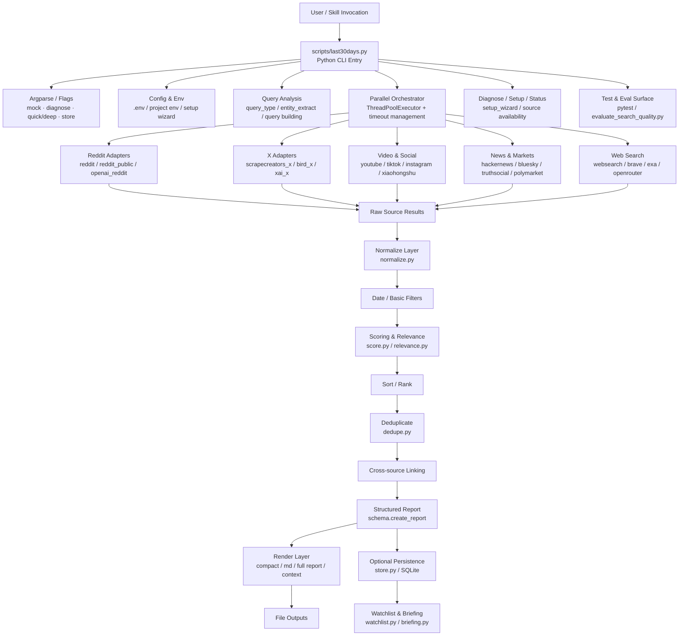

# 2026-04-06｜last30days 架构复盘（含 Mermaid 图）

## 为什么这页存在

这页是为了回答一个具体问题：

> 为什么 `last30days` 更适合用 Python，而 `daily-lane` 当前看起来还是 shell-first？

做法不是凭印象，而是直接根据本机项目结构、入口文件、核心模块和数据流来复盘 `last30days`。

项目路径：
- `/Users/haha/.openclaw/workspace/last30days-skill`

---

## 一句话结论

`last30days` 不是“脚本集合”，而是一个 **Python research engine**：

- 一个 Python CLI 入口负责参数解析、配置加载、诊断、并发调度、结果汇总
- 多个 source adapter 负责从 Reddit / X / YouTube / HN / Bluesky / Polymarket / TikTok / Instagram / Web 等来源取数
- 中间有明确的数据处理流水线：**normalize → filter → score → sort → dedupe → cross-source link → schema report → render**
- 还有独立的 watchlist / store / briefing / evaluation / setup wizard / test suite

也就是说，它天然更像“小型程序”或“研究引擎”，而不是单纯的稳定 shell lane。

---

## 直接证据

### 1. 主入口是 Python

主入口：
- `scripts/last30days.py`

开头就是：

```python
#!/usr/bin/env python3
```

而且 `README.md` 的用法也是：

```bash
python3 last30days.py <topic> [options]
```

入口参数已经包含：
- `--mock`
- `--store`
- `--diagnose`
- `--quick`
- `--deep`

这已经不是“小脚本”级别，而是完整 CLI 应用。

### 2. 核心库是 Python 模块化结构

`scripts/lib/` 下可以看到明确分层：

- source adapters
  - `reddit.py`
  - `reddit_public.py`
  - `scrapecreators_x.py`
  - `bird_x.py`
  - `xai_x.py`
  - `youtube_yt.py`
  - `hackernews.py`
  - `bluesky.py`
  - `truthsocial.py`
  - `polymarket.py`
  - `tiktok.py`
  - `instagram.py`
  - `websearch.py`
  - `brave_search.py`
  - `exa_search.py`

- processing / data shaping
  - `normalize.py`
  - `score.py`
  - `dedupe.py`
  - `relevance.py`
  - `entity_extract.py`
  - `query.py`
  - `query_type.py`
  - `quality_nudge.py`
  - `schema.py`
  - `render.py`

- runtime / environment / setup
  - `env.py`
  - `http.py`
  - `models.py`
  - `cache.py`
  - `setup_wizard.py`
  - `ui.py`
  - cookie / browser 相关模块

### 3. 它有真正的数据流水线

从 `scripts/last30days.py` 的主流程可以直接看到：

1. 并发抓取各 source
2. `normalize.*`
3. `filter_by_date_range`
4. `score.*`
5. `sort_items`
6. `dedupe.*`
7. `cross_source_link`
8. `schema.create_report`
9. `render.*`
10. `write_outputs`

这已经是很典型的“程序型 pipeline”，不是 shell 里调几个命令就完事。

### 4. 它还有配套子系统

除了主研究入口，还能看到：

- `scripts/store.py`
  - SQLite 持久化
  - topics / findings / settings / cost 等数据管理

- `scripts/watchlist.py`
  - watchlist 管理
  - schedule / run-one / run-all / config

- `scripts/briefing.py`
  - 基于累计 findings 生成 briefing data
  - 注意：这里输出的是结构化 briefing data，不是最终 AI 成文

- `scripts/evaluate_search_quality.py`
  - 搜索质量评估

也就是说，`last30days` 不只是“搜一下”，而是已经长成一整套有状态的 research runtime。

### 5. 测试量也说明了它是 Python 程序，不是脚本仓库

`tests/` 下有大量 Python 测试，例如：

- `test_query.py`
- `test_relevance.py`
- `test_normalize.py`
- `test_dedupe.py`
- `test_cache.py`
- `test_status_banner.py`
- `test_schema_roundtrip.py`
- `test_setup_wizard.py`
- `test_smoke.py`

这代表它已经把：
- source 行为
- 数据结构
- 评分逻辑
- setup / diagnose
- output schema

都当成可测试程序来维护。

---

## Mermaid 架构图



---

## 我对这张图的解读

### 1. 它的中心不是 source，而是 orchestration + processing pipeline

`last30days` 的重心并不只是“多 source 抓取”，而是：

- query 分析
- 并发调度
- normalize
- score
- sort
- dedupe
- schema report
- render

也就是说，它的复杂度主要长在**数据处理和程序内部结构**上，而不是单纯的 source 数量。

### 2. diagnose / setup / watchlist / briefing 都是程序型能力

这些能力如果放在 shell 里不是不能做，但会很快进入：

- 数据结构混乱
- 错误处理脆
- 测试痛苦
- jq / awk / grep / heredoc 混战

Python 更容易把这些做成可维护的 runtime。

### 3. 它和 `daily-lane` 的本质区别是：中间处理层已经很厚

如果一个系统已经包含：
- source orchestration
- structured processing pipeline
- report schema
- persistence
- watchlist
- diagnose
- quality evaluation

那它就很自然会走向 Python。

而 `daily-lane` 当前的主目标仍然是：
- collect
- normalize 基础输出
- 按目录协议落盘
- 保持稳定脚本味道

所以两者语言不同，不是偶然，而是架构使然。

---

## 对 lane 后续设计的启发

这次复盘给 `daily-lane` 的启发，不是“照抄 last30days 上 Python”，而是：

### 如果 lane 未来只是 collect engine
那它仍可以长期保持 shell-first。

### 如果 lane 未来也开始长出很厚的 processing / ranking / diagnose / watchlist / report schema 子系统
那它就会越来越像 `last30days` 这类 Python research/runtime 项目。

所以语言迁移的触发条件，不该是主观偏好，而该是下面这些信号：

- 中间处理流水线越来越厚
- 结构化对象越来越多
- 诊断/状态/校验逻辑越来越重
- 测试需求显著上升
- shell 中开始出现大量 JSON 操作与脆弱错误处理

---

## 一句话总结

> `last30days` 是 Python，不是因为“Python 更高级”，而是因为它本质上已经长成了一个 research engine：有入口、有调度、有 pipeline、有 schema、有存储、有 watchlist、有 diagnose、有 tests。它解决的问题形态，本来就比 `daily-lane` 当前这类 collect-first lane runtime 更接近一个程序，而不是一组脚本。
