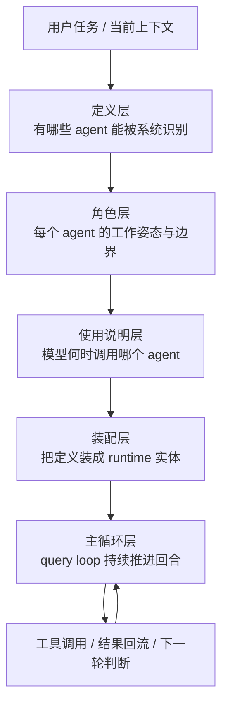
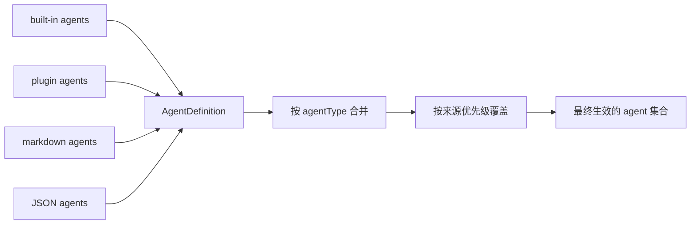
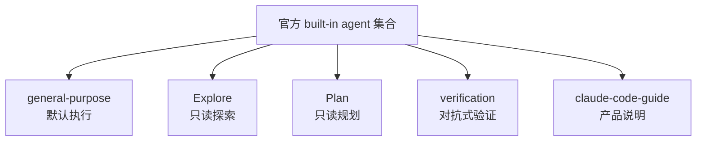
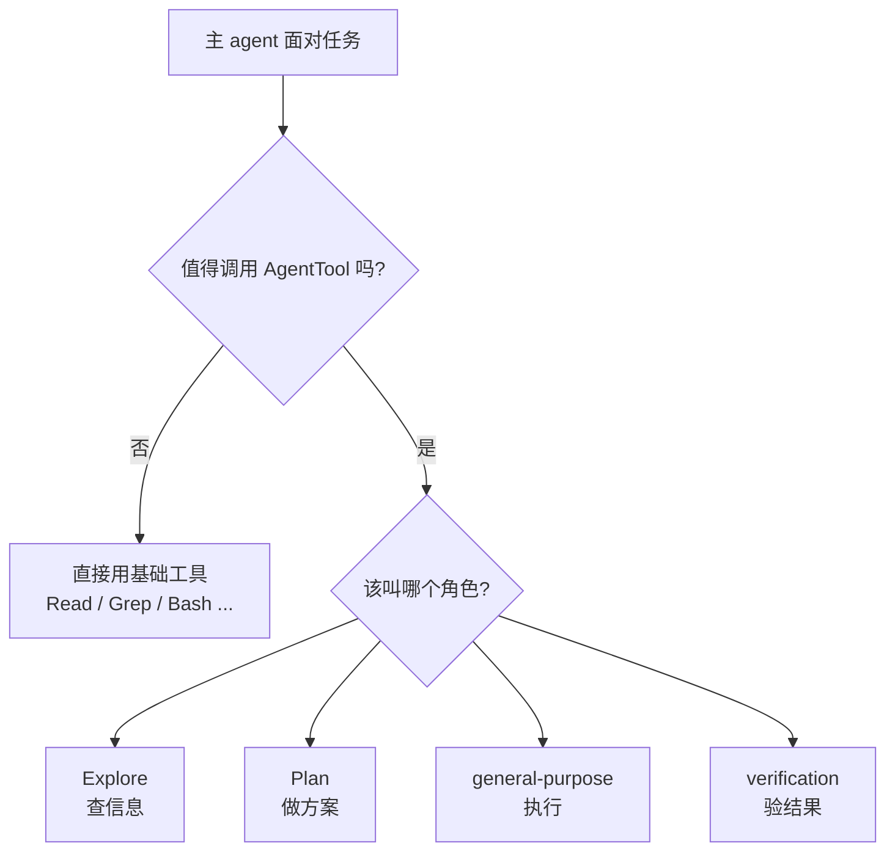
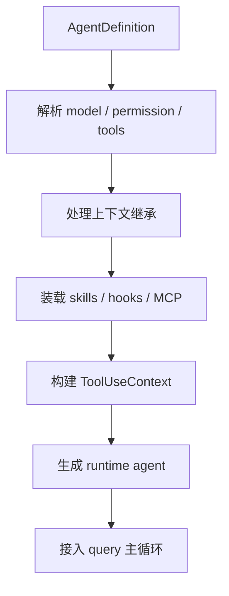
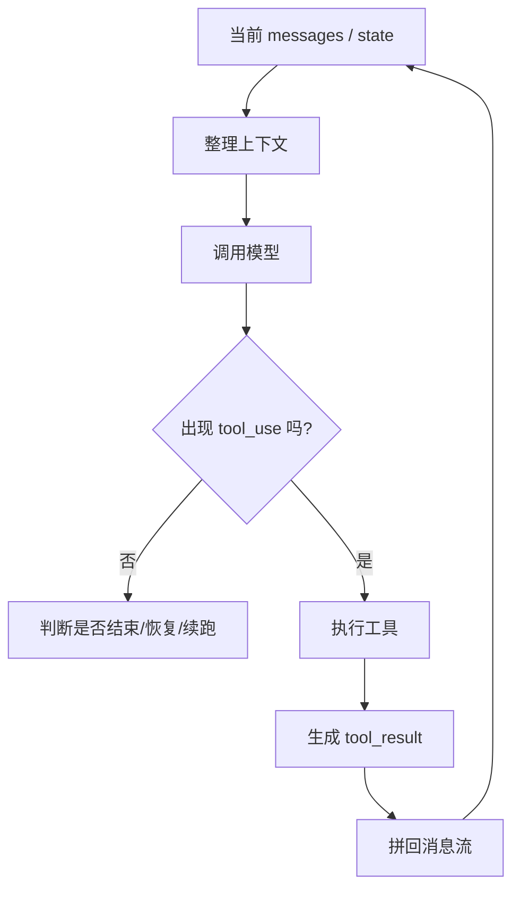
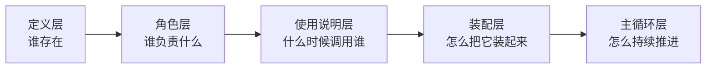

很多人第一次看到 Claude Code 的 sub-agent 能力，都会很自然地把它理解成一件事：

**就是把一个任务分给多个 agent 并行做。**

这个理解不能说错，但它太浅了。

如果只是“多开几个模型”，那它解决的主要是吞吐问题；可你顺着 Claude Code 的源码一路看下来，会发现它真正下功夫的地方，并不是怎么把更多 agent 放出去，而是怎么把 agent **组织起来**。

这也是我最近越来越强烈的一个判断：

> Claude Code 的 agent 调度哲学，本质上不是“让更多 agent 同时干活”，而是把一个复杂任务拆成一个可描述、可分工、可装配、可循环执行的稳定系统。

这篇我想做的，就是把前面几篇共读串起来，给出一张总图。

如果只压成一句话，那我现在的理解是：

- **定义层**回答：系统里到底有哪些 agent
- **角色层**回答：这些 agent 分别负责什么工作姿态
- **使用说明层**回答：模型什么时候该调用谁、怎么调用
- **装配层**回答：一个 agent 怎样被真正组装成可运行体
- **主循环层**回答：任务如何被持续推进到收敛

把这五层放在一起，Claude Code 的 agent 调度逻辑才真正立起来。

---

## 先看总图：Claude Code 不是“多开几个模型”，而是五层联动

这张图里最关键的一点是：

**五层不是五个孤立模块，而是五个不同观察视角。**

很多系统谈 agent，谈到最后都只剩两个问题：

- prompt 怎么写
- agent 怎么并行

但 Claude Code 真正把事情做深的地方，在于它知道：

- 只定义 agent，不够
- 只给角色，不够
- 只教模型怎么用，也不够
- 只把 agent 启动起来，还是不够

真正能把复杂任务稳定推进下去的，是这几层一起咬合。

---

## 第一层：定义层不是 prompt 文件夹，而是 agent 世界的编户齐民系统

前面看 `loadAgentsDir.ts` 时，我的感觉特别强。

它干的不是“读一下 agents 目录”这么简单，而是把不同来源的 agent 统一收进一套 `AgentDefinition` 模型里。

也就是说，在 Claude Code 里，agent 不是一个松散的概念。系统需要先回答一个更底层的问题：

> **谁才算一个 agent？**

这层主要处理的是：

- built-in agent 从哪来
- markdown / JSON agent 怎么解析
- plugin agent 怎么并进来
- 同名 agent 冲突时谁覆盖谁
- 哪个 agent 最终真正生效

可以把它理解成 agent 世界的户籍系统。

这里真正重要的，不是“支持多种格式”，而是它先把 agent 从一堆 prompt 文本，提升成了一种**正式声明对象**。

这一步一旦没有，后面的问题都会开始发散。

比如：

- 角色边界没法稳定声明
- 工具权限没法跟角色绑定
- model / hooks / MCP / memory 这些约束没法跟着 agent 走
- 后面 runtime 装配也没有统一输入

所以定义层的价值不是方便配置，而是给整个 agent system 一个统一对象模型。

一句话说：

> 没有定义层，后面谈调度，其实都是在调度一堆没有正式身份的 prompt 片段。

---

## 第二层：角色层不是“多几种人设”，而是把不同工作姿态做成模板

定义层解决的是“谁存在”，角色层解决的是“谁负责什么”。

看 `builtInAgents.ts` 时我最大的感受是，Claude Code 官方切角色的方式很克制。

它不是按技术栈切的，不是：

- 前端 agent
- 后端 agent
- Python agent
- 数据库 agent

它更像是在按**工作姿态**切：

- `general-purpose`：默认执行 worker
- `Explore`：快速只读搜索
- `Plan`：只读规划
- `verification`：对抗式验证
- `claude-code-guide`：产品说明与文档顾问

这个切法非常重要。

因为它说明 Claude Code 并不把 agent 理解成“不同人格”，而是理解成：

> **不同工作模式下的一组受控执行模板。**

这也是为什么这些角色真正拉开差异的，不只是 prompt 文案，而是这些东西：

- 能不能写文件
- 能不能继续派 agent
- 默认用什么模型
- 是前台跑还是后台跑
- 要不要带完整 Claude.md 上下文
- 输出更像报告、计划还是 verdict

换句话说，角色层真正编码的不是语气，而是**行为边界**。

如果没有这层，主 agent 再聪明，最后也会倾向于把所有事都交给一个万能 worker。短期看很省事，长期看会非常不稳定。

因为：

- 搜索型任务和规划型任务需要的节奏不同
- 执行型任务和验证型任务需要的立场不同
- “去找信息”和“给判决”本来就不该是同一种 agent 姿态

所以角色层不是锦上添花，而是在系统里人为制造分工摩擦。

这听起来像增加复杂度，实际上是在降低失控概率。

---

## 第三层：使用说明层是在教模型如何使用 agent system，而不是单纯展示 agent 列表

很多人做 agent 系统时，很容易忽略这一层。

觉得只要系统里已经有 agent 了，模型自然会调用。

但 Claude Code 在 `prompt.ts` 里其实把一件事写得很明白：

> agent 存在，不代表模型会正确地使用 agent。

所以它专门有一层“给模型看的说明书”。

这层解决的问题不是：

- 有哪些 agent

而是：

- 什么时候该用 agent
- 什么时候不该用
- 该叫哪个 agent
- 给子 agent 的 prompt 应该怎么写
- 什么时候该 fork，什么时候该 fresh spawn
- 什么时候并发有意义
- 什么时候直接 `Read` / `Grep` 更合适

我觉得这层最值的地方，不是那堆例子，而是它把 Claude Code 的一个核心哲学几乎明文写出来了：

> **不要把理解外包给子 agent。**

也就是说，主 agent 可以委派搜索、委派验证、委派局部执行，
但它不能偷懒到把“形成理解、做综合判断”的责任整个甩出去。

这和很多人想象中的 multi-agent 很不一样。

很多人的理想图景是：

- 主 agent 只负责把任务拆开
- 子 agent 各自完成
- 最后自动汇总

听起来很优雅，但现实里这很容易变成：

- 每个子 agent 都拿到不完整上下文
- 各自产出一份局部正确、整体失真的结果
- 主 agent 再把这些结果拼成一份看起来很完整、实际不够可靠的总结

所以 Claude Code 的使用说明层，本质上是在限制模型别把 agent system 用成一个“复杂任务逃逸装置”。

它不是鼓励乱派，而是教模型：

- 什么时候该自己做
- 什么时候该调工具
- 什么时候该委派
- 委派出去之后主 agent 还必须承担什么责任

这层如果没有，定义层和角色层都容易沦为摆设。

---

## 第四层：装配层不是“启动一个子 agent”，而是把声明翻译成可运行体

等模型真的决定要调用 agent 之后，事情才刚开始。

从 `runAgent.ts` 往下看，会发现 Claude Code 并不是拿到一段 prompt 就去开跑。

它会做一整套装配：

- 决定 agent id
- 处理上下文继承
- 过滤不完整 tool calls
- 克隆或创建 file state cache
- 覆写 agent 自己的 AppState 视图
- 重建这次 agent 真正可见的工具池
- 预载 skills
- 注册 hooks
- 初始化这个 agent 专属可见的 MCP servers
- 记录 transcript 和 metadata
- 最后再把这些东西接进 `query()`

所以“装配层”这个词，我觉得特别准确。

因为这一步真正做的是：

> 把一个声明式 agent，翻译成一个有身份、有权限、有工具面、有上下文边界、也有清理责任的运行时个体。

这和很多轻量 agent 框架很不一样。

很多系统里所谓“启动子 agent”，本质上只是：

- 复制一段上下文
- 换个 system prompt
- 再调一次模型

Claude Code 明显不是这个级别。

它更接近：

- agent 是一等运行对象
- 有明确的 runtime 装配过程
- 有自己的工具面、MCP、hooks、transcript、cleanup 生命周期

也正因为如此，它的 agent 才不是“prompt 变体”，而更像真正的 worker。

装配层存在的意义，是把前面那套抽象角色，变成后面主循环真正能驱动的运行实体。

---

## 第五层：主循环层真正让 agent system 活起来

前面四层都很重要，但如果少了主循环，这个系统仍然只是静态设计。

Claude Code 真正把 agent 跑活的地方，是 `query.ts` 那个主循环。

这层的核心不是“调一次模型”，而是持续维护一个 agent 回合：

- 整理当前消息和上下文
- 做压缩与恢复准备
- 调模型采样
- 流式识别 `tool_use`
- 执行工具
- 拼回 `tool_result`
- 判断是否继续下一轮
- 直到这次回合真正收敛

这就是为什么我会觉得：

**Claude Code 的 agent system，最后真正的灵魂不是 agent list，而是 loop。**

因为：

- 定义层解决的是对象模型
- 角色层解决的是分工模板
- 使用说明层解决的是调用规范
- 装配层解决的是 runtime 实体化
- 只有主循环层，解决的是任务怎么持续推进

没有 loop，agent system 很容易退化成一种“能开很多次子调用”的 fancy 接口。

有了 loop，系统才第一次拥有了：

- tool-use 闭环
- 多轮状态推进
- 上下文收敛能力
- 对失败、压缩、恢复、继续的调度能力

所以如果只看表面，Claude Code 像是在做 agent orchestration；
但往底层看，它其实是在做一个更完整的东西：

> **让 agent 以回合制 runtime 的方式持续工作，而不是一次性回答。**

---

## 把五层重新串起来：它们不是并列概念，而是一条因果链

如果把这篇再压缩一次，我觉得最值得记住的是这条链：

这五层之间不是目录关系，而是因果关系。

### 没有定义层
系统没有统一 agent 对象，后面无法稳定声明边界。

### 没有角色层
系统虽然有 agent，但没有稳定分工，最后还是会退回一个万能大 agent。

### 没有使用说明层
模型不知道何时调谁，何时不该调，调度会越来越随机。

### 没有装配层
角色只是纸面配置，不能变成可管理的 runtime 个体。

### 没有主循环层
整个系统只能做一次性子调用，不能形成真正的 agentic 闭环。

所以 Claude Code 的调度哲学，不是在“某一层做得特别强”，而是在：

> 它没有跳过这些中间层，反而认真把每一层都补齐了。

这点非常重要。

因为大部分 agent 系统的不稳定，都不是死在模型不够强，而是死在中间层缺失：

- 有角色，没 runtime
- 有 sub-agent，没使用规范
- 有并发，没回收
- 有 prompt，没分工

Claude Code 的价值就在于，它把这些本来容易被当成“工程细节”的东西，当成了系统骨架。

---

## 所以，Claude Code 的 agent 调度哲学到底是什么？

如果让我最后收成三句话，我会这样总结。

### 第一，先定义，再分工

它不是先想“我要开几个 agent”，而是先回答：

- agent 在系统里是什么对象
- 它能声明什么边界
- 它们如何被统一纳管

先把对象模型站稳，后面的角色系统才有意义。

### 第二，先约束，再放权

Claude Code 并没有把 agent 当成“越自由越强”。

相反，它大量通过：

- tools / disallowedTools
- model / permissionMode
- background / isolation
- usage notes / prompt writing guide

来限制 agent 的行为方式。

这背后的判断很清楚：

> agent 的力量不是来自无限自由，而是来自受控分工。

### 第三，先形成循环收敛，再追求并发规模

很多人看 multi-agent，最兴奋的是并发。

但 Claude Code 从源码上给出的答案更朴素：

- 先让一个 agent 回合能稳定跑完
- 再让工具调用能闭环
- 再让上下文能回流
- 再让失败能恢复
- 最后再去谈 fork、background、parallel

也就是说，它真正优先优化的不是“同时叫多少工人”，而是：

> **一个复杂任务怎样被系统稳定推进到收敛。**

这才是我理解里的 Claude Code agent 调度哲学。

---

## 最后一句话

如果你只把 Claude Code 的 agent system 理解成“多开几个模型”，那你看到的只是表层现象。

它更值得看的地方其实是：

> 它如何把 agent 从一段 prompt，逐层组织成一个能定义、能分工、能装配、能循环推进的工作系统。

这也是为什么我现在越来越觉得，Claude Code 真正厉害的，不只是 agent 能不能开出来，而是它对“调度”这件事，已经有了一套相当完整的工程世界观。