如果你最近在认真用 Claude Code，大概率已经有这个冲动：

**官方既然已经把 agent system 做出来了，那我是不是也该自己配一批 subagent？**

这个想法很自然，而且通常也对。

问题是，很多人一开始设计 custom subagent 的路径就歪了。

最常见的做法是这样的：

- 先想几个听起来很厉害的角色名
- 再给每个角色写一段 prompt
- 然后恨不得把所有工具都开放
- 期待主 agent 之后能自动调度、自动协作、自动收敛

刚配完的时候，通常会觉得很爽。

系统像一下子长出了很多分身，什么都有人能做。可只要真用一段时间，问题就开始冒出来：

- 角色越来越多，但边界越来越糊
- 很多 agent 的能力高度重叠
- 主 agent 经常叫错人
- 子 agent 回来的结果看着都对，拼起来却不稳
- 最后整个系统不像多了几个 worker，更像多了几个会制造噪音的同事

所以这篇我想回答的，不是“怎么写一个 subagent prompt”，而是更底层的问题：

> **看完 Claude Code 官方 agent system 之后，我们自己设计 custom subagent，到底该学什么？**

我现在的结论越来越清楚：

> 自定义 subagent 的关键，不是多写几个 prompt，而是把工作边界、工具边界、输出协议和调度位置设计清楚。

这篇我会从三个层面来讲：

1. 先讲原则
2. 再讲常见模板
3. 最后讲反模式

这样你不只是知道“怎么配”，也知道“为什么这么配”。

---

## 先看总图：一个好 subagent，不是人设，而是一个边界清晰的 worker

很多人一说到 subagent，第一反应还是“角色”。

这当然没错，但如果只停在角色层，很容易把事情做浅。因为真正影响 subagent 稳定性的，往往不是名字，也不是语气，而是它在系统里的位置。

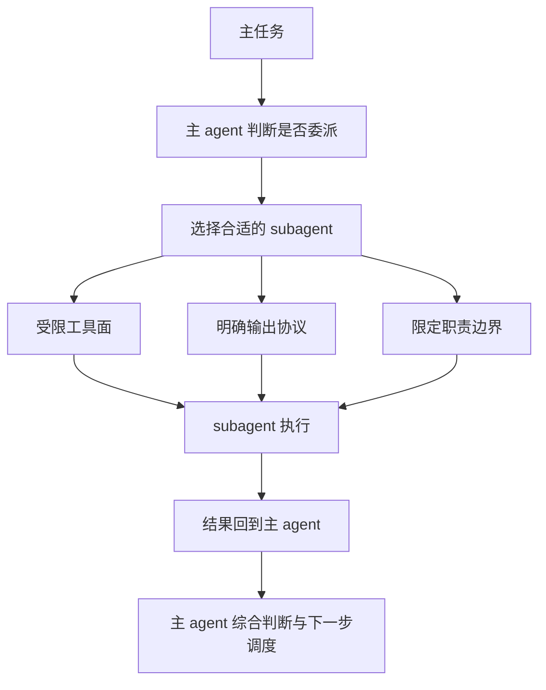

这张图里最关键的一点是：

**subagent 不是为了代替主 agent，而是为了让主 agent 把一部分工作更稳地拆出去。**

所以一个设计得好的 subagent，至少要同时满足四件事：

- 它的职责边界是清楚的
- 它的工具边界是清楚的
- 它的输出格式是清楚的
- 它在主循环里的位置是清楚的

如果这四件事里少了两件以上，这个 subagent 基本迟早会变成“看起来很聪明，但用起来越来越乱”的那一类。

---

## 第一部分：从官方设计倒推，custom subagent 最值得学什么

如果只是从表面看 Claude Code 官方 agent，你很容易只看到几个 built-in 角色：

- `Explore`
- `Plan`
- `verification`
- `general-purpose`

但这些角色真正值得学的，不是名字本身，而是它们背后的设计习惯。

我觉得最值得继承的，有下面几条。

### 第一，官方切角色时，优先切的是工作姿态，不是技术栈

这是我看 built-in agents 时感受最强的一点。

Claude Code 并没有搞一堆这种角色：

- React 专家
- Python 专家
- Postgres 专家
- Docker 专家

它更偏向于这种切法：

- 探索
- 规划
- 执行
- 验证
- 说明

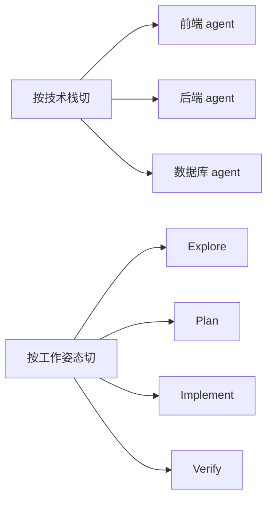

为什么官方更偏第二种？

因为技术栈是知识分类，工作姿态才是调度分类。

主 agent 真正在做调度时，更容易判断的是：

- 现在需要找信息
- 现在需要做方案
- 现在需要动手改
- 现在需要独立验证

而不是：

- 现在我要找一个“既懂 React、又懂 Tailwind、最好还懂 Vite 和 Vitest”的人

后者太细，而且高度依赖上下文。

所以如果你自己设计 custom subagent，我第一个建议就是：

> **先按工作姿态切，再按领域知识补。不要反过来。**

---

### 第二，工具边界通常比角色描述更重要

很多人写 custom subagent 时，把 80% 的精力都花在 prompt 上。

但从官方设计往回看，一个 agent 真正稳不稳，很多时候取决于工具面，而不是文案。

比如：

- 只读探索 agent，如果还给了写权限，它很容易顺手开始改东西
- 验证 agent，如果没有明确的执行和读日志能力，它就只能空口判断
- 写作 agent，如果拿到太多工程工具，也会把任务拖向不必要的实现细节

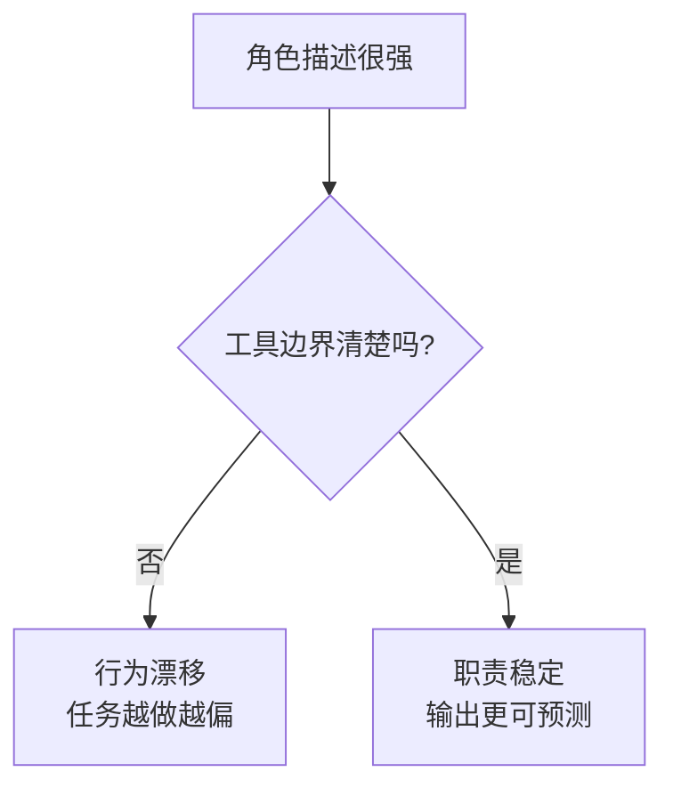

这件事说白了就是一句：

> prompt 决定它“想做什么”，工具边界决定它“到底能做什么”。

在 agent system 里，后者往往更硬。

所以我现在更偏向这样的习惯：

- 角色描述写得够清楚就行，别写太花
- 重点把 `tools` / `disallowedTools` 想清楚
- 能只读就先只读
- 能少给就别多给

尤其是早期。

你一开始最怕的，不是 agent 不够能干，而是 agent 什么都想插手。

---

### 第三，subagent 必须有明确的输出协议

很多 subagent 用久了变得难用，不是因为执行差，而是因为回来的东西太松。

比如你让它“帮我看看这个实现有没有问题”，它回一大段分析；
你让它“帮我查一下为什么失败”，它给你五种可能；
你让它“帮我做个方案”，它把背景、风险、利弊、建议都写了，但没有结论。

这些输出不能说错，但很难被主 agent 稳定消费。

所以一个成熟的 subagent，最好从一开始就带输出协议。

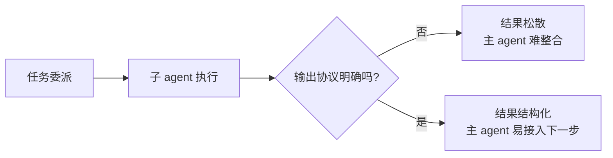

输出协议不一定要很复杂。

很多时候，几条就够了：

- 先给结论
- 再给证据
- 最后给建议动作

或者：

- `PASS / FAIL / PARTIAL`
- 关键证据
- 剩余风险

又或者：

- 发现了什么
- 最值得看的文件/位置
- 推荐主 agent 下一步怎么做

重点不是格式工整，而是**主 agent 能稳定接住**。

如果没有这层，subagent 的结果就会越来越像自由散文。人读可能还能读，系统很难稳。

---

### 第四，主 agent 不要把“形成理解”整个外包出去

这是官方使用说明层里一个特别值得抄的哲学。

很多人一旦有了 subagent，很容易上瘾。

一遇到复杂问题，就想：

- 你去研究一下
- 你看完顺手修了
- 你分析一下再给我个最终方案

短期确实省脑子，但长期有两个问题：

1. 子 agent 很可能拿不到主 agent 当前真正完整的上下文
2. 主 agent 自己会越来越像一个转发器，而不是调度者

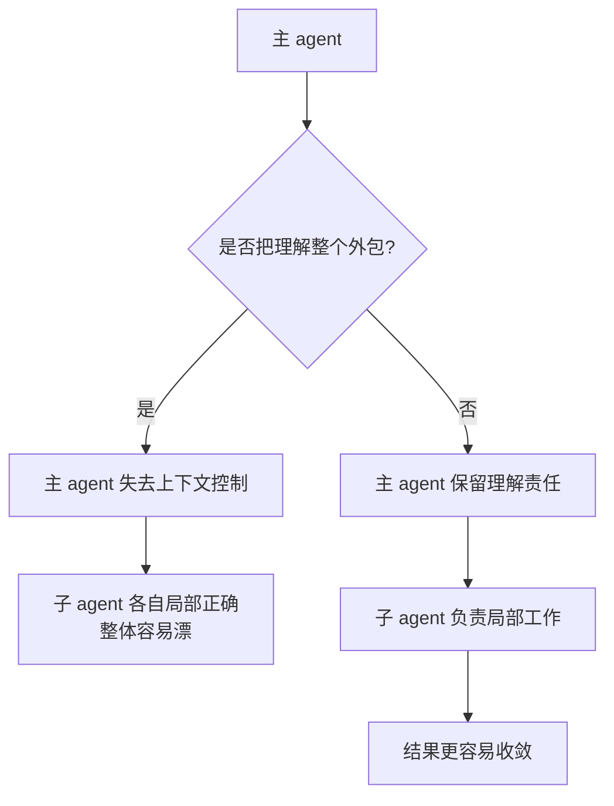

所以我的建议很直接：

> **subagent 负责局部工作，主 agent 负责形成理解。**

可以让子 agent：

- 搜材料
- 跑验证
- 读日志
- 找调用链
- 提出备选方案
- 执行一段局部实现

但主 agent 最好仍然负责：

- 任务拆解
- 关键上下文选择
- 最终综合判断
- 决定下一步调度

这是一个很关键的系统稳定点。

---

### 第五，subagent 是主循环的一部分，不是平行世界

很多人设计 custom subagent 时，潜意识里会把它想成一个独立小助手：

- 它自己理解任务
- 它自己推进工作
- 它自己得出结论
- 然后把完整答案带回来

但从 Claude Code 主循环的角度看，subagent 更像一次受控分叉。

它应该服务的是主循环，而不是取代主循环。

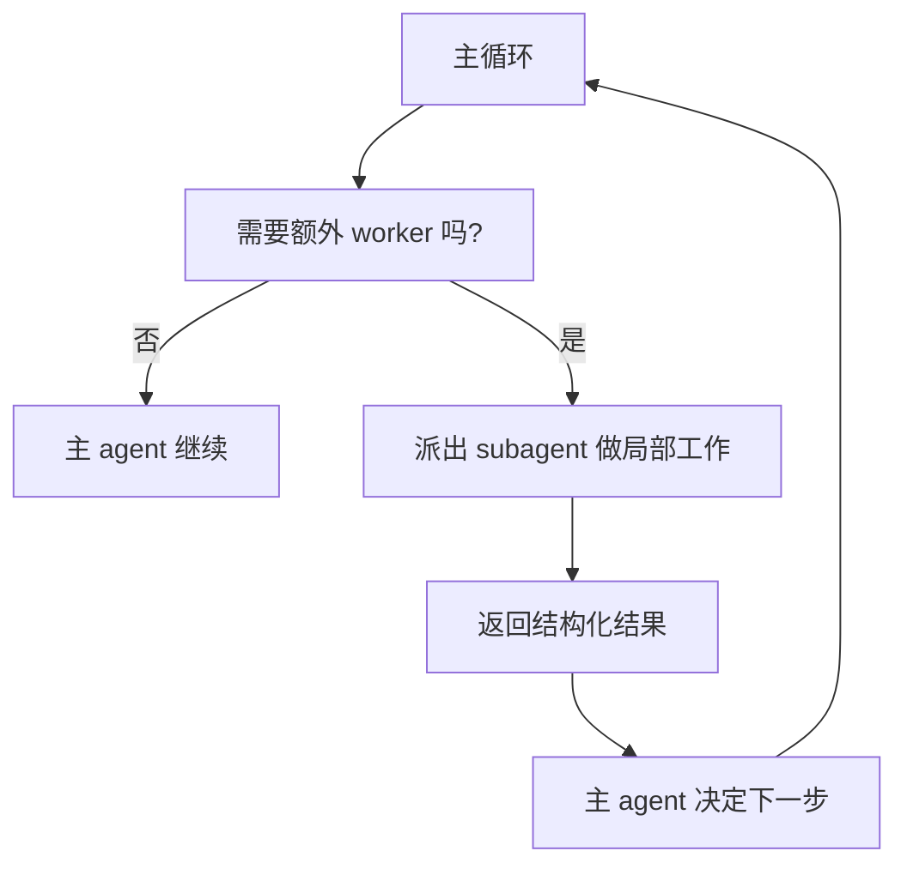

这意味着你设计 subagent 时，不能只问：

- 它自己能不能完成任务

更要问：

- 它的结果回到主 agent 之后，下一步会不会更容易做决定

如果不能，那这个 subagent 大概率设计错位了。

---

### 第六，先做少数稳定模板，不要一开始就角色爆炸

这是最土，但可能最实用的一条。

很多人刚上手自定义 subagent，会很兴奋地做十几个角色。

比如：

- API 文档专家
- 测试失败诊断师
- 前端结构优化师
- PR diff 评论员
- SQL 风险分析员
- 错误信息翻译官

不能说这些都没用，但问题在于：

**过早角色爆炸，几乎一定会带来调度混乱。**

因为：

- 角色边界越来越难区分
- 主 agent 更难选对人
- 很多角色实际只在极少场景下出现
- 维护 prompt、工具边界、输出协议的成本迅速升高

所以我现在更推荐一个保守起步法：

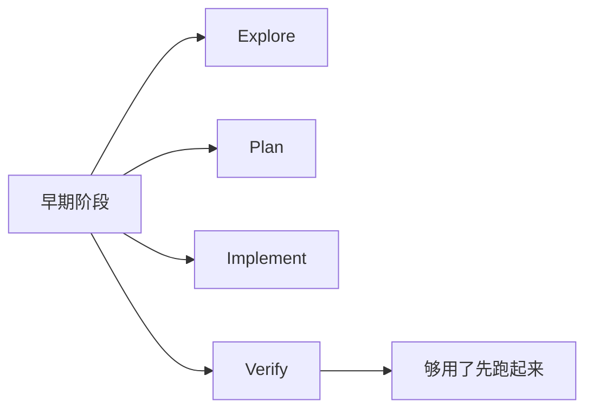

先做 3 到 4 个高频模板。

如果这几个已经能覆盖大部分高价值场景，就别急着继续拆。

因为一个少而稳的 subagent 系统，通常比一个热闹但混乱的 agent zoo 更有生产力。

---

## 第二部分：如果让我自己配，我会优先做哪几类 custom subagent

上面讲的是原则。下面说更实操的。

如果你是 Claude Code 使用者，想从零开始配自己的 custom subagent，我建议优先考虑下面这几类。

不是因为它们最全，而是因为它们最稳、最通用、最容易被主 agent 正确调度。

---

### 模板一：Explore 型——只读探索 worker

这是最值得最先做的一类。

它适合做的事很明确：

- 搜代码
- 找定义
- 读日志
- 理调用链
- 帮主 agent 快速定位值得看的文件和证据

它不该做的事也应该同样明确：

- 不改代码
- 不顺手修 bug
- 不直接给最终实现方案

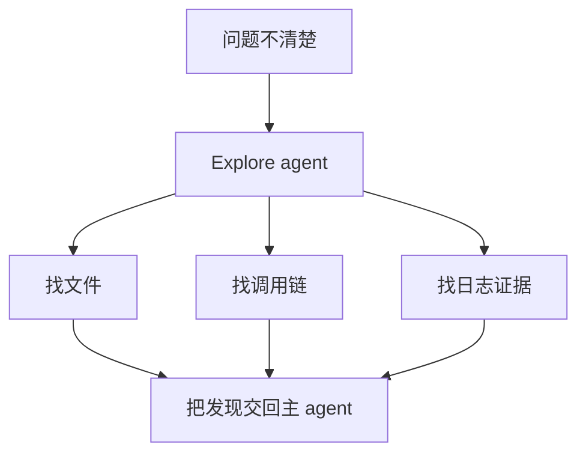

如果让我给 Explore 型 agent 写一句核心要求，我会写：

> 你的任务是降低搜索成本，不是替主 agent 做最终判断。

这种 agent 最大的价值，不是“聪明”，而是快、稳、少副作用。

---

### 模板二：Plan 型——方案整理 worker

第二类值得有的是 Plan。

它和 Explore 很像，都偏只读；但它的输出目标不同。

Explore 更像“我发现了什么”。
Plan 更像“基于这些发现，我建议怎么做”。

它适合负责：

- 梳理实现路径
- 列关键文件
- 给变更顺序建议
- 拆风险点
- 提出几种实现方案及 trade-off

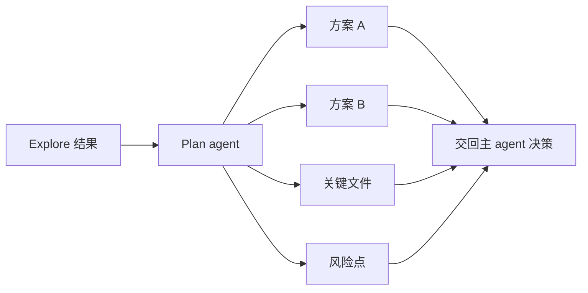

我会特别建议把 Plan 和 Implement 拆开。

因为“想清楚怎么改”和“真的去改”，是两种完全不同的工作姿态。

合在一个 agent 里，通常会变成：

- 还没想清楚就开始动
- 一边改一边补理由
- 最后输出混在一起，不容易审

---

### 模板三：Implement 型——局部实现 worker

真正需要写代码的时候，才轮到 Implement 型 agent 上场。

这类 agent 的目标不是“全权负责项目”，而是：

- 在明确范围内执行一段实现
- 处理局部文件改动
- 跑必要的局部验证
- 把改了什么、怎么验证的讲清楚

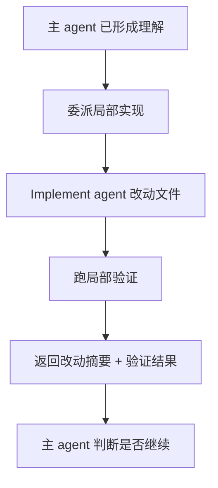

这里最重要的一点是：

**不要让 Implement 型 agent 背太大的任务。**

它最适合的是清晰边界的局部执行，不是让它自己接过整个项目控制权。

如果你一上来就把“把这个复杂功能全部实现完”扔给某个 custom implementer，通常不是它太弱，而是你给它的调度位置错了。

---

### 模板四：Verify 型——独立验收 worker

如果只能再多配一个，我会优先配 Verify，而不是更多执行型角色。

原因很简单：

系统里最容易缺的不是会干活的人，而是肯认真查错的人。

Verify 型 agent 适合做：

- 跑测试
- 复现失败
- 对照需求查漏
- 专门找反例
- 给 PASS / FAIL / PARTIAL verdict

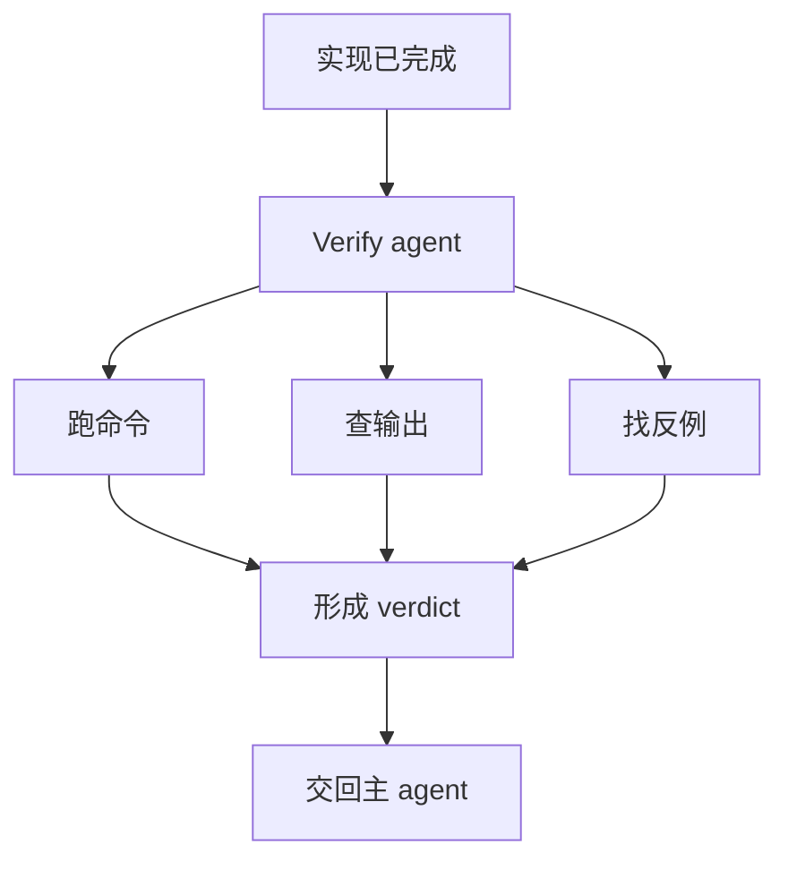

这类 agent 的关键不在于它懂多少，而在于它**立场要硬**。

它不是来帮你圆场的，而是来帮你挑错的。

如果你的 custom subagent 体系里只有会研究、会规划、会实现的人，没有一个明确负责验收和找错的角色，系统的幻觉率通常会慢慢升高。

---

### 模板五：Writer / Summarizer 型——对外表达 worker

这类 agent 不是每个人都需要，但如果你的日常工作里有很多：

- 写日报
- 写变更说明
- 写 PR 摘要
- 写面向人的解释文本

那它其实很值。

不过这类 agent 最容易被设计坏。因为一不小心，它就会变成“把什么都写漂亮”的包装器。

所以我更推荐把它定义得窄一点：

- 根据已有事实重写
- 不擅自补技术结论
- 保留关键证据
- 面向目标读者调整表达方式

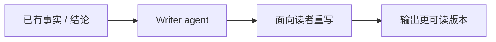

如果你让 Writer agent 一边补事实、一边替你做判断、一边再润色语言，它最后很容易把真实信息抹平。

这类 agent 的正确位置，更像表达层，而不是认知层。

---

## 第三部分：几种最常见、也最容易踩的反模式

如果说前面讲的是“怎么设计会更稳”，那这一部分讲的就是：

**哪些设计看起来很强，实际上最容易把 custom subagent 系统带歪。**

---

### 反模式一：万能专家型

这种角色通常长这样：

- 你是资深全栈工程师、架构师、测试专家、产品顾问
- 你擅长理解需求、制定方案、编写代码、调试、测试和优化
- 你会自主判断并尽可能完成全部工作

看起来像一个 superman。

问题是，主 agent 一旦有这种角色，几乎就会什么都想丢给它。

结果通常不是效率最高，而是边界最糊。

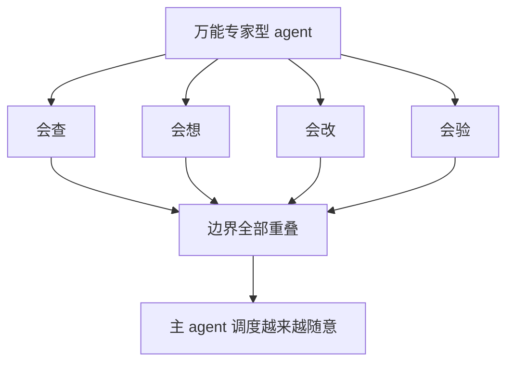

真正的问题不是它能力太强，而是：

- 主 agent 学不会稳定分工
- 角色之间没有明确差异
- 最后所有事都被一个巨型 worker 吸走

这种系统短期看很省事，长期非常难维护。

---

### 反模式二：角色过细型

和万能专家相反，另一种常见错误是拆得太细。

比如：

- React Hooks 专员
- 状态管理顾问
- 样式排查助手
- Jest 诊断师
- API schema 校对员

听起来很专业，但调度时基本会变成灾难。

因为主 agent 很难在实时任务里稳定判断这些微差别。

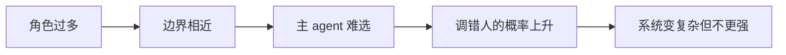

我现在越来越相信一件事：

> 对 subagent 来说，少数大颗粒、边界稳定的角色，通常比大量细颗粒角色更实用。

---

### 反模式三：没有工具边界型

这种最容易发生在刚开始配置的时候。

出于怕限制太多、担心 agent 不够能干，很多人会一股脑把工具全开。

结果就是：

- Explore agent 开始写文件
- Writer agent 开始跑命令
- Verify agent 顺手自己修了

这些事情单看每次都未必是灾难，但系统稳定性会一点点掉。

因为角色一旦能轻易越界，主 agent 对它的预期就不再稳定。

而调度系统最怕的，就是预期失真。

---

### 反模式四：没有输出协议型

这种问题前期最不容易被注意到。

因为看起来每个 agent 都“说得挺多”。

可一旦你真的要把这些结果喂回主循环，就会发现：

- 有的给结论，不给证据
- 有的堆证据，没有结论
- 有的像汇报，有的像聊天
- 有的写了三屏，主 agent 还是不知道下一步该干嘛

这时你就会发现，subagent 的可用性其实不只看内容质量，还看**结构可消费性**。

没协议，系统就只能靠主 agent 每次临时消化。久了很累，而且不稳。

---

### 反模式五：把主 agent 做成纯转发器

这是我最警惕的一种。

有些人用了很多 subagent 之后，主 agent 会慢慢退化成：

- 收到任务
- 转给某个子 agent
- 子 agent 回来
- 再转给另一个子 agent
- 最后拼个总结

表面上看，这像 orchestration。

但如果主 agent 自己不保留理解责任，它最后就只是在搬运别人的局部结果。

这时候系统往往会出现一种很危险的错觉：

- 每一步都像有依据
- 每个 agent 都说得头头是道
- 但整体方向开始越来越不受控

所以主 agent 最少也得承担两件事：

- 维护任务的整体上下文
- 对 subagent 返回结果做主动综合和取舍

这才叫调度，不然只是传球。

---

## 最后收成一套最小可行实践

如果你现在就想给 Claude Code 配自定义 subagent，而不想一头扎进复杂系统，我会建议直接从下面这套最小组合起步：

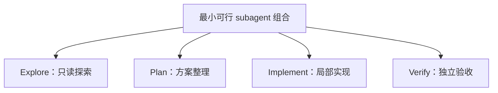

然后每加一个新角色，都先问四个问题：

1. 它解决的是一个独立工作姿态，还是只是旧角色的别名？
2. 它的工具边界和别的角色相比，真的不同吗？
3. 它的输出协议足够清楚吗？
4. 它回到主 agent 之后，是否真的让下一步更容易判断？

如果四个问题里有两个答不稳，就先别加。

因为大部分时候，你缺的不是更多角色，而是更稳的边界。

---

## 最后一句话

看完 Claude Code 官方 agent system 之后，我觉得最值得学的，其实不是“他们有哪些 built-in agent”，而是他们在一遍遍强调一件事：

> 一个好 subagent，不是更聪明的小助手，而是主系统里一个职责单一、边界清楚、结果可收敛的 worker。

如果只会给角色起名字、堆 prompt、开权限，你得到的通常是一套热闹的系统。

如果你肯认真设计边界、工具面、输出协议和调度位置，subagent 才会真的变成生产力。

这两者看起来都叫“自定义 agent”，但中间差得其实很大。