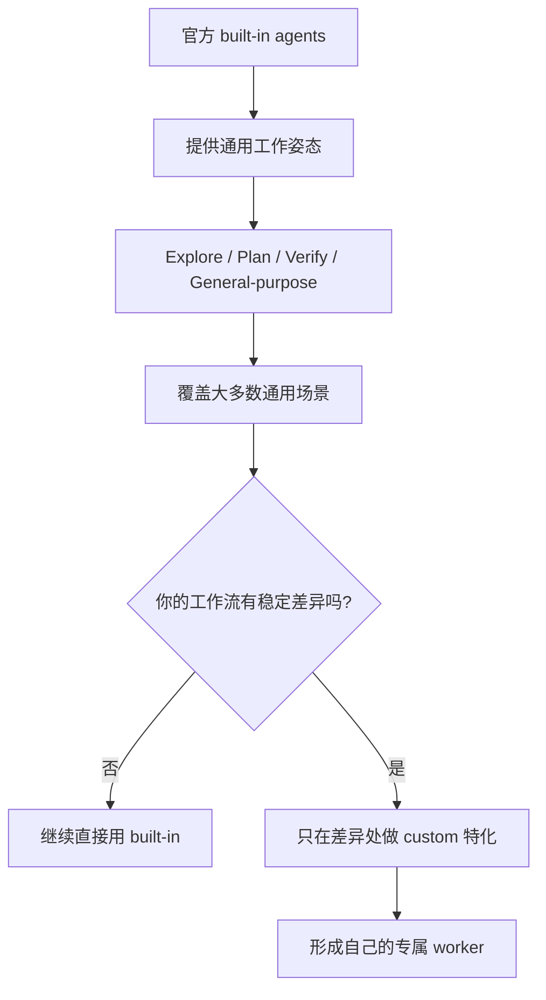
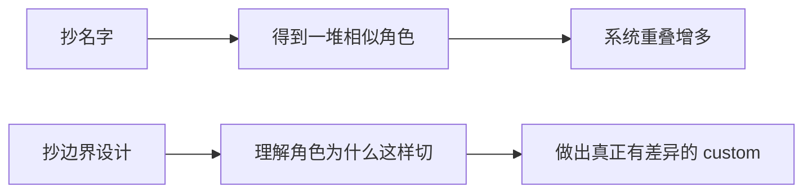
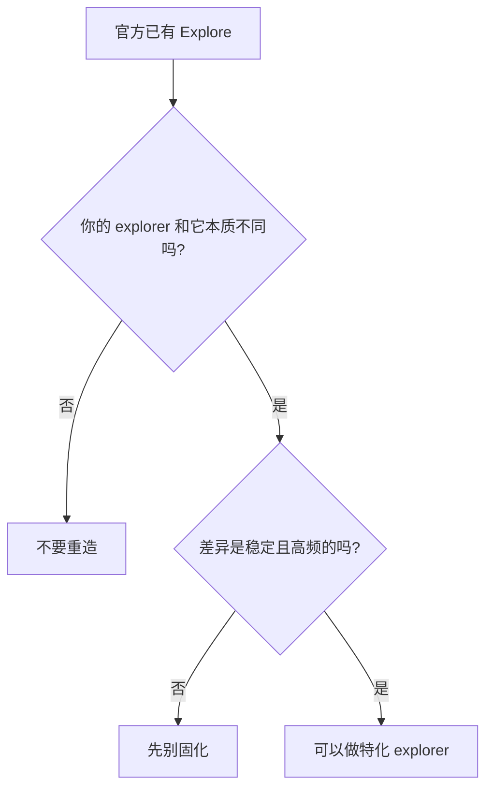
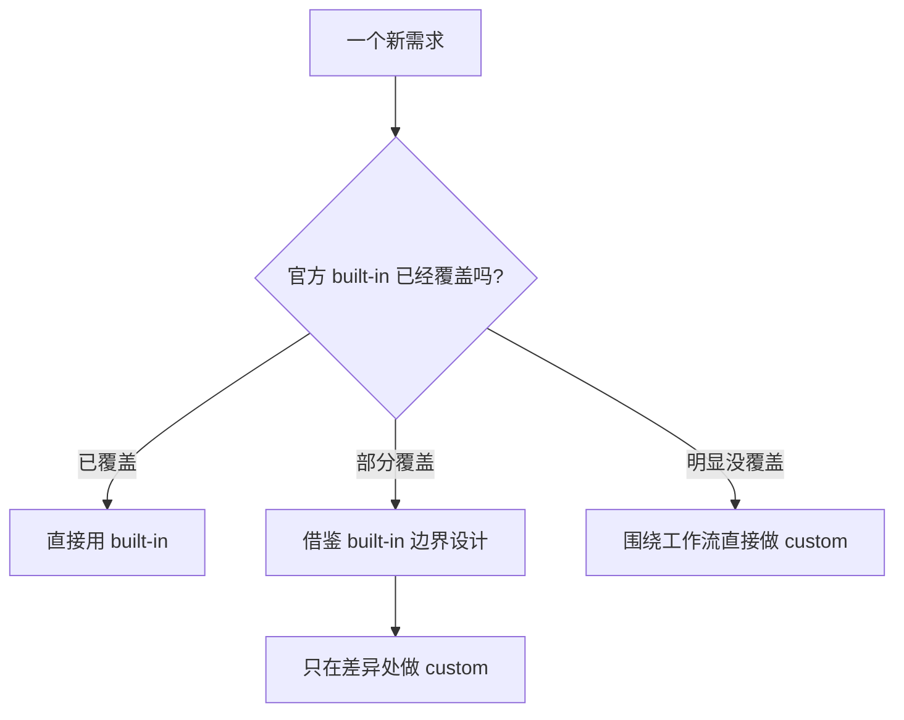
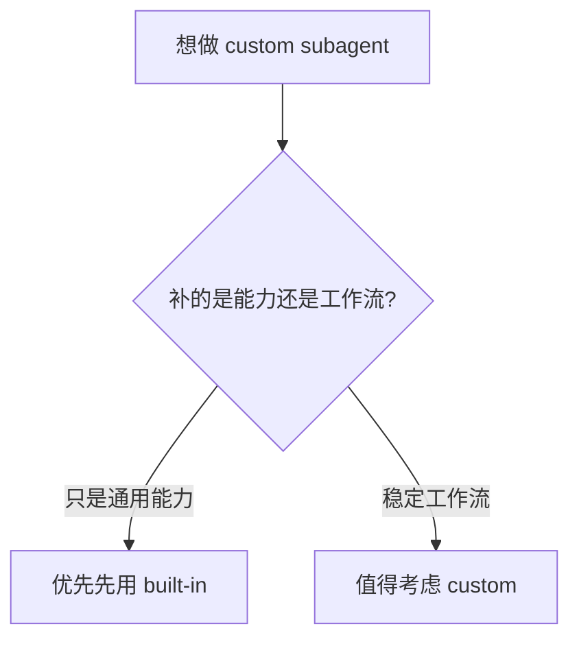

看完 Claude Code 的 built-in agents 之后，很多人都会立刻冒出一个很自然的冲动：

**既然官方已经把这套 agent system 做出来了，那我是不是也该按这个思路，自己再定义一批 custom subagent？**

这个冲动很正常。

问题是，很多人接下来走的第一步就歪了。

最常见的两种歪法，一种是**重复造轮子**：

- 官方已经有 `Explore`
- 我再造一个 `MyExplorer`
- 官方已经有 `Plan`
- 我再造一个 `ArchitectAgent`
- 官方已经有 `verification`
- 我再造一个 `QA-Master`

名字越来越花，角色越来越多，但系统能力并没有真正增加多少。

另一种歪法是另一个极端：

- 官方既然都做了
- 那我是不是永远只用 built-in 就行
- custom 这件事是不是其实没必要

这也不对。

因为官方 built-in agent 解决的是一类**通用工作姿态**，而你自己的工作流、输出协议、项目结构、协作习惯，往往又会产生一些非常明确的特化需求。

所以真正重要的问题，不是：

> **我要不要自己做 custom subagent？**

而是：

> **built-in 和 custom 到底应该怎么分工？什么应该直接用，什么只适合借鉴，什么已经值得做成自己的 worker？**

我现在越来越认同一种更稳的做法：

> **先把 built-in 当作基础角色层，再只在“官方没覆盖的工作流差异”上做 custom。**

这篇就专门讲这个问题。

---

## 先说结论：默认不是重造，而是继承 + 特化

如果只给一句总原则，我会这么说：

> **built-in 负责提供通用工作姿态，custom 负责承接你的专属工作流。**

也可以再展开成三句：

- **能直接用 built-in，就先别重造**
- **想学的主要不是名字，而是边界设计**
- **只有当你的工作流差异已经足够稳定时，custom 才真正值得出现**

这三句，其实就是整篇文章的核心。

---

## 一张总图：built-in 和 custom 的关系，不是替代，而是分层

很多人脑子里默认的图景是这样的：

- 要么用官方 built-in
- 要么自己做 custom

但我觉得更准确的图景是：

也就是说，custom 最合理的位置通常不是“另起一套系统”，而是：

> **站在 built-in 之上，只补官方没有替你补的那一层。**

这会比“模仿官方再造一套”稳得多。

---

## 第一个原则：built-in 先解决的是通用工作姿态，不是你的个人工作流

官方 built-in 最大的价值，不是它有哪些名字，而是它把几种典型工作姿态先切出来了。

比如：

- `Explore`：只读探索
- `Plan`：只读规划
- `verification`：独立验证
- `general-purpose`：通用执行

这些角色本质上是在回答：

- 查信息这类活，应该怎么切
- 做方案这类活，应该怎么切
- 验结果这类活，应该怎么切
- 默认执行体，应该是什么风格

它解决的是**调度层面的通用问题**。

但你的工作流，通常还会有一些它天然不关心的东西，比如：

- 你更偏向什么输出格式
- 你最关心哪些证据
- 你们团队最常见的问题类型是什么
- 你自己的项目结构有哪些固定套路
- 你希望一个 worker 在哪一步停下来，把判断交回主 agent

这些东西，官方不可能替你写死。

所以 built-in 的定位，从来就不是“替你把一切都做完”。

它更像是：

> **先把通用姿态做好，剩下留给你自己的工作流去长。**

---

## 第二个原则：custom 真正该继承的，不是名字，而是边界设计

很多人看 built-in，第一反应是抄角色名。

但我觉得真正值得抄的，不是 `Explore` 这个名字，也不是 `Plan` 这个词，而是它背后的边界设计方式。

比如，官方 built-in 最值得学的几个点是：

- 它是按工作姿态切，不是按技术栈切
- 它把工具边界看得很重
- 它会给角色明确的输出倾向
- 它会让某些角色保持只读
- 它会让某些角色带明显的立场，比如验证型立场

这差别很大。

如果你抄的是名字，你会得到：
- `my-explorer`
- `my-planner`
- `my-verifier`

如果你抄的是边界方法，你得到的会是：
- 哪些角色必须只读
- 哪些角色应该只给 verdict，不负责修
- 哪些角色适合服务主循环，而不是替代主循环
- 哪些角色的价值来自独立立场，而不是知识更多

后者才是值得继承的东西。

---

## 第三个原则：不要在“通用能力”上重造 built-in，要在“稳定差异”上做 custom

这是我觉得最重要的一条。

如果你想自己做 custom，最值得先问的问题不是：

- 我想不想要一个自己的角色？

而是：

- **我的工作流里，到底存不存在一种官方 built-in 没覆盖好的稳定差异？**

这里的“稳定差异”很关键。

不是某一次特殊需求，不是某个临时偏好，而是那种会反复出现、而且你已经知道它应该怎么工作的差异。

比如：

- 你长期需要一个会严格按固定诊断卡片回报的验证 worker
- 你长期需要一个围绕 repo 结构摸图的 codebase mapper
- 你长期需要一个专门审 diff 影响面的 reviewer
- 你长期需要一个把 release 变化读成情报摘要的 worker

这些都不是官方通用 built-in 天然会替你做好的一层。

这时候 custom 就有意义了。

---

## 一个最常见的问题：官方已经有 Explore，我还要不要自己定义 explorer？

这是个特别好的例子。

因为它几乎就是 built-in 和 custom 分工问题的缩影。

我的判断很明确：

> **大多数时候，不要再造一个通用 explorer。**

原因很简单。

官方 `Explore` 已经解决了大多数通用探索任务：

- 搜代码
- 找定义
- 查调用链
- 快速阅读局部上下文

如果你再定义一个 `my-explorer`，但它本质上也是这些事，那你得到的通常只有：

- 角色重叠
- 调度变复杂
- 维护成本上升
- 实际新增价值很有限

真正值得做的，不是再造一个“通用 Explore”，而是只在差异非常明确时，做一个**特化探索 worker**。

比如：

- `repo-mapper`
- `diff-impact-explorer`
- `log-investigator`
- `release-notes-explorer`

这些角色的价值，不在于“会探索”，而在于：

- 探索对象不同
- 探索目标不同
- 输出协议不同
- 它们在主流程里的位置也不同

这才叫 custom。

---

## 所以 built-in 和 custom 的分工，可以压成三类动作

我现在更喜欢把它们分成三层：

也就是说，面对一个新需求，你其实有三种动作：

### 1. 直接用
当官方 built-in 已经足够好时，不要硬做 custom。

### 2. 借鉴后特化
当官方 built-in 已经覆盖了 60%~80%，但你的工作流有明显稳定差异时，最适合这种方式。

### 3. 直接自定义
当官方根本没覆盖这类工作，或者你的需求本质上就是专属工作流时，才应该直接做 custom。

这比“要么全部 built-in，要么全部 custom”稳得多。

---

## 服务端工程师视角下，哪些更适合直接用 built-in，哪些更值得做 custom

如果站在服务端工程师的日常里，我会这样分。

### 更适合直接用 built-in 的

#### 1. 通用代码探索
- 找入口
- 找调用链
- 找定义
- 看局部逻辑

这些优先用 `Explore`。

#### 2. 通用实现规划
- 先找关键文件
- 列出改动路径
- 比较几种做法

这些优先用 `Plan`。

#### 3. 独立验证
- 跑测试
- 查边界 case
- 看输出是否支持结论

这些优先先吃满官方 `verification` 的能力。

也就是说，官方 built-in 其实已经覆盖了很大一块日常工程姿态。

---

### 更值得围绕工作流做 custom 的

#### 1. 面向 repo 的结构地图 worker
比如你的仓库很复杂，你经常需要：
- 按模块画结构图
- 找稳定入口
- 找领域边界
- 把代码勘探结果收成固定格式

这比通用 Explore 更像自己的 `repo-mapper`。

#### 2. 面向 diff 的影响面审查 worker
比如你经常需要：
- 看一组改动影响到哪些模块
- 哪些调用链可能回归
- 有没有违反既有约束

这更像 `diff-impact-reviewer`，而不是单纯 Explore。

#### 3. 面向 release / changelog 的情报型 worker
比如你长期做技术情报、工具跟踪、框架更新总结，
这类角色天然就是你的专属工作流，不是官方通用 built-in 的重点。

#### 4. 面向你自己输出协议的验证 worker
有时候官方 verification 不是不够好，而是你的团队对输出格式、验证范围、验收卡片有明确固定习惯。
这时你就不是在重造 verifier，而是在做你自己的 `team-verifier`。

---

## 一个很实用的判断标准：你是在补能力，还是在补工作流？

这是我现在觉得最顺手的判断法。

如果你想做一个 custom subagent，先问：

> **我现在是在补一种官方没有的能力，还是在补一种官方没有替我固化的工作流？**

大多数时候，你会发现：

- 官方缺的未必是能力
- 真正缺的是“怎么按你的方式把事情做完”

这就是 custom 最合理的出生点。

---

## built-in 和 custom 的正确关系，不是竞争，而是演化

很多人脑子里 built-in 和 custom 的关系像是对立的：

- 要么官方的
- 要么自己的

但我觉得更好的理解是：

> **built-in 是底座，custom 是从真实工作流里长出来的特化层。**

甚至更进一步说，最稳的 custom 通常不是拍脑袋想出来的，而是这样长出来的：

1. 先直接用 built-in
2. 观察哪些地方反复不顺手
3. 识别出稳定差异
4. 再把这部分固化成 custom worker

这个顺序很重要。

因为它会让你的 custom 不是“想象中的角色”，而是“从重复真实工作里长出来的角色”。

这种 custom 往往更稳，也更不容易和 built-in 打架。

---

## 最后一句话

如果你只想记住一句，我建议记这个：

> **built-in 负责通用姿态，custom 负责稳定差异。**

能直接用 built-in，就先别重造；
想学 built-in，就学它怎么切边界，而不是学它叫什么名字；
只有当你的工作流里已经出现了官方没替你固化好的那一层，custom 才真正值得出现。

这时候你做出来的，才不是“又一个看起来很像 built-in 的角色”，而是一个真正服务你自己工作流的 worker。

这才是 built-in 和 custom 最合理的分工方式。