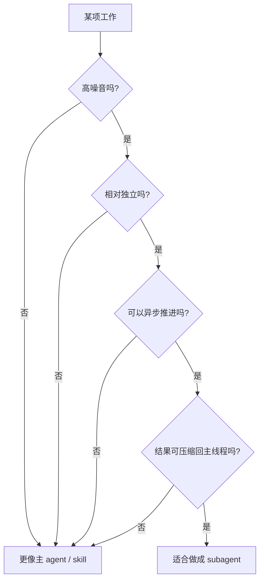
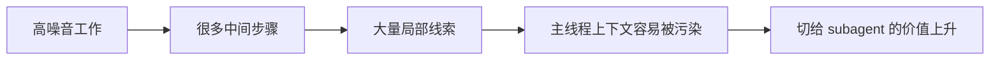
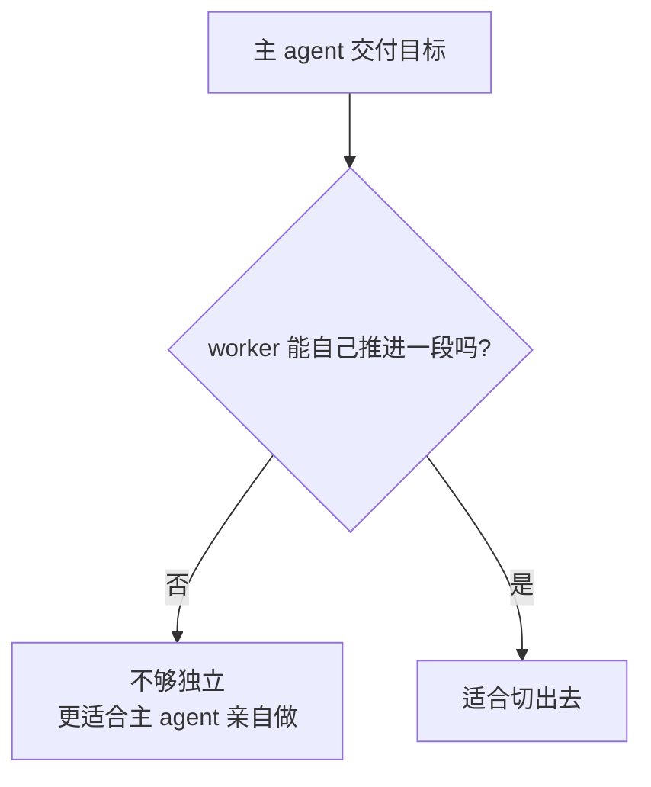
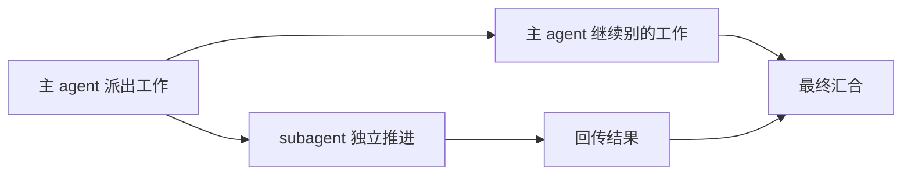
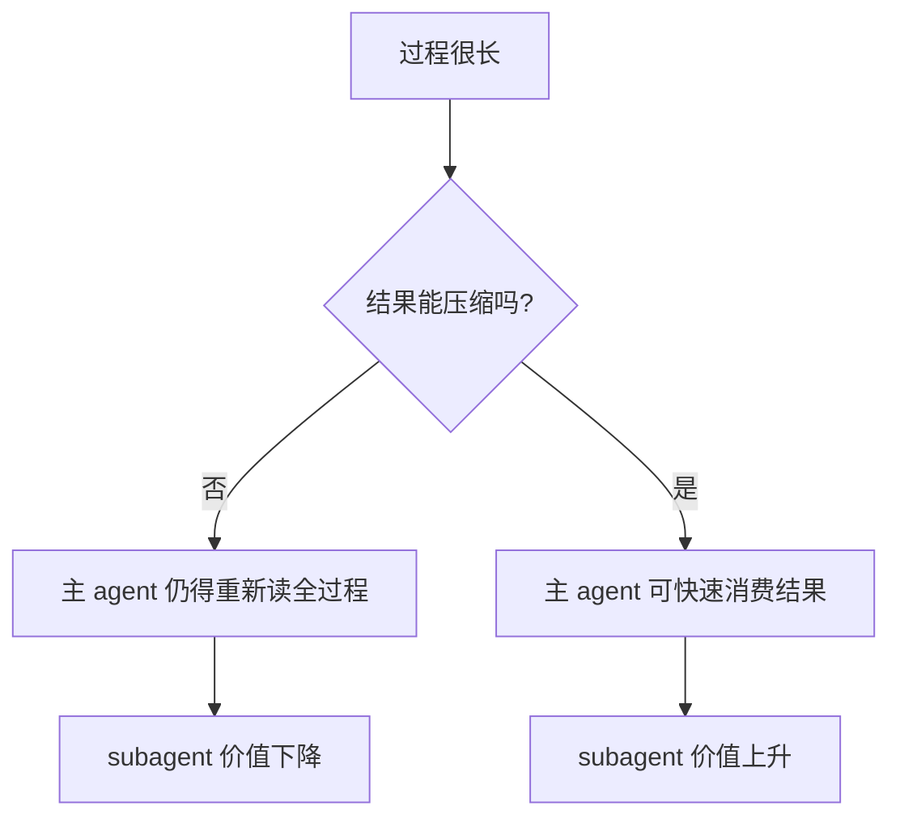
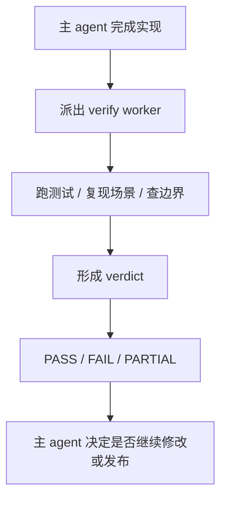
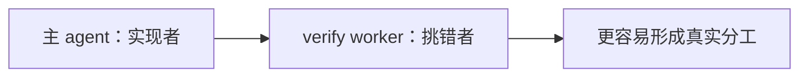
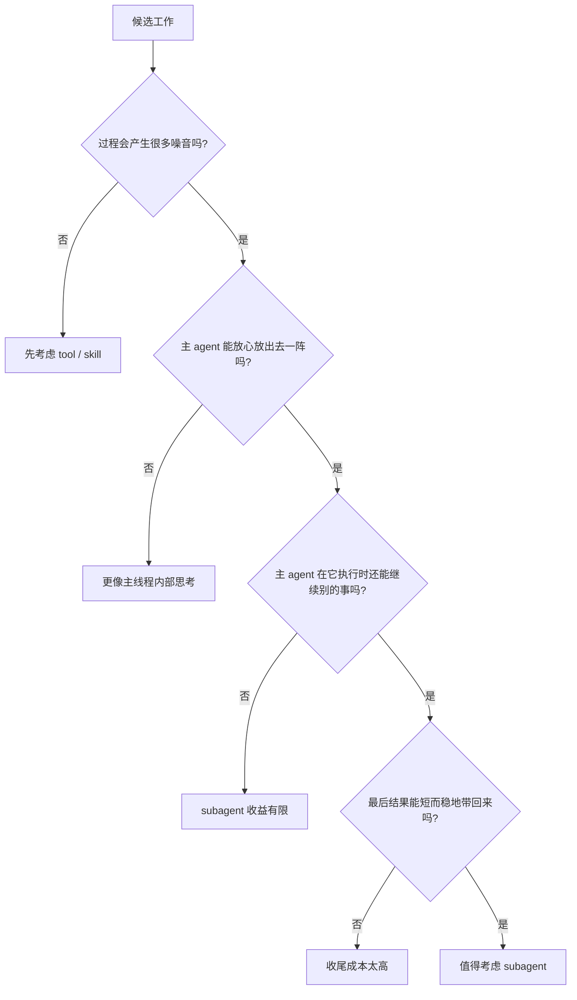

聊 subagent 时，大家最容易犯的一个错，就是把它想成一种“更强形态的调用方式”。

仿佛只要某件事做成 subagent，它就会立刻显得更高级、更智能、更像一个完整的 agent system。

但真到日常工程里用一阵子，你很快就会发现：

**很多工作其实根本不适合做成 subagent。**

比如：

- 查一个文件
- grep 一个关键词
- 跑一条命令
- 下载一份日志
- 改一个局部实现

这些事当然都可以“交给另一个 session 去做”，但这不代表它们值得被定义成一个 subagent。

所以问题的关键，不是“能不能做成 subagent”，而是：

> **什么样的工作，做成 subagent 才真的有价值？**

如果站在服务端工程师视角，我现在越来越认同一个比较朴素的判断：

> subagent 最适合承接的，不是一个步骤，也不是一个工具调用，而是一类高噪音、相对独立、可以异步推进、结果又能压缩回主线程的工作。

这篇我就只讲这个问题。

不是讲怎么写 prompt，不是讲怎么配角色，而是先把最底层的判断标准讲清楚。

因为这件事如果一开始没想明白，后面你做出来的多半不是 subagent 系统，而是一组热闹但重复的 session 包装壳。

---

## 先说结论：subagent 不是默认选项

如果只给一个总判断，我会这么说：

> **大部分工程动作更适合主 agent + tools/skills。只有少数工作，才值得被切成 subagent。**

这点很重要。

因为很多人刚接触 agent system 时，脑子里的默认路径正好反过来：

- 这件事能不能做成 subagent？
- 那件事能不能也拆一个 subagent？
- 日志要不要一个 subagent？测试要不要一个 subagent？代码搜索要不要一个 subagent？

但如果你真的这样往下拆，最后很容易得到一个问题：

- 角色越来越多
- 调度越来越重
- 主 agent 越来越像转发器
- 真正的生产力提升却没有同步变大

所以第一件要接受的事实是：

**subagent 不是默认答案，而是一种有明确适用边界的工作切分方式。**

---

## subagent 真正解决的，到底是什么问题

我觉得最容易把这件事说清楚的方式，不是先讲定义，而是先讲它和 skill 的根本区别。

### skill 更像什么？

skill 更像一段可复用的方法包。

它擅长解决的是：

- 这件事怎么做
- 这台机器上怎么做
- 这套步骤如何稳定触发

比如：

- 下载日志
- 拉取某个服务状态
- 按固定方式导出数据
- 执行某个排查脚本

这些东西本质上都是能力或流程。

### subagent 更像什么？

subagent 更像一个被主线程派出去做一类工作的 worker。

它擅长解决的是：

- 这段工作谁来负责
- 这段高噪音工作怎么切出去
- 这段过程很长的工作怎么独立推进
- 结果怎么压缩后交回主线程

所以 subagent 真正解决的，不是“能力不足”，而是：

> **主线程是否值得把一段工作从当前上下文里切出去，让另一个 worker 带着明确目标跑一阵，再把结果压缩回来。**

这就是它的核心价值。

---

## 一张总图：什么样的工作才值得切成 subagent

我现在更倾向用四个条件来判断。

这四个条件分别是：

1. **高噪音**
2. **相对独立**
3. **可以异步推进**
4. **结果可压缩**

少一个都不是绝对不行，但只要少掉两项，subagent 的收益通常就会急剧下降。

下面我一个个拆。

---

## 标准一：高噪音

这是我觉得最容易被忽略，但又最关键的一条。

所谓高噪音，指的不是任务复杂，而是这段工作会产生大量中间过程，而这些中间过程并不值得长期留在主线程上下文里。

典型表现包括：

- 大量 grep / read / search
- 大量候选线索
- 大量试探性命令
- 很多失败尝试
- 过程中会读很多文件，但最后真正有用的只是一小部分结论

为什么这条重要？

因为主 agent 最宝贵的，不是执行力，而是上下文清晰度。

一段工作如果会往主线程里灌入大量：

- 暂时无用的信息
- 很快会过期的候选线索
- 只能局部成立的探索片段

那它就很适合被切出去。

换句话说：

> 如果过程很脏、信息很多、但真正该带回来的结论很少，这就是 subagent 的甜点区。

---

## 标准二：相对独立

第二条是相对独立。

这里不是说它可以完全脱离主 agent，而是说：

> 主 agent 把目标、范围和验收口径交代清楚之后，这段工作能不能自己跑一阵，而不需要每两步就回头问一次。

为什么这条关键？

因为 subagent 不是为了“多个人一起动”，而是为了让某段工作拥有真正的切分边界。

如果一段工作从头到尾都需要主 agent 持续判断：

- 下一步该看哪
- 这个线索该不该继续
- 这条路径要不要放弃
- 这个结果和当前主判断是否一致

那它其实还是主 agent 的内部思考过程，切出去价值不大。

这也是为什么很多“日志诊断 + 结合代码定位”的场景，未必天然适合 subagent。

因为它经常不是一个独立 worker 在跑，而是主 agent 思考过程中的一段技能链。

---

## 标准三：可以异步推进

第三条是可以异步推进。

这条很简单，但很多人一开始不会主动想到。

subagent 之所以有价值，很大一部分原因就在于：

> 主 agent 把任务派出去后，不必卡死在原地等待。

它可以继续：

- 整理别的部分
- 做别的实现
- 写说明
- 继续其他子任务

如果一段工作必须同步完成、而且主 agent 在它运行期间什么都做不了，那 subagent 的优势就会小很多。

这时它更像是一次“换个地方执行”，而不是一次真正有调度收益的切分。

所以从工程感受上说，subagent 最舒服的场景通常不是：

- 立刻给我一个答案

而是：

- 你去跑一阵，等你有结论了再回来

这个差别很大。

---

## 标准四：结果可压缩

第四条经常和第一条成对出现。

过程很长，不够。过程很吵，也不够。

如果最后结果没法被压缩回主线程，那 subagent 仍然不值。

所谓结果可压缩，指的是：

- 这段工作虽然过程复杂
- 但最后能以较短、较稳定的结构回报主 agent

比如回成：

- 结论
- 关键证据
- 风险点
- 下一步建议

或者：

- PASS / FAIL / PARTIAL
- 关键失败证据
- 没覆盖到的边界

这条特别重要，因为它决定了一件事：

**主 agent 最后收回来的到底是“结果”，还是“另一段长上下文”。**

如果是后者，那你其实只是把复杂度暂时挪出去，最后还得全额搬回来。

这种切分是没有真正收益的。

---

## 所以，什么样的工作最不适合做成 subagent

有了上面四条，很多事情就很容易判断了。

比如下面这些，通常就不太适合：

### 1. 单一步骤型动作
比如：
- 下载日志
- 跑某个命令
- 读取某个配置
- 查某个服务状态

这些更像工具能力或 skill，不像独立 worker。

### 2. 强依赖主线程持续判断的工作
比如：
- 主 agent 一边想方案，一边随手看几段日志
- 一边改代码，一边临时查调用链

这类工作是主 agent 思考过程的一部分，切出去未必更好。

### 3. 结果无法压缩的工作
比如：
- 需要把大量阅读过程和原始材料完整带回来
- 结论很难比原过程更短

这种工作不适合切成 subagent，因为收尾成本太高。

---

## 服务端工程师视角下，最适合做成 subagent 的东西是什么

如果只让我挑一个最值得优先做成 subagent 的角色，我会选：

# **验证型 worker**

也可以叫：

- verify
- regression checker
- implementation auditor
- ship-readiness reviewer

一句话定义就是：

> 你不是来证明实现“看起来差不多行”，你是来尽可能找它哪里还不行。

---

## 为什么验证型 worker 是最像 subagent 的工作

因为它几乎完美符合前面那四条标准。

### 它很高噪音
验证过程会产生大量中间材料：

- 跑测试
- 失败输出
- 参数调整
- 重现步骤
- 日志片段
- 边界 case
- 对照需求的检查过程

这些都非常吵，而且很多中间步骤并不值得长期留在主线程里。

### 它相对独立
一旦主 agent 把下面这些说清楚：

- 改了什么
- 目标是什么
- 哪些风险点最值得查

验证 worker 通常就能自己跑一阵。

### 它适合异步推进
主 agent 在它验证时完全可以继续别的事。

### 它的结果特别容易压缩
最后完全可以压成一张诊断卡片：

- verdict
- 关键证据
- 剩余风险
- 推荐下一步

这就是非常标准的 subagent 工作形态。

---

## 为什么它比“日志诊断 worker”更像 subagent

很多人一开始会先想到日志、搜索、代码阅读。

但这些工作有个共同问题：

它们常常和主 agent 当前的理解过程缠得太紧。

而验证型 worker 不一样。

它和主 agent 的关系非常自然：

### 主 agent 的职责
- 理解需求
- 做设计
- 完成实现
- 知道自己最担心哪些地方

### verify worker 的职责
- 站在挑错立场
- 找失败证据
- 检查边界漏项
- 给验收回报

这里最关键的，不是工具面，而是**立场差异**。

这也是我现在越来越认同的一点：

> subagent 最适合承接的，往往不是“另一个会干活的人”，而是“另一种立场明确的 worker”。

这句话对服务端工程很成立。

因为服务端工程里最贵的错误，往往不是写不出来，而是：

- 看起来实现了
- 实际没覆盖边界
- 看起来测试过了
- 实际只是 happy path 过了
- 看起来能上线
- 实际只是没被认真审过

这时，一个独立验证 worker 的价值就会很高。

---

## 一套更实用的判断表

如果以后再遇到“这件事要不要做成 subagent”，我建议直接问下面这几题。

你也可以把它压成一个更工程化的 checklist：

### 适合做成 subagent 的信号
- 这段工作过程很长，而且很吵
- 主 agent 不想被这些中间过程污染
- 主 agent 可以先把边界交代清楚，再让它自己跑
- 主 agent 在等待它时还可以继续别的事
- 最后结果能被压成一张短报告或 verdict
- 这段工作和主 agent 有天然立场差异

### 更适合做成 skill 的信号
- 本质是一个固定步骤或流程
- 主要目的是减少重复说明
- 主 agent 仍然需要掌控全过程
- 这段工作更像能力复用，而不是角色切分
- 结果和过程同样重要，切出去意义不大

---

## 用这套标准反推几个常见例子

### 例子一：下载日志
这显然更像 skill。

因为它：
- 是单一步骤
- 目标明确
- 不构成独立 worker

### 例子二：日志诊断并结合代码定位
这个要看情况，但多数时候更像高层 skill，或者主 agent 的技能链。

因为它常常：
- 和主 agent 理解过程强绑定
- 未必适合异步跑很久
- 中间过程很多，但主 agent 往往又需要直接参与判断

### 例子三：独立验证 / 回归审计
这就是最典型的 subagent。

因为它：
- 噪音高
- 独立性强
- 可异步
- 结果可压缩
- 和主 agent 存在天然立场差异

### 例子四：大范围代码库勘探
这也经常很适合。

比如：
- 帮我摸清 billing retry 相关的所有入口、任务链路和状态流转

这种任务往往：
- 读很多
- 中间线索很多
- 主 agent 不想被全部过程污染
- 最后只想拿一张结构化地图回来

这时切成 subagent 就很合理。

---

## 最后一句话

如果你只想记住一句，我建议记这个：

> **subagent 最适合承接的，不是一个步骤，而是一种高噪音、相对独立、可异步推进、结果又能被压缩回主线程的工作。**

从服务端工程师视角看，最值得优先做成 subagent 的，往往不是日志、不是搜索，也不是普通实现，而是：

> **独立验证、回归审计、影响面审查、大范围勘探这类“过程很吵，但结果可以压成判断”的工作。**

想明白这件事后，你再看 subagent，就不会再把它当成一个泛化概念。

你会更容易判断：

- 哪些工作只是 skill
- 哪些工作该留在主线程
- 哪些工作真的值得切出去，变成一个长期稳定的 worker

这才是 subagent 最有用的地方。